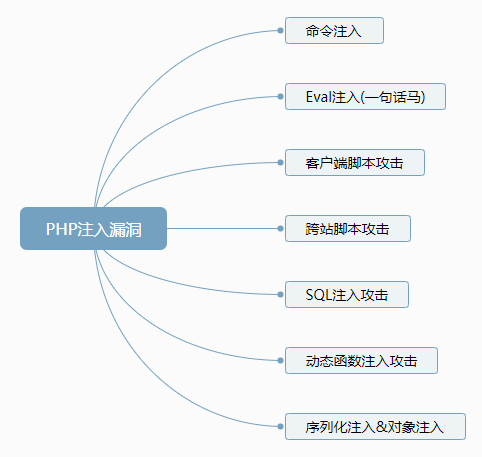

# PHP审计中的命令注入

- 👴 like that old time rock 'n' roll ！ 
<<[Old Time Rock & Roll](https://music.163.com/#/song?id=1098827)>> 
专辑：Stranger in Town
歌手：Bob Seger

##  什么是PHP命令注入

PHP中可以使用[特殊函数](PHP中的特殊函数.md)来执行外部的代码或函数.

可以理解为，应用PHP语言中一些具有命令执行功能的函数时,将外部输入的代码执行为php可执行代码或系统命令，也就是俗称的 `webshell` 。在服务器不进行权限设置的时候。权限仅仅是 网页启动者的权限(Linux 中为apache权限)，在windows中是，apache启动者的权限。 在Linux中是权限低的apache用户权限。

**常见注入有**




举例：
```php
<?php
echo shell_exec('whoami');
```

输出结果:
windows：


linux:


**常见的命令注入函数有:**

|函数|作用|示例(此处command由shell代替)|
|---|---|---|
|exec() | 执行一个外部程序|exec("shell")|
|passthru() |执行外部程序并且显示其原始输出 , 此函数由来替代 exec() 或 system() 函数|passthru("shell")|
|proc_open()|执行一个命令，并且打开用来输入或输出的文件。此函数默认被禁用，需更改PHP.ini|proc_open("shell", $descs,"$pipes")详情见下[1]|
|shell_exec()&``|通过shell环境执行命令，并且将完整的输出以字符串的方式返回。|echo shell_exec("shell");
|system()|执行外部程序，并且无需`echo`可显示执行输出结果|system("shell")|
|popen()|通过popen()的参数传递一条命令，并对popen()所打开的文件进行执行文件执行。|$file = popen("shell","r"); pclose($file); 路径要写全。|


