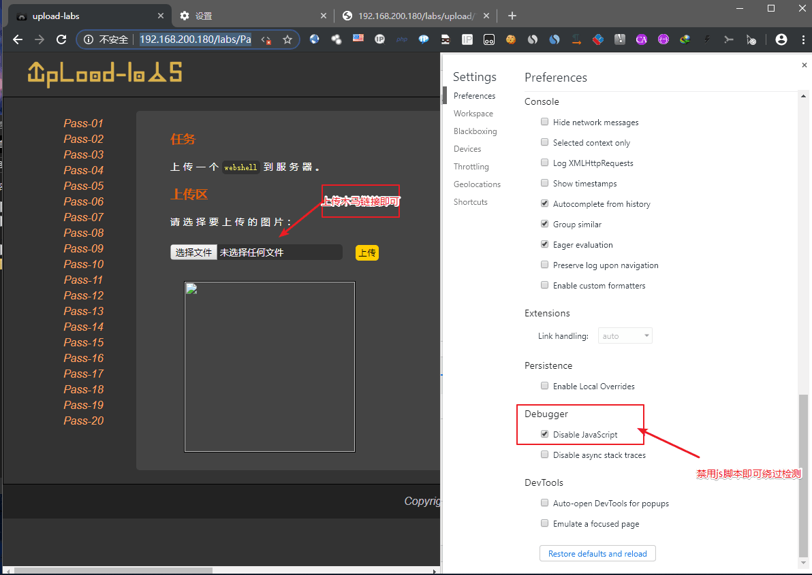
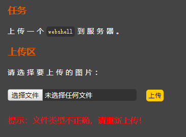
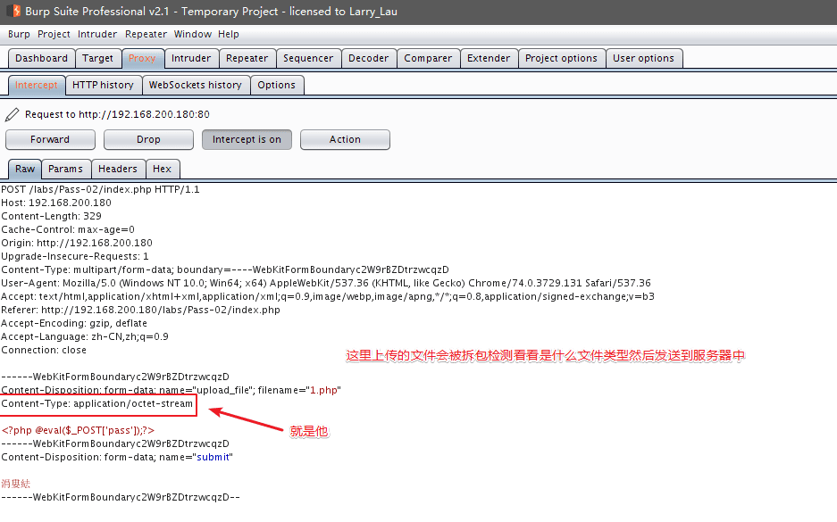
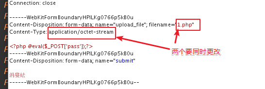

# labs

方法不唯一！！！
常用方法：

>白名单绕过：

 
--- 1、截断攻击，比如a.asp%00.gif等 ---
--- 2、.配合操作系统文件命令规则

（1）上传不符合windows文件命名规则的文件名

        　test.asp.
      　　test.asp(空格)
          test.php:1.jpg
          test.php:: $DATA


https://doge-dog.github.io/2017/12/11/file-upload/

## 第一关

页面使用的是js脚本拦截，禁用js脚本即可绕过

判断方式：在浏览加载文件，但还未`点击上传按钮时`便弹出对话框，(进一步确定可以通过配置浏览器HTTP代理（`没有流量经过代理就可以证明是客户端JavaScript检测`））内容如：只允许传.jpg/.jpeg/.png后缀名的文件，而此时并没有发送数据包。



## 第二关

http://www.lybbn.cn/data/datas.php?yw=13

先尝试提交几个空文件，发现并不是客户端的js脚本过滤。

>以为有时候仅仅对文件名后缀进行判断并不能有效阻止恶意文件的上传`（比如某服务器只允许上传jpg文件格式）`，不允许上传后缀为php等文件，但是把后缀为php改为jpg上传到服务器，某些情况下也能执行上传文件，`因此对文件格式（content-type）检测十分必要，也就是服务端MIME类型检测。`


服务器代码：

```php
$is_upload = false;
$msg = null;
if (isset($_POST['submit'])) {
    if (file_exists(UPLOAD_PATH)) {
        if (($_FILES['upload_file']['type'] == 'image/jpeg') || ($_FILES['upload_file']['type'] == 'image/png') || ($_FILES['upload_file']['type'] == 'image/gif')) {
            $temp_file = $_FILES['upload_file']['tmp_name'];
            $img_path = UPLOAD_PATH . '/' . $_FILES['upload_file']['name'];          
            if (move_uploaded_file($temp_file, $img_path)) {
                $is_upload = true;
            } else {
                $msg = '上传出错！';
            }
        } else {
            $msg = '文件类型不正确，请重新上传！';
        }
    } else {
        $msg = UPLOAD_PATH.'文件夹不存在,请手工创建！';
    }
}
```
从中不难看出是使用的MIME检测上传文件的类型的

>修改提交http头部的content-type字段信息，或者使用挂马图片（mime限制的文件类型挂马）等

步骤：

使用`burpsuite`工具的proxy代理功能，来修改文件中content-type字段值，来达到上传到服务器的目的。
先上传一个php文件尝试一下，报错如下：


使用burp拦截一下康康



把content-Type改成在服务器白名单中的类型


修改`content-type`类型为 

         image/gif
         
点击提交OK 链接木马即可。

 上传成功

## 第三关


这次是在服务器`检测了第二关的文件mine码的同时`也检测了`后缀名` 两者要`匹配`才能上传成功

服务器源代码：
```php
$is_upload = false;
$msg = null;
if (isset($_POST['submit'])) {
    if (file_exists(UPLOAD_PATH)) {
        $deny_ext = array('.asp','.aspx','.php','.jsp');
        $file_name = trim($_FILES['upload_file']['name']);
        $file_name = deldot($file_name);//删除文件名末尾的点
        $file_ext = strrchr($file_name, '.');
        $file_ext = strtolower($file_ext); //转换为小写
        $file_ext = str_ireplace('::$DATA', '', $file_ext);//去除字符串::$DATA
        $file_ext = trim($file_ext); //收尾去空

        if(!in_array($file_ext, $deny_ext)) {
            $temp_file = $_FILES['upload_file']['tmp_name'];
            $img_path = UPLOAD_PATH.'/'.date("YmdHis").rand(1000,9999).$file_ext;            
            if (move_uploaded_file($temp_file,$img_path)) {
                 $is_upload = true;
            } else {
                $msg = '上传出错！';
            }
        } else {
            $msg = '不允许上传.asp,.aspx,.php,.jsp后缀文件！';
        }
    } else {
        $msg = UPLOAD_PATH . '文件夹不存在,请手工创建！';
    }
}
```


尝试修改一下上传文件的后缀同时上传
在文件后缀加入

        %00.jpg
        比如index.php%00.jpg




上传成功。。。


## 第四关

服务器源代码：
```php
$is_upload = false;
$msg = null;
if (isset($_POST['submit'])) {
    if (file_exists(UPLOAD_PATH)) {
        $deny_ext = array(".php",".php5",".php4",".php3",".php2","php1",".html",".htm",".phtml",".pht",".pHp",".pHp5",".pHp4",".pHp3",".pHp2","pHp1",".Html",".Htm",".pHtml",".jsp",".jspa",".jspx",".jsw",".jsv",".jspf",".jtml",".jSp",".jSpx",".jSpa",".jSw",".jSv",".jSpf",".jHtml",".asp",".aspx",".asa",".asax",".ascx",".ashx",".asmx",".cer",".aSp",".aSpx",".aSa",".aSax",".aScx",".aShx",".aSmx",".cEr",".sWf",".swf");
        $file_name = trim($_FILES['upload_file']['name']);
        $file_name = deldot($file_name);//删除文件名末尾的点
        $file_ext = strrchr($file_name, '.');
        $file_ext = strtolower($file_ext); //转换为小写
        $file_ext = str_ireplace('::$DATA', '', $file_ext);//去除字符串::$DATA
        $file_ext = trim($file_ext); //收尾去空

        if (!in_array($file_ext, $deny_ext)) {
            $temp_file = $_FILES['upload_file']['tmp_name'];
            $img_path = UPLOAD_PATH.'/'.$file_name;
            if (move_uploaded_file($temp_file, $img_path)) {
                $is_upload = true;
            } else {
                $msg = '上传出错！';
            }
        } else {
            $msg = '此文件不允许上传!';
        }
    } else {
        $msg = UPLOAD_PATH . '文件夹不存在,请手工创建！';
    }
}
```
在源代码中可知，使用了后缀黑名单，也就是检测后缀是否为常规木马文件后缀，所以依然可以使用抓包，改mime和改文件后缀的方法上传

>方法和第三步相同 


略

## 第五关

服务器源代码：
```php
$is_upload = false;
$msg = null;
if (isset($_POST['submit'])) {
    if (file_exists(UPLOAD_PATH)) {
        $deny_ext = array(".php",".php5",".php4",".php3",".php2",".html",".htm",".phtml",".pht",".pHp",".pHp5",".pHp4",".pHp3",".pHp2",".Html",".Htm",".pHtml",".jsp",".jspa",".jspx",".jsw",".jsv",".jspf",".jtml",".jSp",".jSpx",".jSpa",".jSw",".jSv",".jSpf",".jHtml",".asp",".aspx",".asa",".asax",".ascx",".ashx",".asmx",".cer",".aSp",".aSpx",".aSa",".aSax",".aScx",".aShx",".aSmx",".cEr",".sWf",".swf",".htaccess");
        $file_name = trim($_FILES['upload_file']['name']);
        $file_name = deldot($file_name);//删除文件名末尾的点
        $file_ext = strrchr($file_name, '.');
        $file_ext = str_ireplace('::$DATA', '', $file_ext);//去除字符串::$DATA
        $file_ext = trim($file_ext); //首尾去空

        if (!in_array($file_ext, $deny_ext)) {
            $temp_file = $_FILES['upload_file']['tmp_name'];
            $img_path = UPLOAD_PATH.'/'.date("YmdHis").rand(1000,9999).$file_ext;
            if (move_uploaded_file($temp_file, $img_path)) {
                $is_upload = true;
            } else {
                $msg = '上传出错！';
            }
        } else {
            $msg = '此文件类型不允许上传！';
        }
    } else {
        $msg = UPLOAD_PATH . '文件夹不存在,请手工创建！';
    }
}
```

这次服务器代码中禁用了一系列已：.php",".php5",".php4",".php3",".php2",".html",".htm",".phtml",".pht",".pHp",".pHp5",".pHp4",".pHp3",".pHp2",".Html",".Htm",".pHtml",".jsp",".jspa",".jspx",".jsw",".jsv",".jspf",".jtml",".jSp",".jSpx",".jSpa",".jSw",".jSv",".jSpf",".jHtml",".asp",".aspx",".asa",".asax",".ascx",".ashx",".asmx",".cer",".aSp",".aSpx",".aSa",".aSax",".aScx",".aShx",".aSmx",".cEr",".sWf",".swf",".htaccess结尾的文件但是，我们依然可以用修改文件后缀名的方法绕过，依然可以上传成功！方法和第四关相同。但是与第四关不一样的是多了很多过滤！你依然可以绕过！


## 第六关

```php
$is_upload = false;
$msg = null;
if (isset($_POST['submit'])) {
    if (file_exists(UPLOAD_PATH)) {
        $deny_ext = array(".php",".php5",".php4",".php3",".php2",".html",".htm",".phtml",".pht",".pHp",".pHp5",".pHp4",".pHp3",".pHp2",".Html",".Htm",".pHtml",".jsp",".jspa",".jspx",".jsw",".jsv",".jspf",".jtml",".jSp",".jSpx",".jSpa",".jSw",".jSv",".jSpf",".jHtml",".asp",".aspx",".asa",".asax",".ascx",".ashx",".asmx",".cer",".aSp",".aSpx",".aSa",".aSax",".aScx",".aShx",".aSmx",".cEr",".sWf",".swf",".htaccess");
        $file_name = $_FILES['upload_file']['name'];
        $file_name = deldot($file_name);//删除文件名末尾的点
        $file_ext = strrchr($file_name, '.');
        $file_ext = strtolower($file_ext); //转换为小写
        $file_ext = str_ireplace('::$DATA', '', $file_ext);//去除字符串::$DATA
        
        if (!in_array($file_ext, $deny_ext)) {
            $temp_file = $_FILES['upload_file']['tmp_name'];
            $img_path = UPLOAD_PATH.'/'.date("YmdHis").rand(1000,9999).$file_ext;
            if (move_uploaded_file($temp_file,$img_path)) {
                $is_upload = true;
            } else {
                $msg = '上传出错！';
            }
        } else {
            $msg = '此文件不允许上传';
        }
    } else {
        $msg = UPLOAD_PATH . '文件夹不存在,请手工创建！';
    }
}
```
这里只是多了大小写的过滤 依然可以通过第一位1大写第三位大写绕过，步骤略。

## 第7步

```php
$is_upload = false;
$msg = null;
if (isset($_POST['submit'])) {
    if (file_exists(UPLOAD_PATH)) {
        $deny_ext = array(".php",".php5",".php4",".php3",".php2",".html",".htm",".phtml",".pht",".pHp",".pHp5",".pHp4",".pHp3",".pHp2",".Html",".Htm",".pHtml",".jsp",".jspa",".jspx",".jsw",".jsv",".jspf",".jtml",".jSp",".jSpx",".jSpa",".jSw",".jSv",".jSpf",".jHtml",".asp",".aspx",".asa",".asax",".ascx",".ashx",".asmx",".cer",".aSp",".aSpx",".aSa",".aSax",".aScx",".aShx",".aSmx",".cEr",".sWf",".swf",".htaccess");
        $file_name = trim($_FILES['upload_file']['name']);
        $file_ext = strrchr($file_name, '.');
        $file_ext = strtolower($file_ext); //转换为小写
        $file_ext = str_ireplace('::$DATA', '', $file_ext);//去除字符串::$DATA
        $file_ext = trim($file_ext); //首尾去空
        
        if (!in_array($file_ext, $deny_ext)) {
            $temp_file = $_FILES['upload_file']['tmp_name'];
            $img_path = UPLOAD_PATH.'/'.$file_name;
            if (move_uploaded_file($temp_file, $img_path)) {
                $is_upload = true;
            } else {
                $msg = '上传出错！';
            }
        } else {
            $msg = '此文件类型不允许上传！';
        }
    } else {
        $msg = UPLOAD_PATH . '文件夹不存在,请手工创建！';
    }
}
```
只过滤了php等文件的大小写，抓包改后缀依然可以绕过
和前面步骤相同 

略


## 第8关

NTFS文件系统包括对备用数据流的支持。 是主要提供文件中的兼容性。备份数据流。每个文件中至少有一个数据流。
在
上传的时候输入

        1.php::$DATA绕过

(windows限定)


## 第9关


10关

略

## 第11关

https://www.kanxue.com/book-6-235.htm

服务器代码
```php
$is_upload = false;
$msg = null;
if(isset($_POST['submit'])){
    $ext_arr = array('jpg','png','gif');
    $file_ext = substr($_FILES['upload_file']['name'],strrpos($_FILES['upload_file']['name'],".")+1);
    if(in_array($file_ext,$ext_arr)){
        $temp_file = $_FILES['upload_file']['tmp_name'];
        $img_path = $_GET['save_path']."/".rand(10, 99).date("YmdHis").".".$file_ext;

        if(move_uploaded_file($temp_file,$img_path)){
            $is_upload = true;
        } else {
            $msg = '上传出错！';
        }
    } else{
        $msg = "只允许上传.jpg|.png|.gif类型文件！";
    }
}
```

这里使用一开始提到的白名单绕过
使用截断方法

        1、截断攻击，比如a.asp%00.gif等

## 第13-15关图片马

```php
function getReailFileType($filename){
    $file = fopen($filename, "rb");
    $bin = fread($file, 2); //只读2字节
    fclose($file);
    $strInfo = @unpack("C2chars", $bin);    
    $typeCode = intval($strInfo['chars1'].$strInfo['chars2']);    
    $fileType = '';    
    switch($typeCode){      
        case 255216:            
            $fileType = 'jpg';
            break;
        case 13780:            
            $fileType = 'png';
            break;        
        case 7173:            
            $fileType = 'gif';
            break;
        default:            
            $fileType = 'unknown';
        }    
        return $fileType;
}

$is_upload = false;
$msg = null;
if(isset($_POST['submit'])){
    $temp_file = $_FILES['upload_file']['tmp_name'];
    $file_type = getReailFileType($temp_file);

    if($file_type == 'unknown'){
        $msg = "文件未知，上传失败！";
    }else{
        $img_path = UPLOAD_PATH."/".rand(10, 99).date("YmdHis").".".$file_type;
        if(move_uploaded_file($temp_file,$img_path)){
            $is_upload = true;
        } else {
            $msg = "上传出错！";
        }
    }
}
```


在cmd中使用

        copy smi1e.jpg /b + shell.php /a shell.jpg


.php
.php5
.php4
.php3
.php2
.html
.htm
.phtml
.pht
.pHp
.pHp5
.pHp4
.pHp3
.pHp2
.Html
.Htm
.pHtml


