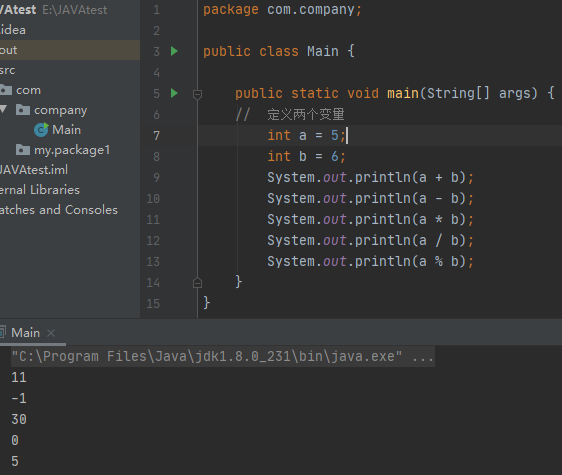

# JAVA


<p align="center">
    
</p>

<p align="center">👴 如果黑夜不再点亮,我会奔向你迷失的方向.</p>
<p align="center"><a href="http://music.163.com/song?id=1824450519"><font>《自发光》</font></a> </p>
<p align="center">专辑：自发光</p>
<p align="center">歌手：南游记乐队</p>


> 最近比较喜欢的一首歌...

IDEA使用教程: https://www.cnblogs.com/zyx110/p/10666082.html


## 第一个程序

### 打印函数

```java
package com.company;

public class Main {

    public static void main(String[] args) {
	// write your code here
        System.out.println("hello world");
    }
}
```

## 常数

**常量**: 在程序运行过程中，其值不可以发生改变的量。

 |**常量的分类**|表示含义                              |
 |----------------|----------------------------------- |
 |**字符串常量：**| 用双引号括起来的内容，"Hello world"  |
 |**整数常量：**  |不带小数的数字。'666-888'            |
 |**小数常量：**  |带小数的数字。 13.14，1.12           |
 |**字符常量：**  |用单引号括起来的内容。'A','0','我'    |
 |**布尔常量：**  |布尔值，表示真假。true，false         |
 |**空常量：**    | 一个特殊的值，空值                   |

#### 常见字符串类型


#### 变量

**变量定义**

```java
数据类型    变量名  =   变量值
int         a      =    10;
```

**基本数据类型**

```
byte,short,int,long,float,double,char,boolean
```

**变量的使用**

取值格式：变量名
修改格式：变量名 = 变量值；


**自动类型转换**


把一个表述数据`范围小的数值`或者`变量`赋值给另外一个表示数据 `范围大的变量`

```java
package com.company;

public class Main {

    public static void main(String[] args) {
//        自动类型转换
        double d = 10;
        System.out.println(d);
    }
}
```


**定义byte类型的变量**

```java
    public static void main(String[] args) {
//        定义byte 类型的变量
        byte b = 10;
        short s = b;
        int i = b;
    }
```

数据类型不兼容时无法进行转换

**强制类型转换**

```java
package com.company;

public class Main {

    public static void main(String[] args) {
//            强制类型转换
        int k = (int)88.88;
        System.out.println(k);
    }
}
```

> 将浮点型数据类型转换为 int型

### 运算符和表达式

常见的 `加减乘除取余`



```java
package com.company;

public class Main {

    public static void main(String[] args) {
    //  定义两个变量
        int a = 5;
        int b = 6;
        System.out.println(a + b);
        System.out.println(a - b);
        System.out.println(a * b);
        System.out.println(a / b);
        System.out.println(a % b);
    }
}
```

`严格的数据类型校验` 当整数相除时只能得到整数，如果想要得到小数，此时必须有浮点型的参与。


