# Mysql 扩展连接

php针对mysql数据库操作进行的拓展：

允许php当作mysql的一个客户端连接服务器进行操作。

## 与数据库连接

- 1.使用 `mysqli` 进行数据库对象的连接。
- 面向过程的

```php

//建立数据库连接
// 1.主机地址：默认是自动连接端口3306
$mysqli = mysqli_connect('localhost:3306','root','123123'); // user  //password
$mysqli->set_charset('UTF-8'); // 设置数据库字符集
$result = $mysqli->query('select * from customers'); //查询数控表中的xxx数据
$data = $result->fetch_all(); // 从结果集中获取所有数据
print_r($data);//返回一个值为 $data
```
最常见的数据库连接

---


- 2. 使用 `mysqli` 进行数据库对象的连接。
- 面对对象的

```php
$mysqli = @new Mysqli($serve,$username,$password,$dbname);

if($mysqli->connect_error){//如果连接错误就会提示错误信息
	die('连接错误:'.$mysqli->connect_errno);
}
$mysqli->set_charset('UTF-8'); // 设置数据库字符集

$result = $mysqli->query('select * from customers');
$data = $result->fetch_all(); // 从结果集中获取所有数据
print_r($data);


```

此处添加了一个报错，有反馈信息的。所以偏向于对象

---

- 3. 使用 `PDO` 连接数据库


```php
<?php
$serve = 'mysql:host=localhost:3306;dbname=examples;charset=utf8'; //设置数据库信息
$username = 'root';
$password = 'root';

try{ // PDO连接数据库若错误则会返回一个PDO Exception 异常
	$PDO = new PDO($serve,$username,$password);//设置值
	$result = $PDO->query('select * from customers');
	$data = $result->fetchAll(PDO::FETCH_ASSOC); // PDO::FETCH_ASSOC表示将对应结果集中的每一行作为一个由列名索引的数组返回
	print_r($data);
} catch (PDOException $error){
	echo 'connect failed:'.$error->getMessage();
}

 ?>
```

### 区别

1. PDO 这种连接方法，可以连接12种数据库，然而mysqli只能连接MYSQL及其分支，例如MariaDB，Oracle。


2. 如果在你的项目中有切换连接不同数据库的需求，你可以考虑下PDO，那将会让过程变得很简单，只需要重写一些查询命令，但是如果你用的mysqli，那你可能要重构整个代码。
两者都支持面向对象，但是mysqli还支持面向过程


3. 都支持预编译语句，都可以很好防止mysql注入，大大提高了项目的安全性

可得出，如果需要跟高的拓展性，或者更高的性能可以使用 `POD` 连接数据库。


###  选择数据库

```php
$sql = 'use news'; //编写连接数据库的语句
mysqli_query($link,$sql); //设置数据库连接
```


### 与数据库交互的函数


`mysqli_query(); — 对数据库执行一次查询`

```php
$obj = mysqli_connect('127.0.0.1','root','root'); //对数据库连接
$sql = "set name utf8"; //设置编码
$return = mysqli_query($obj,$sql); //查询并返回是否成功
print_r($return);
```


### 关闭连接

mysqli的关闭连接和PDO都会在程序结束后自动关闭，如果想提前关闭可以使用以下方法。

```php

$conn->close(); //面向对象的mysqli


mysqli_close($conn);  // 面向过程的mysqli


$conn = null; // PDO

```


---


## 注意！

 原 MYSQL操作执行代码仅支持在 PHP5和以下使用

 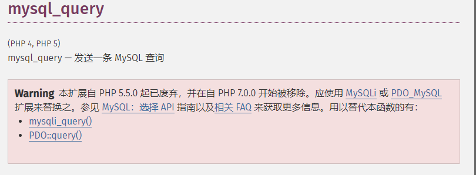

 在mysql5.5和7.0及以上版本都应该替换成  `mysqli` 来执行数据库连接增删改操作。

若返回值为true 则为执行成功
若返回值为false 则有两种可能， 第一种是sql查询语法错误，第二种是执行失败。


---

## 创建Mysql数据库。

```sql
create database News charset utf8;   --先输入。 新建一个表为News 编码为utf8。


-- 在News数据库开启命令行输入以下表格文件。
create table n_news(
id int primary key auto_increment, 
title varchar(50) not null comment '新闻标题',
isTop tinyint not null comment '是否置顶',
content text comment '内容',
publiser varchar(20) not null comment '发布人',
pub_time int not null comment '发布时间'
)charset utf8;

```

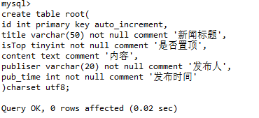


---

如果每次连接都要初始化那就很麻烦。

不然每次都有特别要打个新建就很麻烦，所以就建立一个脚本来初始化数据库。

`若之后要操作数据库则包含该脚本即可。`


---


## 数据库连接成功后

```php
$conn ->options(MYSQLI_OPT_CONNECT_TIMEOUT,5);//设置超时时间倒计时。
echo '</br>';
echo $conn->character_set_name()."</br>"; //获取数据库编码信息
echo $conn->get_client_info()."</br>"; // 获取数据库版本信息
echo $conn->host_info.'</br>';// 获取主机信息
echo $conn->server_info."</br>";//获取数据库属性
echo $conn->server_version.'</br>';//获取数据库版本

```

---


## 与数据库的交互     ---     触发器

由某一种操作，来触发执行一段 `SQL` 代码,此处的印象无非就是。

```sql
update

insert

delete
```


> 也就是常说的 `增 删 改`。

 `四个因素`

1. 事件： update / insert / delete
           更新    修改      删除

2. 时间    befor /after    
         //事件完成前/后

3. 对象   table  
         //表

4. 范围   for each row
         //行级触发器；行触发器；每一行

---

create triggger 触发器名称  时机   事件  on  表  for each row
  //函数        命名        时间                   一行

---

补充说明：

查询需求：如果执行成功返回是一个 `结果集` 资源。


如果结果集资源并不是数据。


---


## 文件管理

PHP提供了一套文件操作系统函数.通过这些函数可以进行文件管理，创建和删除文件等操作。

文件的理解：
对于 `windows系统` 来说文件就只有两种区别  : `文件`   和    `文件夹`。
										存储数据		  存储文件


## 文件相关信息函数

## **file_exists($filename);** 判断文件是否存在。

说明:
	用于判断一个文件是否存在

	filename     是一个表示文件完整名的一个字符串，可以是绝对路径也可以是相对路径。

**实列**：

```php
<?php
header('Content-type:text/html;charset=utf-8');
// include_once 'link_mysql.php';

$file1= '1.txt';
$file1 = file_exists($file1);
echo $file1;

if($file1 == false){
    echo  'nmsl大傻逼乱输入些什么垃圾东西';

}else{
    echo 'nmd文件不就在下面吗：';
    include_once $file1; //包含进来
}
;
```

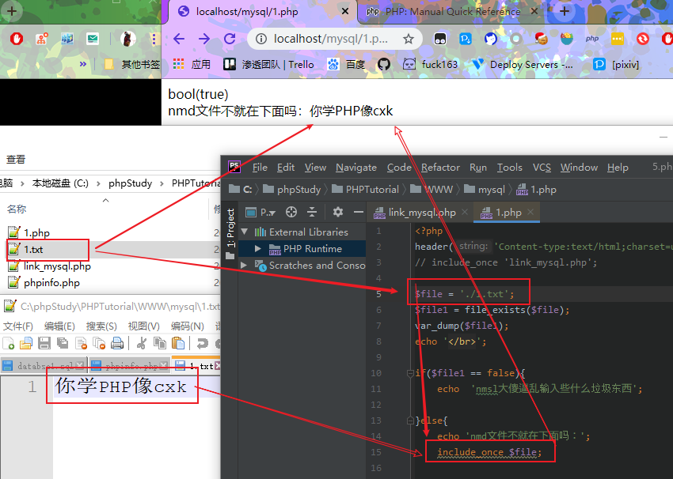


## **filetime($filename);**   查看文件最后修改时间。


**实例**

```php
<?php
header('Content-type:text/html;charset=utf-8');
// include_once 'link_mysql.php';

$file1= '1.txt';
$file1 = filetime($file1);
echo date('Y-m-d H:i:s',$time);

if($file1 == false){
    echo  'nmsl大傻逼乱输入些什么垃圾东西';

}else{
    echo 'nmd文件不就在下面吗：';
    include_once $file1; //包含进来
}
;
```


##  filesize($file1);   查看文件在系统中的大小。

**实列**

```php
<?php
header('Content-type:text/html;charset=utf-8');
// include_once 'link_mysql.php';

$file1= '1.txt';
$file1 = filesize($file1);
echo $file1;

if($file1 == false){
    echo  'nmsl大傻逼乱输入些什么垃圾东西';

}else{
    echo 'nmd文件不就在下面吗：';
    include_once $file1; //包含进来
}
;
```


## basename(path);     获取文件名

**实例**   用来获取文件名

```php
$file1= '1.txt';
$file1 = basename($file1);
echo $file1;
```


## realpath($path);    文件的真实路径

```php
$path= '1.txt';
$path1 = basename($file1);
var_dump($path);
```
用于判断文件路径是否真实存在。


---


## 文件的写入和读取


## fwrite(handle,data);    文件的写入


**实例**
 对于文件的写入

```php
<?php
header('Content-type:text/html;charset=utf-8');
// include_once 'link_mysql.php';


$id = null;
$file1 = $_GET["id"]; //get ID的值
$file = './1.txt'; //文件路径
$handle = fopen($file,'r+'); //打开文件路径或文件url, 'r+'以读写的方式打开文件。
$return = fwrite($handle,$file1); //对文件进行写入
var_dump($return);//输出文件写入多少值


if($file1 == false){
    echo  'nmsl大傻逼乱输入些什么垃圾东西';

}else{
    echo 'nmd文件不就在下面吗：';
    include_once $file; //包含进来
}
;
```

我们来分别解析一下 `fopen` 是如何打开文件的

|  代码   | 如何打开  | 如果文件不存在  | 如果文件存在
|------|-------------|---------------|------
|r    | 以只读的方式打开| `如果文件不存在则报错`  |        写入是 `覆盖` 写入          |
|r+   | 以读写的方式打开| `如果文件不存在则报错`  |       写入是 `覆盖` 写入         |
|w   | 以写的方式打开文件| **如果文件不存在则创建文件**| 如果文件存在则 `会` 清空文件 |
|w+   | 以读写的方式打开文件|   **如果文件不存在则创建文件**| 如果文件存在则 `会` 清空文件 |
|a   | 以追加的方式打开文件| **如果文件不存在则创建文件**| 如果文件存在， `并不会` 清空文件 |
|a+   | 以追加和读的方式打开文| **如果文件不存在则创建文件**| 如果文件存在， `并不会` 清空文件 |


**fopen**

 函数可以理解为 `file open ` 打开一个文件的缩写


1. fgetc(handle); 是fopen函数的返回值资源中的一种。

每次从 `handle` 中所代表的文件中读取一个字符。

```php
<?php
header('Content-type:text/html;charset=utf-8');
// include_once 'link_mysql.php';


$id = null;
//$file1 = $_GET["id"];
$file = './1.txt';

$handle = fopen($file,'r+');
//$return = fwrite($handle,$file1);
echo fgetc($handle),'</br>'//输出文件的第一个字符

```


2. fget(handle,[len])

说明： 

|handle |是fopen函数的返回资源类型。|
|-------|----
|len   |读取表示字节个数， `当遇到换行回车的时候会结束读取` ，默认值为 `1024` 。|

```php
<?php
header('Content-type:text/html;charset=utf-8');
// include_once 'link_mysql.php';


$id = null;
//$file1 = $_GET["id"];
$file = './1.txt';

$handle = fopen($file,'r+');
//$return = fwrite($handle,$file1);
echo fgetc($handle,3),'</br>'
```


3. fgetread(handle,len)

说明：

|handle  | 是fopen函数返回的资源类型
|-------|-------
|len     | 表示读取的字节数，不可省略，`当遇到换行回车的时候会继续读取至结束` 


4. file(filename)

说明：
 filename 用于表示文件的字符串

 因为是字符串所以需要使用 `print_r` 来输出。

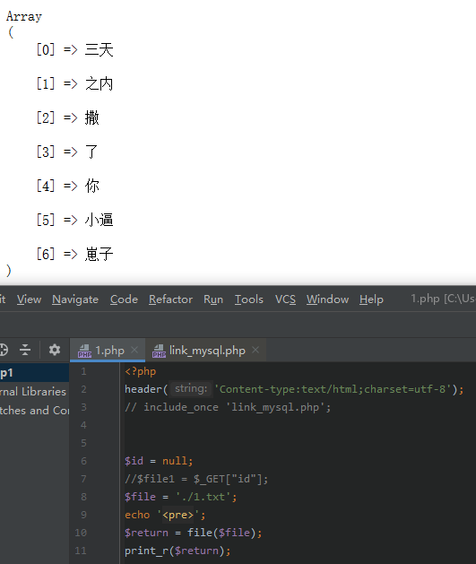

```php

<?php
header('Content-type:text/html;charset=utf-8');
// include_once 'link_mysql.php';


$id = null;
//$file1 = $_GET["id"];
$file = './1.txt';
echo '<pre>';
$return = file($file);
print_r($return);

```


5. readfile($file); 单纯的提取文件中的内容，输出不为数组。


实例：

```php
<?php
header('Content-type:text/html;charset=utf-8');
// include_once 'link_mysql.php';


$id = null;
//$file1 = $_GET["id"];
$file = './1.txt';
echo '<pre>';
$return = readfile($file);
print_r($return);
```

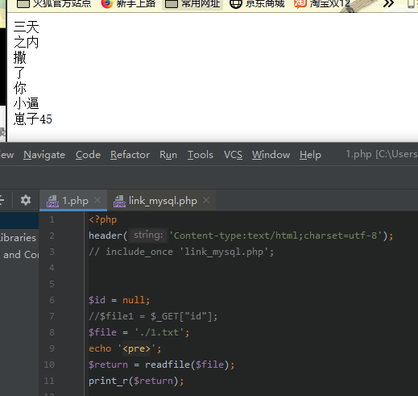

6. file_get_contents; 获取文件的字符串

```php
$file = './1.txt';
echo '<pre>';
$return = file_get_contents($file); //表示文件的字符串，不需要打开文件，一次性将文件中的所有东西都读取出来。
print_r($return);
```


---


## 拷贝文件 

copy(source,dest)

用于辅助一个文件：

source   原文件

dest     目标文件

```php
$file = './1.txt';
echo '<pre>';
$return = copy(($file); //表示删除这个文件。
var_dump($return);
```

---


## 删除文件

**unlink(filename);**

说明: filename    用于个表示文件的字符串

    用于删除文件   

```php
$file = './1.txt';
echo '<pre>';
$return = unlink($file); //表示删除这个文件。
var_dump($return);
```


---


## 文件的判断

**if_file(filename);**

说明:主要用于判断文件是文件夹还是文件，顺便还可以判断文件是否存在。


```php
$file = './1.txt';
echo '<pre>';
$return = if_file(($file); //表示删除这个文件。
var_dump($return);
```

---


# 文件目录的操作

**创建目录** 

mkdir(path[mode])


---


##  遍历文件夹


**scandir($file);** 遍历文件

```php
<?php
header('Content-type:text/html;charset=utf-8');
// include_once 'link_mysql.php';

//如果是文件夹继续输出子文件中的所有内容
$dir = "img";
//$file1 = $_GET["id"];
function get1($dir){
    $arr = scandir($dir);
    foreach ($arr as $v){
        $item = $dir.'/'.$v;  //判断文件是否是文件夹
        if(is_dir($item)){
            echo '<font color="red">'.$item.'</font>','<br/';
//如果是文件夹就继续遍历文件夹
        }
        else{
            echo '<font color="yellow">'.$item.'</font>','<br/';

        }    }

}
get1($dir);
```

**HTTP**

> 通过content-type,来设置返回值的数据类型。


**PHP操作HTTP响应头**

默认HTTP协议的响应头是由web服务器自动组织的，

PHP为我们提供了一个设置HTTP响应的协议头的函数：`header`

示例:
- `header('Content-type:text/html;charset=utf-8');`

1. 设置响应的数据的格式  (Content-type:text/html)

2. 设置浏览器的显示编码。 (charUTF-8)


`header('location:url');`
3. 用于进行跳转 
    语法：header('location:url');
    说明：url 所要跳转的网页。


4. 通过协议头告诉浏览器，将要发送给你的数据，作为附件下载。

header('Content-disposition:attachment;filname=game.jpg');


5. 读取所要发送的文件内容，并发送给客户端。

```php
$content = file_get_contents('123.jpg');
echo $content;
```

---

# 数据采集   --仅供了解

-  什么是数据采集，有些数据的获取成本是巨JB高的。所谓的数据的收集就是将别人的网站中的数据，为我们所用。
`(A君：抄就完事了。)`

**curl函数的介绍：**

`Command Url`

是一个代码版的浏览器。允许我们在代码中像浏览器一样访问别人的页面。
> 默认PHP是并没有开启对 `Curl` 的支持的，需要我们到配置文件中手动开启。

到你当前选用版本的 PHP.ini中开启


若开启后也无法使用，需要将PHP目录中的文件 `libeay32.dll、libssh2.dll、ssleay32.dll、php5ts.dll`,复制到apache的bin目录中

---


## curl函数的使用

1. 初始化curl
语法：
    curl_init()

说明：初始化curl功能


2. 设置curl的参数

语法：
`curl_setopt(curl,参数名，参数值);`

说明：
-  curl   就是curl_init的返回值
-  参数名   参数都是以常量的形式设计的
-  CURLOPT_URL     用于设置所请求的网址。

示例：
`curl_setopt($ci,CURLOPT_URL，'https://www.baidu.com');`


3. 执行curl(回车);
语法:
    `curl_exec(curl)` 

说明：
    参数 curl 就是 curl_init 的返回值，
    用于执行某个 curl 工具


## 用于模拟 `GET` 请求


## 用于模拟 `POST` 请求


---

# 会话技术

用于`HTTP` 是`无状态无连接`的，所以http无法记住客户端的信息。为了弥补HTTP协议的两点`不足` ，所以出现了会话技术。


## 会话 技术


### COOKIE

-[cookie设置和属性](https://juejin.im/post/59d1f59bf265da06700b0934)


1. 什么是 `cookie` 

在服务器端，将能够唯一识别用户的数据保存到客户端的一种方法。之后浏览器在每次请求的时候都会自动携带给服务器。


2. **设置cookie**

语法：

```php
setcookie(name,value[,expire[,path[,domain[,secure[,httponly]]]]]);   //[为选填]
        // 命名  值    有效期    路径   域       协议   访问控制 
```

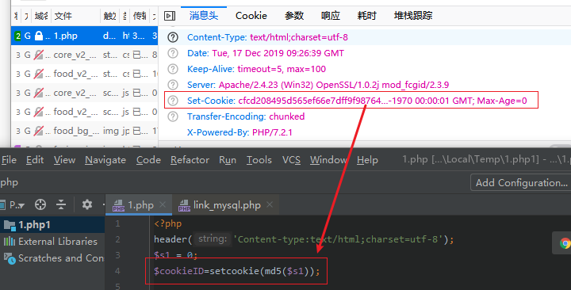


**获取cookie**
```php
<?php 
require("config.php");//引入配置
//获取用户信息 
$user_id = isset($_COOKIE['user_id']) ? $_COOKIE['user_id'] : 0;
$user_name = $_COOKIE['user_name'];
$user_type = $_COOKIE['user_type']; 
$type_name = $_COOKIE['type_name'];
```


3. **读取cookie**

`$_COOKIE `  就是一个关联数组。主要用于存客户端通过 ` cookie技术提交` 的数据.

$_COOKIE 也是一个php自带函数。


4. **cookie的过期时间**

`setcookie(name,value,expire)`

`expire`是用于设置cookie的过期时间的,时间是用秒来记录的，若不设置则有效期的起点是时间的原点，即`1970年 00:00:00`。

`如果省略表示会话的cookie的expire的值，则cookie的有效期为到浏览器关闭为止。`

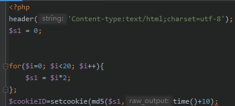

设置`cookie`的有效期为，浏览器运行后加10秒为止。


**Cookie失效的时间，单位`秒`。**

如果为正数，则该Cookie在maxAge秒之后失效。
如果为负数，该Cookie为临时Cookie，关闭浏览器即失效，浏览器也不会以任何形式保存该Cookie。

`如果为0，表示删除该Cookie。`
默认为`–1`


在java中设置cookie时效单位为毫秒，当绝对值小于-1000的时候，会默认0，所以如果需要设置为永久，需要复制-1000
`所以JESSIONID没有时间，即默认-1，在浏览器打开期间存在。`


**设置永久cookie**
 
对于永久cookie我们用了 `Fri, 31 Dec 9999 23:59:59 GMT` 作为过期日。
所以  过期时间是  `9999年12月31日` ; 


如果你不想使用这个日期，可使用 `世界末日 Tue, 19 Jan 2038 03:14:07 GMT`，它是32位带符号整数能表示从1 January 1970 00:00:00 UTC开始的最大秒长(即01111111111111111111111111111111, 是 new Date(0x7fffffff * 1e3))。


5. **cookie的路径**

cookie的默认路径为网页的相对路径。

可以通过 `path` 设置更改。

`setcookie(name,value,expire,path)` 

path是用于设置cookie在浏览器的设置。

这时候，如果客户端的cookie的显示路径是所请求的php文件的 `父路径` 则会被携带过去。


这就可以解释为什么，你访问一个网页的父路径会带上子路径的cookie。如果父路径也设置了自己的cookie，则cookie的值会很长，即为 `父路径+子路径`。

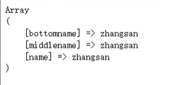

**使用 `$_COOKIE` 函数显示出函数的值。**


**最骚的是还不能删**

所以，绝大多数的情况是将一个cookie设置为 `整站的cookie` 。


`setcookie(name,value,expire,'/')` 
要在cookie中设置一个整站cookie的路径即可实现单cookie控制。

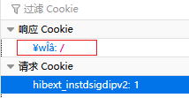


6. **`Cookie浏览器端的处理`**

- cookie是浏览器的一个功能，也可以被禁止。如果cookie被禁止，如何实现session功能。
 


1. 设置不仅仅使用cookie保存 `session ID`

 


2. 设置可以使用 `trans_sid` 保存 `Session ID`


在3里设置session ID 连接到 `2.php` 中，在 `2.php` 中添加 `print_r($_SESSION)` 函数。


### SESSION


**Session生命周期**

session的生命周期结束。（默认20分钟，每次访问自动刷新）
调用Session的invalidate方法销毁。
若不想每过一段时间需要自动登录，又不想太危险，可是设置为24小时.


**Session文件的垃圾回收机制**

对于session文件可以设置一个有效期，`默认设置如下`

 

意思是如果一个session文件在 `1440` 秒内没有被访问那就算过期。

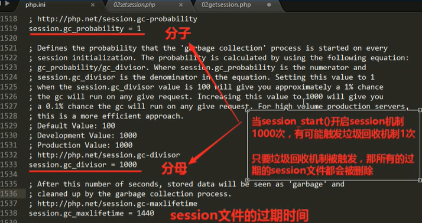 


session 形成的过程：
    PHP在启动的过程中会检测到 sessionid，当客户端请求了某个PHP文件时，`session` 机制会自动查找到当前的 `PHP` 文件中是否有a链接，如果有就在URL后门加 **？PHPSESSION= 当前的session值。** 

**(A君：其实如果当成get来记会很好记。)**

在设置之后，所有的文件都必须先验证 `session` 的值。


### COOKIE 和 SESSION的区别

会话技术： 
    http协议是无连接，无状态的，为了弥补这个不足，才会有会话技术。

`cookie`：
        以http协议为基础，服务器端将数据存储在客户端(可理解为客户浏览器)。

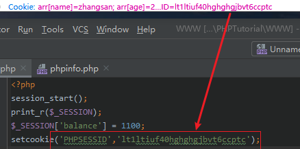 

但是你无法直接读取出其中的数据，打个比方:


如果cookie的值是： `name = xiz，id = 1；`
你无法直接从其中获取出有用的数据。只是id是 `1234`.无法分析出数据。因为重要数据保存在服务器上。


 


`SESSION`:

（A君：你客户端想要访问那个文件我客户端直接给你就好了。）


13 6.5 11 
---


## 如何实现

```mysql
create database News charset utf8; //新建一个库
create table users(id int unsigned primary key auto_increment,u_name varchar(32),u_pwd varchar(128))charset utf8; //创建一个表
insert into users values(default,'admin',md5('123'));
```


设置获取数据的php。

```php
<?php

if(!isset($_SESSION['userInfo'])){ //session维持
    header('localhost:/denglu/1.html');//如果是其他session会话就回返回到主页
    exit;
}

$u_name = $_POST['username'];   //获取用户输入的账号
$u_pwd = $_POST['password'];   //获取用户输入的密码
$varify = $_POST['varify'];

$obj = mysqli_connect('localhost','root','root');
$sql = "set name utf8";
$return = mysqli_query($obj,$sql);

$sql = "use news";
$return = mysqli_query($obj,$sql);
$u_pwd = md5($u_pwd);
$sql = "select * from users where u_name='$u_name' && u_pwd ='$u_pwd'";
$result = mysqli_query($obj,$sql);

if($userInfo){  //用户登录的函数
    $_SESSION['userInfo'] = $userInfo;
    header('localhost:/denglu/2.html'); //进入到登陆后的界面
}else{
    header('localhost:/denglu/1.html'); //返回原界面。
}

?>


```

**登录界面**

```html
<!DOCTYPE html>
<html>
<head>
 <title>用户登录页面</title>
 <meta charset="UTF-8"/>
 <style type="text/css">
 *{margin:0px;padding:0px;}
 ul{
 width:400px;
 list-style:none;
 margin:50px auto;
 }
 li{
 padding:12px;
 position:relative;
 }
 label{
 width:80px;
 display:inline-block;
 float:left;
 line-height:30px;
 }
 input[type='text'],input[type='password']{
 height:30px;
 }
 img{
 margin-left:10px;
 }
 input[type="submit"]{
 margin-left:80px;
 padding:5px 10px;
 }
 </style>
</head>
<body>
 <form action="4.php" method="post">
 <ul>
 <li>
 <label>用户名：</label>
 <input type="text" name="username" id ="username" placeholder="请输入注册账号"/>
 </li>
  <li>
   <label>密 码：</label>
   <input type="password" name="password" id = "password" placeholder="请输入密码" />
  </li>
  <li>
   <label>名称：</label>
   <input type="text" name="varify" id= "varify" placeholder="请输入密码" />
  </li>

 <li>
 <input type="submit" value="登录" />
 </li>
 </ul>
 </form>
</body>
```


