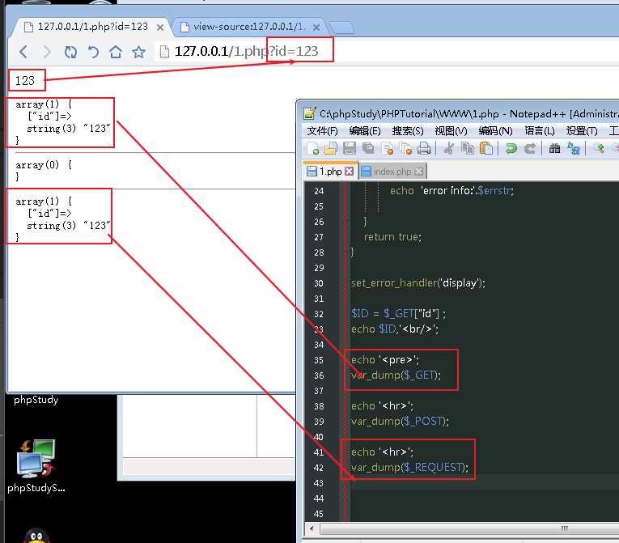
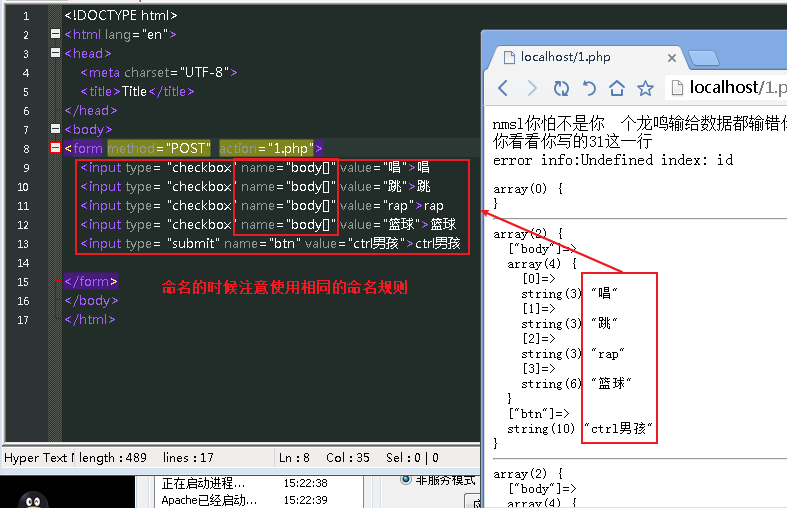
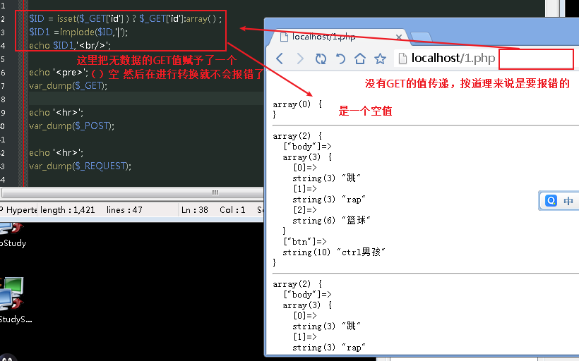
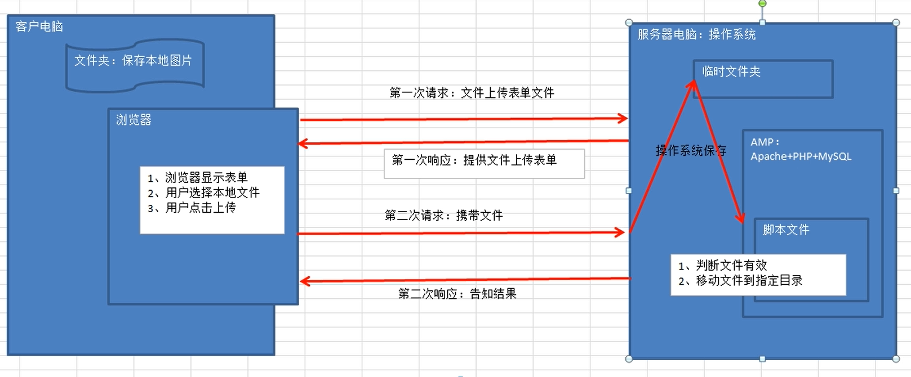
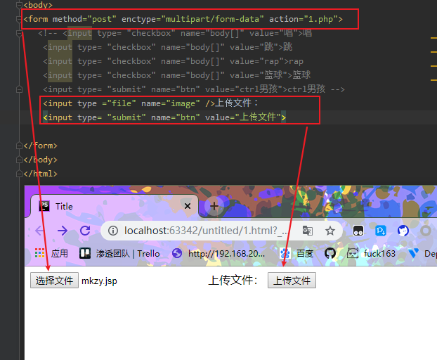
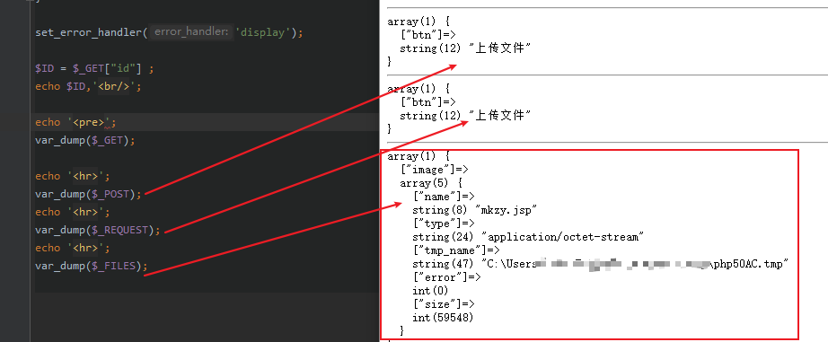
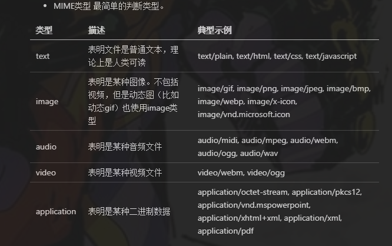

# **PHP于数据库交互**


# **表单传值**

## **概念** 

>  表单传值即浏览器通过表单元素将用户的选择或者输入的数据提交给后台服务器语言

(A君：可以理解为将数据参数提交给服务器 mysql、mssql、sqlserver)


## **为什么使用表单传值**

实现**表单数据和数据库的交互**


# **表单传值的方式**

(A君：要来了，要来了！)


## **- GET 传值**

1. form表单

```html
<form method = "GET">表单元素</form>
```
在表单中输入数据后就可以通过表单传输进入数据库。


2. a标签

```html
<a href = "www.itcast.cn/index.php?学科=php">
```
其中 ?是传参的标志 


3. location 对象的href `属性`

```html
<script>location. href ="www.itcast.cn/index.php?data=php"</script>

```
使用标签和href传参。
传入数据库中，使用？来get值


4. location 对象的 assign()方法。

```html
<script>location.assign=("www.itcast.cn/index.php?data=php")</script>
```


## **- POST 传值**

1. POST表单方式的基本设定

```html
<form method="POST">表单信息</form>
```

2. post方式跟GET方式的区别

    - 1. GET 传输数据主要用来获取数据，不断改变服务器上的资源。<br>
`此时get只是用来获取数据内容`</br>


    - 2. Post传输的数据主要用来增加数据，改变服务器上的资源。：<br>
    `post会改变服务器上的数据内容`


    - 3. 传输方式上的`Post必须使用Form表单`，`而GET改变使用From表单和URL。`


    - 4. GET传输数据可以在URL中对外可见，而POST不可见。
    在GET传值会最终在浏览器的地址栏中全部显示：`?数据名=数据值&数据名  2=数据值2  ...以此类推`


    - 5. get和post能传输的数据大小不同，而`GET为2k`，`post理论无限制`。(理论上GET和POST传值都可以进行无限制大小传输，但是浏览器厂家做了限制)


    - 6. GET和post能够传输的数据格式也有区别：
         GET可以传输简单的数据(数值/字符串)。
         POST可以提交复杂的数据(二进制等)


# 表单传值

## PHP接受数据的三种方式

这三种都是PHP的超全局(没有定义范围限制)的预定义数组。


$_GET         方式
$_POST        方式
$_REQUEST     方式

1） $_REQUEST  所存储的数据的内容。

2） $_REQUEST  和$_GET 和 $_Post的联系。



由图可见 `$_REQUEST`和`$_GET`可以通过同样的方式获取数据


在REQUEST中POST会覆盖GET


在同时传值的时候 `GET会干GET该干的事`
(A君：男人就该干男人？？？)


可见其中POST的数据传输的优先级(或者是top等级)会大于GET


# **表单传值**


## php处理复选框数据


## 复选框表单项的命名方式

- 复选框： 通常是将`一类内容`以同样的形式传递给后台，数据库存储通常是一个字段存储.

实列如下：


<form method="post" >
<input type= "checkbox" name="body" value="唱">唱
<input type= "checkbox" name="body" value="跳">跳
<input type= "checkbox" name="body" value="rap">rap
<input type= "checkbox" name="body" value="篮球">篮球
</form>


## `复选框如何`接收数据

```html
<form method="post" >
<input type= "checkbox" name="body" value="唱">唱
<input type= "checkbox" name="body" value="跳">跳
<input type= "checkbox" name="body" value="rap">rap
<input type= "checkbox" name="body" value="篮球">篮球
</form>
```

使用POST 传参时 当复选框被勾选时就会传值 - 当出现同名name时候  `POST传参数据`会被覆盖。


> 如何接收checkbox的数据？

这时候不代表post未传值,而是`浏览器认为其数据不具有特殊性！`

但是PHP认为：`[]`这个符号具有特殊性，但是系统自动认为该符号是数组符号的形式！

所以PHP就会自动将同名但是具用`[]`的元素组合到一起，形成一个数组。


## 复选框数据的`接收形式`


当数组中`[]`无数据时，会`自动`将同名的带有[]中会形成`一个数组`。


<form method="POST"  action="1.php">
    <input type= "checkbox" name="body[]" value="唱">唱
    <input type= "checkbox" name="body[]" value="跳">跳
    <input type= "checkbox" name="body[]" value="rap">rap
    <input type= "checkbox" name="body[]" value="篮球">篮球
    <input type= "submit" name="btn" value="ctrl男孩">ctrl男孩

</form>




## 复选框的数据常见的处理

 1). 单选按钮的数据处理
`Radio Button` ：可以出现多个选择项，但是之能选择其中一个。
1. 表单中使用的name的属性，使用同名即可：只能选择一个！


2. 后台接受数据也不需要额外处理，


3. 数据库存储的话只需要一个字段存储普通数据即可(数字或者字符串)


4. 当PHP拿到数据后会对数据进行映射

(B君：也就类似于PHP把数据进行了解析 把数据以 男，女  的形式改成 1，0之类的)


 2). 多选按钮的数据处理

1. 表单中name属性的使用数组格式未：名字[](一个复选框数据使用一个)
2. 后台接受到数据后，是一个数组(`数组不能存储到数据库`)
(A君：废话它哪里看得懂唱跳rap篮球 ？)

3. PHP需要


 3). 其他常规同名表单项的数据处理
除开radio button 单选框和复选框，很少会出现同名的表单项。如果非要使用同名来进行管理，那么可以采用checkbox的方式来进行操作。

1. 表单中同名增加[]

2. PHP接受时数数组处理

3. PHP转换有格式的字符串

4. 数据库字符串存储


# 复选框细节

如果复选框没有选中，那么浏览器就不会提交。
> 所以在PHP中接收使用复选框(单选框)数据的时候，应该先判断是否存在数据。




# **文件上传**


## **原理**

文件上传 文件从用户本地电脑通过传输协议-方法( WEB表单) 保存到数据库服务器所在指定的目录下。

1. 增加文件上传的表单：浏览器请求一个服务器的HTML脚本(包含文件上传表单)

2. 用户从本地选择一个文件[点击上传框(按钮)]

3. 用户点击上传：文件会通过物联网上传到服务器上。

4. 服务器操作系统会将文件保存到临时目录：是以临时文件格式保存的(Windows下tmp)

5. 服务器脚本开始工作：判断文件是否有效。

6. 服务器脚本将有效文件开始从临时目录移动到指定目录下(完成文件上传)。





# **文件上传的表单**


## **表单写法**

1. method 属性：表单提交方式必须为`POST`

2. enctype 属性：form表单属性 ，主要是规范表单数据的编码方式。


3. 上传表单：file表单




在文件属性中


```html
<form method="post" enctype="multipart/form-data" action="1.php">
```
会让你提交文件


# **文件上传**

> 在PHP中，有一个预定义变量 `$_FILES`是专门用来存储用户上传的文件的。上传的文件只要符合  GET ， POST ，表单类型就可以上传到`$_FILES`文件中。




可见 获取文件类型的函数为    `$_FILES`

> 注意：html中的表单属性一定要加`enctype="multipart/form-data"`


## **$-FILES函数的变量解析**


```php
  ["image"]=>
  array(5) {
    ["name"]=>     //文件在用户(浏览器端)电脑上的实际存在的名字
    string(8) "mkzy.jsp"
    ["type"]=>   //文件类型
    string(24) "application/octet-stream"
    ["tmp_name"]=>  //文件上传到服务器后操作系统保存的临时路径
    string(47) "C:\Users\XiDanEr\AppData\Local\Temp\php50AC.tmp"
    ["error"]=>    //文件上传的代号 用来告诉(PHP在文件传输过程中遇到了什么问题)。
    int(0)
    ["size"]=>  //文件上传的大小
    int(59548)
```


## 多文件上传

    当商品需要上传多个图片进行展示的时候：那么需要多文件上传，针对一个内容但是说明文件不同：
- 同名表单

    当商品需要进行多给维度图片的说明的时候： 需要使用多文件上传，针对的是不同的内容所以表单名字不同：
- 批量解决问题

```php

//判断1
function Image($filename)
{
    //设定图片类型
    $types = '.jpeg|.png|.gif|.jpg';

    if (file_exists($filename)) {
        //判断是否为图片
        $info = getimagesize($filename);  //取得图像大小
        //获取文件后缀
        $imgext = image_type_to_extension($info[2]);
        //进行对比
        if (stripos($types, $imgext) >= 0) {
            return $imgext;
        } else {
            return 0;
        }
    }
    else {

        return 0;
    }
}

$is_upload = false;
//检测button是否点击上传
if (isset($_POST['btn'])) {
    //获取上传文件保存
    $temp_file = $file;
    $res = Image($temp_file);
    if (!$res) {
        echo "你上传真像cxk";
    } else {
if (is_uploaded_file($file['tmp_name'])){

    if(move_uploaded_file($file['tmp_name'],'C:\phpStudy\PHPTutorial\WWW\ ' . $file['name'])){
        echo '保存成功';
    }else{
        echo 'noooob';
    }
}}}
?>
```


## stripos 查找字符串在文章中首次出现的位置 

>可用于检查文件对比后缀名，或文件上传是否符合规范。

```php
$a = '1,2,3,4,5,6';

$b = '123,345';

stripos

 if (stripos($types, $imgext) >= 0){
     return 1;
 }else{
     return 0;
 }

```

## 关于输出的**区别**

- request()语句

PHP 程式在执行前，就会先读入 require 所指定引入的档案，使它变成 PHP 程式网页的一部份。

- include()语句

网页在读到 include 的档案时，才将它读进来。这种方式，可以把程式执行时的流程简单化。引入是有条件的，发生在程序执行时，只有条件成立时才导入（可以简化编译生成的代码）。

两个包含语句的意思都相近

但是呢 


文件上传的表单填写
```html
  <div id="upload_panel" >
                <form enctype="multipart/form-data" method="post"> 
                        <input class="input_file" type="file" name="image"/>
                        <input class="button" type="submit" name="btn" value="上传"/>

                </form>
        <div>
```

在post提交的时候是无文件大小限制的


**文件上传**


对于最基础的文件上传要做的是

- 三次判断两次修改

- 1. 判断 `**error**` 的值 看是否等于4。


如果error的值为2，则是超出大小。

如果error的值为3，则是上传出现问题 上传中断。

如果error的值为4，则是未上传。


- 2. 判断 `**type**` 获取的值是否为所需要的值。

```php
$file = $_FILES['file'];
$allow_type= array('image/jpg','image/png','image/jpeg','image/gif','image/pjpeg')
$allow_format('jpg','gif','png','jpeg');

```



若不符合丢弃，

- 3. 判断 `**SIZE**` 是否大于规定上传大小。

新建一个 `$max_size` 值让获取的文件size和max_size做对比，若大于则不合规范。

-- 

- 4. 修改文件名为规定的文件名。

```php

fullname = strstr($file['type'],'/',TRUE) . date('YYmmdd'); //查找字符串首次出现的位置，然后构造文件名字： 一般为 type(类型) + 年月日+随机字符串.$ext
for($i =0 ；$i<4;$i++){
$fullname .= chr(mt_rand(65,90)); //用chr随机产生字符串
}
//拼凑到后缀（也就是$file)
$fullname .= '.' .ext;
//移动到指定目录（临时目录）
if(!is_uploaded_file($file['tmp_name'])){
    //如果错误
    $error = '文件你传的个什么JB东西tmd传的全错的你看看你传的倒霉玩意';
    return false;

```


- 5. 修改文件路径为指定路径。

```php
 if(is_uploaded_file($file['tmp_name'])){ //获取文件5个属性中的tmp—_name -- 为tmp_name为临时文件名称。

   if (move_uploaded_file($file['tmp_name'], 'C:\phpStudy\PHPTutorial\WWW\img\ ' . $file['name'])) { //存储到指定文件中的  上传文件。 找到临时路径，指定存放文件。 保存名称为：原文件名

            echo '保存成功';
        } else {
            echo '保存nooob';
        }

        }
```


最简单的批量上传代码：
```php
<?php
header('Content-type:text/html;charset=utf-8');

echo '<hr/>';

foreach ($_FILES as $file){ //获取文件名 -- $file 不同名文章处理

    if(is_uploaded_file($file['tmp_name'])){ //获取文件5个属性中的tmp—_name -- 为tmp_name为临时文件名称。

   if (move_uploaded_file($file['tmp_name'], 'C:\phpStudy\PHPTutorial\WWW\img\ ' . $file['name'])) { //存储到指定文件中的  上传文件。 找到临时路径，指定存放文件。 保存名称为：原文件名

            echo '保存成功';
        } else {
            echo '保存nooob';
        }

        }}
?>

<div>
    <div id="upload_panel" >
        <form enctype="multipart/form-data" method="post" action="4.php">
            <input class="input_file" type="file" name="hand"/>
            <input class="input_file" type="file" name="budy"/>
            <input class="input_file" type="file" name="nmsl"/>
            <input class="button" type="submit" name="btn" value="上传"/>

        </form>
        <div>

</div>
```


**文件上传的封装函数**

实现文件上传的重复利用：封装文件的`上传函数`

功能：上传文件 
    - 识别文件大小，实现控制文件是否保留
    - 控制文件存储位置，外部指定。 

条件：条件判断 
    - 判断是否符合条件。外部指定MIME类型。
    - 文件类型是否合适。外部指定。


- MIME类型 最简单的判断类型。

|类型	         |描述	                                                                      |             典型示例
|---------------|----------------------------------------------------------------------------|-------------------
|text	        |表明文件是普通文本，理论上是人类可读	                                      |text/plain, text/html, text/css, text/javascript
|image	        |表明是某种图像。不包括视频，但是动态图（比如动态gif）也使用image类型	      |image/gif, image/png, image/jpeg, image/bmp, image/webp, image/x-icon, image/vnd.microsoft.icon
|audio	        |表明是某种音频文件	                                                       | audio/midi, audio/mpeg, audio/webm, audio/ogg, audio/wav
|video	        |表明是某种视频文件	                                                        | video/webm, video/ogg
|application	|表明是某种二进制数据	                                              |application/octet-stream, application/pkcs12, application/vnd.mspowerpoint, application/xhtml+xml, application/xml,  application/pdf


**保存文件的重命名**


```php

fullname = strstr($file['type'],'/',TRUE) . date('YYYYmmdd'); //查找字符串首次出现的位置，然后构造文件名字： 一般为 type(类型) + 年月日+随机字符串.$ext
for($i =0 ；$i<4;$i++){
$fullname .= chr(mt_rand(65,90)); //用chr随机产生字符串
}
//拼凑到后缀（也就是$file)
$fullname .= '.' .ext;
//移动到指定目录（临时目录）
if(!is_uploaded_file($file['tmp_name'])){
    //如果错误
    $error = '文件你传的个什么JB东西tmd传的全错的你看看你传的倒霉玩意';
    return false;

```


