# Python - 函数

- [学习来源](https://www.bilibili.com/video/BV1o4411M71o?p=1)

<p align="center">
    
</p>

<p align="center">👴 My angel is a centerfold</p>
<p align="center"><a href="https://music.163.com/#/song?id=22224003"><font>《Centerfold》</font></a> </p>
<p align="center">专辑：Freeze Frame</p>
<p align="center">歌手：J. Geils Band</p>

## 目录

  - 函数的作用
  - 函数的使用步骤
  - 函数的参数作用
  - 函数的返回值作用
  - 函数的说明文档
  - 函数嵌套

## 函数的作用

函数就是将 `一段具有独立功能的代码块` 整合到一个整体并命名，在需要的位置 `调用这个名称` 即可完成对应的需求。

> 函数在开发过程中，可以更高效率的实现 `代码重用`。

### 函数的定义和调用

#### 函数的定义

```py
def 函数名(参数)
    代码1
    代码2
······
```

#### 调用函数

```py
函数名(参数)
```

> 注意：
  1. 不同的需求，参数可有可无
  2. 在Python中，函数必须先定义后使用。

### 编写函数

1. 搭建整体框架
```py
print('密码正确登录成功')
# 显示"选择功能"界面
sel_func()

print('查询余额完毕')
# 显示"选择功能"界面
sel_func()

print('取了2000元钱')
# 显示"选择功能"界面
sel_func()
```

2. 确定 “选择功能” 界面内容

```py
def sel_func()
    print('查询余额')
    print('存款')
    print('取款')
```

3. 封装“选择功能”
> 注意：一定是先定义函数，后调用函数。如果先定义后调用，程序会报错
> 如果没有调用函数，则函数里面的代码不会执行


函数的含义就是将代码整合并命名，在需要的地方调用即可
示例如下：
```py
def sel_func()
    print('查询余额')
    print('存款')
    print('取款')

print('密码正确登录成功')
# 显示"选择功能"界面
sel_func()

print('查询余额完毕')
# 显示"选择功能"界面
sel_func()

print('取了2000元钱')
# 显示"选择功能"界面
sel_func()
```

**函数的执行流程**
当遇到定义函数时，先不会执行，在遇到调用函数时，再去执行函数。定义函数的时候，函数体内部缩进的代码并没有执行。


### 函数的参数作用

本小结讲述最简单的参数写法和作用。

先来最简单的，要求完成两个数 相加的和的加法运算，如何书写程序？
```py
def add_num():
    c = 1 + 2
    print(c)

add_num()
```

思考：上述函数 只能完成数字`1`和`2`的加法运算，如果想要这个函数变得更灵活，可以计算任何用户指定的两个数字的和，改如何书写程序。

分析：用户要在调用函数的时候指定具体数字，那么在定义函数的时候就需要接受用户指定的数字。函数调用的时候的数字和定义函数的时候接收的数字即是函数的参数。
示例如下:
```py
def add_num(a,b):
    a= int(a)
    b= int(b)
    return a+b

a1 = input('a1')
b1 = input('b1')
number=add_num(a1,b1)
print(number)
```

### 函数的返回值

例如：我们去超市购物，需要买 阔落 ，给钱之后，问售货员返回我们烟这个商品。在函数中，如果需要返回结果给用户，则需要使用到函数的返回值。

```py
def buy():
return '阔落'

# 使用变量获取函数返回值
paymoney = buy()
print(paymoney)
'''
输出结果为：
阔落
'''
```

> return会返回结果给函数调用的地方。同时也会退出当前函数。return 下方的所有代码都不会执行。


制作一个计算器，计算任意两数字之和，并保存结果。


### 函数的说明文档

当定义一个函数后，程序员如何书写程序能快速提示这个函数的作用？
`注释`

如果代码，岂不是需要在很多代码中找到这个函数定义的位置，才能看到对应的注释。如果想更加方便的查看函数的作用应该怎么办？

`函数的说明文档`

**如何定义函数的说明文档**

语法：
```py
def 函数名():
    """说明文档位置"""
    代码
    ······
```

> 如何查看函数的说明文档
`help(函数名)`

示例：
```py
def add_num(a,b):
    """求和函数"""
    a= int(a)
    b= int(b)
    return a+b

help(add_num)
'''
输出结果：
add_num(a, b)
    求和函数
'''
```

### 函数嵌套调用

所谓函数嵌套调用指的是一个函数里面又调用了另外一个函数。

示例
```py
def test1():
    print('1函数开始')
    print('这是1函数')
    print('1函数结束')

def test2():
    print('2函数开始')
    test1() # 嵌套1函数
    print('2函数结束')
test2()
```

### 示例

**打印一条横线**

```py
def printline():
    print('_'*20)
printline()
```


**打印多条直线**

实现循环调用某个函数，需要函数中写入循环嵌套并在调用时控制循环数量
示例：
> 使用`while`循环嵌套控制函数。
```py
def printline():
    print('_'*20)


def printline1(num):
    i = 0
    while i< num:
        printline()
        i+=1
printline1(2)  # 规定打印个数

```


### 函数计算

**求三个数之和**

```py
def sum_num(a,b,c):
    a = int(a)
    b = int(b)
    c = int(c)
    return a+b+c

a1 = input('请输入第一个数：')
a2 = input('请输入第二个数：')
a3 = input('请输入第三个数：')
print(sum_num(a1,a2,a3))

```
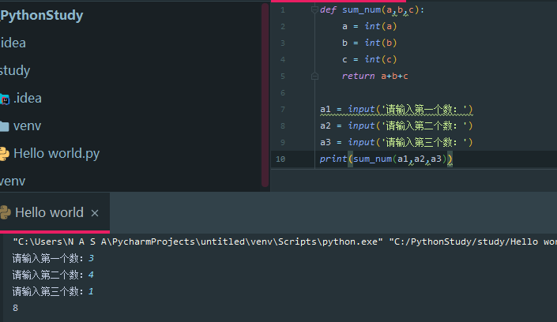


**求三个数的平均数**

```py
def sum_num(a,b,c):
    a = int(a)
    b = int(b)
    c = int(c)
    return a+b+c

a1 = input('请输入第一个数：')
a2 = input('请输入第二个数：')
a3 = input('请输入第三个数：')
print('三个数和为：',sum_num(a1,a2,a3))

def average_num(a,b,c):
    sum = sum_num(a,b,c)
    return sum / 3

result = average_num(a1,a2,a3)
print('平均值为：',result)

```
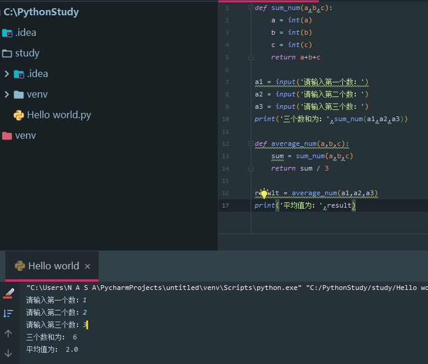


### 总结

- **函数的作用**：封装代码，高效的代码重用
- **函数的使用步骤**：
  - 定义函数
    ```py
    def 函数名():
        代码1
        代码2
        代码3
        ······
    ```
  - 调用函数
    ```py
    函数名()
    ```

-   函数的参数:函数调用的时候可以传入真实数据，增大函数的使用的灵活性
    - 形参：形式参数，在函数的定义和书写时使用的参数(非真实参数)
    - 实参：实际参数，函数调用时书写的参数(真实参数)


  - 函数的返回值
     - 作用：函数调用后，返回需要钉钉计算结果
     - 写法
       ```py
       return 表达式
       ```

-  函数的文档说明
   -  作用：保存函数解释说明的信息
   -  写法
    ```py
    def 函数名():
    '''函数说明文档'''
    ```

- 函数嵌套调用：一个函数内部嵌套调用另外一个函数

---

## 函数进阶

- **目标**
    - 变量作用域
    - 多函数程序的执行流程
    - 函数的返回值
    - 函数的参数
    - 拆包和交换两个变量的值
    - 引用
    - 可变和不可变类型

### 变量作用域

> 变量作用域指的是，变量的生效范围，主要分为两种：
- 局部变量
    所谓局部变量就是在函数体内的变量，即只在函数体内部生效。
    ```py
    def testA():
        a = 100
        print(a)

    testA() # 100
    print(a) #100? 报错
    ```
> 变量A是定义在`testA`函数内部的变量，在函数外部访问则立即报错。

局部变量的作用：在函数体内部，`临时保存数据`，即当函数调用完成后，则销毁局部变量。

- 全局变量

在函数外定义的变量即可变成全局变量。

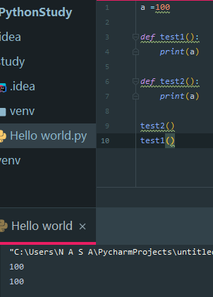

```py
# 定义全局变量
a =100

def test1():
    print(a) # 调用全局变量

def test2():
    print(a) # 调用全局变量

test2()
test1()
```

可见外全局变量定义的数，在函数中一样可以调用

**局部变量和全局变量的关系**

```py
a =100
def test1():
    print(a)
def test2():
    a = 200
    print(a)
test2()
test1()
# 在test2调用后，还是变回了100
print(f'此时变量a为：',{a})
'''
200
100
此时全局变量为：a= {100}
'''
```
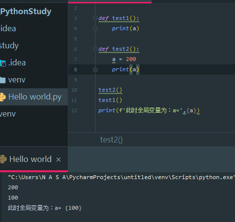

可见，在函数中，局部变量>全局变量，而局部变量无法影响函数意外的变量。

> 如何在函数体内修改全局变量？

```py
a =100
def test1():
    print(a)
def test2():
    # 声明全局变量
    global a
    a = 200
    print(a)

test1()
test2()
print(f'此时变量a为',{a})
```

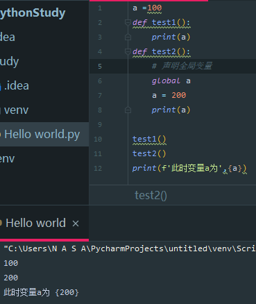

> 此时在全局调用A变量时发现，数值变成了200.在函数中，定义了全局变量的值。


全局变量调用
写法：
```py
global 函数名
```


### 多函数程序执行流程

一般在实际开发过程中，一个程序往往由多个函数(后面知识中会讲解类)组成，并且多个函数共享某些数据，如下所示：

- 共用全局变量
```py
glo_num=0

def test1():
    global glo_num
    # 修改全局变量
    glo_num=100

def test2():
    # 调用test1函数中修改后的全局变量
    print(glo_num)
test2()
# 先调用一下函数 test2(),查看全局变量的内容，看看是否被修改。
test1()
# 调用test1 函数，执行函数内容代码：声明和修改全局变量
test2()
# 调用test2函数，执行函数内部代码：打印

'''
0
1
100
1
'''
```
可见在函数在为调用函数时不会执行。在test1调用后，`glo_num` 的函数值改变。

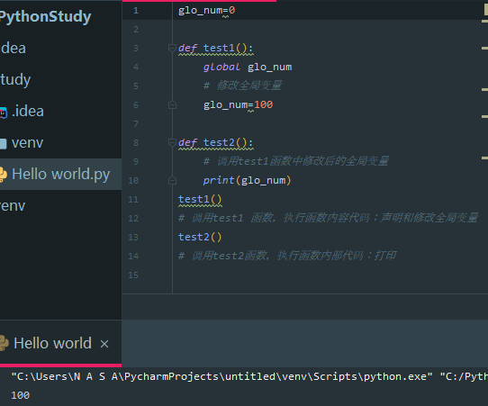

- **返回值作为参数传递**

```py
# 将返回值作为参数传递
def test1():
    return 50

def test2(a):
    print(a)

result = test1()
test2(result)
'''
50
'''
```
>可以将一个函数的返回值嵌套给另外一个函数进行运算。

### 函数的返回值

思考：如果一个函数如些两个return(如下所示)，程序如何执行？
```py
def return_num():
    return 1
    return 2

result = return_num()
print(result)
```

函数中只会执行第一个 `return` 函数。因为`return`会退出当前函数，导致`return` 下方的代码不执行。

此时，如果一个函数有多个返回值，要如何书写？

```py
def return_num():
    return 1,2

result = return_num()
print(result)
# 返回值为一个元组。
'''
(1,2)
'''
```


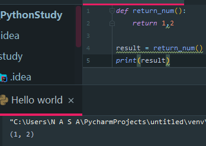

> 注意：
>> 1. return a,b 的写法，在返回多个数据的时候，默认是元组类型。
>> 2. return后面可以连接列表，元组或字典，以返回多个值。

在return时可以直接书写 元组 列表 字典。`return [10,20]`

### 函数的参数

**位置参数**

位置参数：指调用函数时根据函数定义的参数位置来传递参数。
```py
def user_info(name,age,gender):
    print(f'name={name},age={age},sex={gender}')

user_info('tom',20,"男")
```
> 注意：此时传递和定义参数的顺序及个数必须一致。

### 关键字参数

函数调用：通过 `"键=值"` 形式加以指定。可以让函数更加清晰、容易使用、同时也清楚了参数的顺序需求。

```py
def user_info(name,age,gender):
    print(f'name={name},age={age},sex={gender}')

# 利用关键字传参。
user_info('rose'，age=20,gender='女')
# 就算打乱顺序也可以传输进去。
user_info('man'，gender='男'，age=22)

'''
输出结果：
name=rose,age=20,sex=女
name=man,age=22,sex=男
'''
```


### 缺省参数

`缺省参数也叫默认参数`，用于定义函数，为参数提供默认值，调用函数时可不传改默认参数的值
(注意：所有位置参数必须出现在默认参数前，包括函数定义和调用)。

```py

def user_info(name,age,gender='男'):
    print(f'name={name},age={age},sex={gender}')

user_info('rose',20,)
user_info('man',22,gender='女')
```
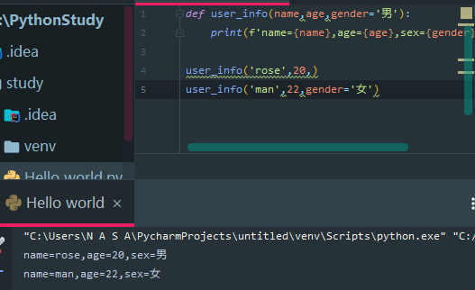

> 注意：当函数存在默认值时就叫做缺省参数，如果为缺省参数传值则修改默认参数值；否则使用这个默认值。

### 不定长参数

不定长参数也叫可变参数。`用于不确定调用的时候会传递多少个参数`(不传参数也可以)的场景。此时，可用包裹(packing) 位置参数，或者包裹关键字参数，来进行参数传递，会显得非常方便。

 - 包裹位置传递
    示例如下：
    ```py
    def user_info(*name):
   print(name)

    user_info('rose',20,)
    user_info('man',22,'女')
    user_info() # 可以不传数据
    ```
    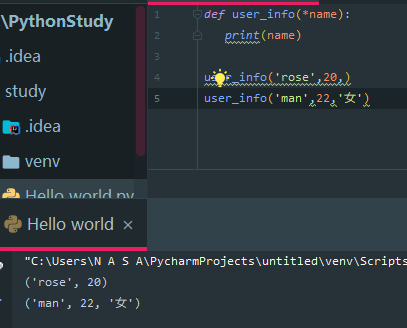

    当传值时，无论多少都会返回，因为是不定长参数。返回是元组。


当传进的所有参数都会被`args`变量收集，它会根据传进参数的位置合并为一个元组(tuple)，`args` 是元组类型，这就是包裹位置传递。

  - 包裹关键字传递
    ```py
    def user_info(**kwargs): # 在python底层，接受不定长参数的代码都是 kwargs 所以用这个名称即可。
        print(kwargs)

    user_info(name='tom',age=18,id=100) # 收集所有关键字参数，返回一个字典。
    '''
    里面所有的形参都不能加引号，因为是形参。
    '''
    ```
    > 综上所述：无论是包裹位置传递还是包裹关键字传递，都是一个`组包`的过程。


### 拆包和交换变量值

#### 拆包(指蹲在包旁边嗯e)

 - 拆包：元组

   ```py
    def return_num():
    return 100,200

    num1,num2=return_num()
    print(num1)
    print(num2)
   ```

    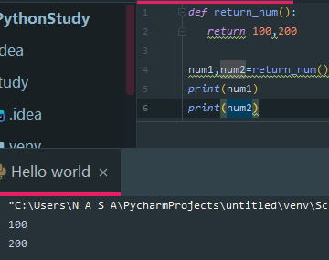

 - 拆包：字典

   ```py
    dict= {'name':'tom','age':18}
    a,b=dict

    # 对字典进行拆包，取出来的是字典的key
    print(a) # name
    print(b) # age

    print(dict[a]) # tom
    print(dict[b]) # 18
   ```
    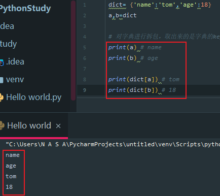

### 交换变量值

需求：有变量 a=10 和 b = 20 ，交换两个变量的值。

 - 方法一

    借助第三变量存储数据
    ```py
    a = 10
    b = 20

    # 1. 定义中间变量
    c = 0

    # 2. 将a的数据存储到c
    c = a

    # 3.将b的数据20赋值到a，此时 a = 20
    a = b
    b = c

    print(a) # 20
    print(b) # 10
    ```
    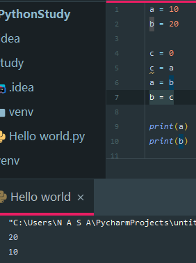

 - 方法二

    ```py
    a,b=1,2 # a = 1,b = 2
    a,b=b,a
    print(a)
    print(b)
    ```
    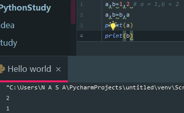

    > 交换a和b的值。

### 引用

#### 了解引用

> 在Python中，值是靠引用来传递来的。

我们可以用ID()，来判断两个变量是否为同一个值的引用。我们可以将ID理解为那块`内存的地址标识`。

- int 型
    ```py
    a = 1
    b = a
    print(b)
    print(id(a)) # 此时a在内存中的地址
    print(id(b)) # 此时b在内存中的地址

    a = 2
    print(b) # 1，说明int类型为不可变类型

    '''
    1
    140730227126528
    140730227126528
    1
    '''

    print(id(a)) # 此时a在内存中的地址
    print(id(b)) # 此时b在内存中的地址
    '''
    140730196521248
    140730196521216
    '''
    ```
    > 说明值是靠引用来传递的。程序先在内存中开辟一块地址，赋值为1，然后a将引用内存地址，此时赋值就是将a的内存地址赋给b。而将a重新赋值就是重新开辟内存和引用不同的内存地址。

    1. 不可变：int：1.1声明变量保存整型数据，把这个数据赋值到另一个变量：id()检测两个变量的id值(内存的10进制)

- 列表
    ```py
    aa = [10,20]
    bb = aa

    print(id(aa))
    print(id(bb))

    aa.append(30)
    print(bb)

    print(id(aa))
    print(id(bb))
    ```

    因为列表是可变地址，其引用不会变，直接更改内存中的数据。

#### 引用当做实参

> 实践，引用是否可以当做实参传递。而粗暴的理解，引用就是一个变量名！

代码如下：
```py
# 需求：引用是否可以当作实参
'''
定义函数：有形参
   1，1 访问打印参数看是否有数据
   1，2 访问形参的id
   1.3 改变形参的数据，查看这个形参并打印id，看id值是否相同
2. 调用函数 -- 把可变和不可变两种类型依次当作实参传入
'''
def test1(a):
    print(a)
    print(id(a))
    a +=a
    print(a)
    print(id(a))

b = 100
test1(b)

c = [11,22] # 面不可变类型的数组，数组进行加减后，内存地址不会进行改变。
test1(c)
```

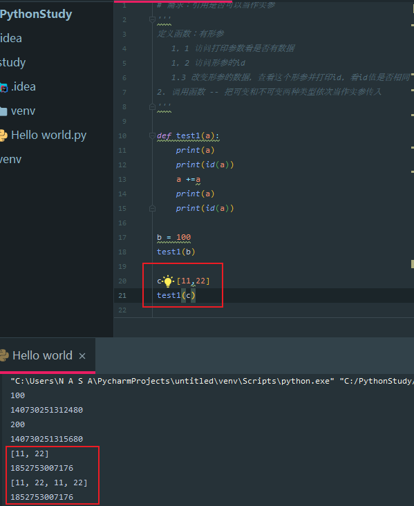

### 可变和不可变类型

所谓可变类型和不可变类型是指：数据能够直接进行修改，如果能直接修改那么就是可变类型，否则是不可变类型。

- 可变类型：
   - 列表
   - 字典
   - 集合
 - 不可变类型
   - 整型
   - 浮点型
   - 字符串
   - 元组

### 函数二总结

  - 变量作用域
    - 全局：函数体内外都能生效
    - 局部：当前函数体内部生效
  - 函数多返回值写法

    ```py
    return 表达式1，表达式2/列表等
    ```

  - 函数的参数
    - 位置参数
      - 形参和实参的个数和书写顺序必须一直
    - 关键字参数
      - 写法：`key=value`
      - 特点：形参和实参的书写顺序可以不一致；关键字参数必须书写在位置参数的后面
    - 缺省参数
      - 缺省参数就是默认参数
      - 写法：`key=value`
    - 不定长位置参数
      - 收集所有位置参数，返回一个元组。
    - 不定长关键字参数
      - 收集所有关键字参数，返回一个字典。
  - 引用：python中，数据的传递都是通过引用。


## 函数进阶

  - 目录
    - 应用:学员管理系统
    - 递归
    - lambda 表达式
    - 高阶函数

### 学院管理系统

  - 系统简介

需求：进入系统显示系统功能界面，功能如下：
  1. 添加学员
  2. 删除学员
  3. 修改学员信息
  4. 查询学员信息
  5. 显示所有学员信息
  6. 退出系统

### 步骤分析

  1. 显示功能界面
  2. 用户输入功能序号
  3. 根据用户输入的功能序号，执行不同的功能(函数)
     1. 定义函数
     2. 调用函数 在需求地方调用函数即可

### 需求实现

按照需求按步实现

```py
# 定义功能界面函数

# 1. 显示功能界面
# 2. 用户输入功能序号
# 3. 按照用户输入的功能序号，执行不同的功能(函数)

# 定义功能界面函数
def info_print():
    print('请选择功能----------')
    print('1. 添加学员')
    print('2. 删除学员')
    print('3. 修改学员信息')
    print('4. 查询学员信息')
    print('5. 显示所有学员信息')
    print('6. 退出系统')
    print('_'*20)

# 等待存储所有学员信息
info = []


# 系统需要循环使用，直到用户输入6，才能退出
while True:
    # 1. 显示功能界面
    info_print()

    # 2. 用户输入功能序号
    user_num = int(input('请输入功能序号：'))

    # 3. 按照用户输入的功能序号，执行不同的功能(函数)
    # 如果用户输入1 执行添加：如果用户输入2 则执行删除... -- 多重判断

    if user_num == 1:
        print('添加')
    elif user_num == 2:
        print('删除')
    elif user_num == 3:
        print('修改')
    elif user_num == 4:
        print('查询')
    elif user_num == 5:
        print('显示所有')
    elif user_num == 6:
        print('退出系统')
    else:
        print('输入的功能有误')
```

#### 定义不同功能的函数

所有功能函数都是操作学员信息，所有存储所有学员信息应该是一个`全局变量`，数据类型为`列表`。
```py
info=[] # 使用列表
```


***添加学员功能实现***
 - 需求分析
    1. 接收用户输入学员信息，并保存
    2. 判断是否添加学员信息
       1. 如果学员姓名已经存在则进行报错提示
       2. 如果学员姓名不存在则准备空字典，将用户输入的数据追加到字典，在列表追加到字典数据
    3. 对应的if条件成立的位置调用该函数
  - 代码实现

```py
# 等待存储所有学员信息
info = []
# 添加学员信息的函数
def add_info():
    '''添加学员函数'''
    # 接收学员信息
    new_id = input('输入学号')
    new_name = input('请输入姓名')
    new_tel = input('请输入手机号')

    global info

    # 如果用户输入的
    info_dict = {}
    info_dict['id'] = new_id
    info_dict['name'] = new_name
    info_dict['tel'] = new_tel
    # print(info_dict)

    # 将这个学员的字典数据追加到列表
    info.append(info_dict)
    print(info)
```

> 按照姓名查重
```py
    for i in info:
        if new_name == i['name']:
            print('该用户已经存在！')
            # 此时return由于退出当前函数，后面添加信息的代码不执行
            return # 不去执行添加
```

#### 删除学员

- 需求分析
按照用户输入的学员姓名进行删除
  1. 用户输入目标学员姓名
  2. 检测这个学员是否存在
     1. 如果存在，则列表删除这个数据
     2. 如果不存在，则提示"该用户不存在"
  3. 对应的if条件成立的位置调用该函数

- 代码实现
    ```py
    def del_info():
    '''删除学员函数'''
    # 1. 用户输入要删除的学员的姓名
    del_name = input('请输入要删除的学员姓名')
    # 2. 判断学员是否存在：存在则删除；不存在则提示
    # 3. 声明info是全局变量
    global info
    # 4. 判断学员是否存在：存在则执行删除(列表里面的字典)；break：不存在提示
    for i in info:
        if del_name == i['name']:
            info.remove(i)
            break
        else:
            print('该学员不存在')
    print(info)
    ```

#### 修改学员信息

- 需求分析
  - 用户输入目标学员姓名
  - 检查整改学员是否存在
    - 如果存在，则修改这位学员的信息，例如手机号
    - 如果不存在，则报错
  - 对应的if条件成立的位置调用该函数
- 代码实现
  ```py
  # 修改函数
    def modify_info():
        '''修改函数'''
        # 1. 用户输入要修改的学员的姓名
        modify_name = input('请输入要修改的学员的姓名')
        global info
        # 判断是否存在：如果存在则修改输入的姓名的手机号，否则提示报错
        for i in info:
            if modify_name == i['name']:
                i['tel'] = input('请输入新的手机号')
                break
            else:
                print('该学员不存在')
        print(info)
  ```

#### 查找学员信息

- 需求分析
- 检查学员是否存在
  - 如果存在，则显示这个学员的信息
  - 如果不存在，则报错提示
- 对应的if条件成立的位置调用该函数
- 代码实现
```py
def search_info():
    '''查询学员'''
    # 1. 输入要查询的学员的姓名
    search_name = input('请输入要查找的学员姓名')
    # 定义全局变量
    global info
    # 2.判断学员是否存在
    for i in info:
        if search_name == i['name']:
            # 如果存在则打印信息
            print('查询到的学员信息如下——————')
            print(f"该学员的学号是{i['id']},姓名是{i['name']},手机号是{i['tel']}")
            break
    else:
            print('该学员不存在')
```

#### 显示所有学员信息

- 打印所有学员信息
  - 代码实现
    ```py
    def print_all():
    '''查询所有学员信息'''
    # 打印tishi字符
    print('学员\t姓名\t手机号\t')
    # 打印所有学员的数据
    for i in info:
        print(f"学号是{i['id']},姓名是{i['name']},手机号是{i['tel']}")
    ```

#### 退出系统

- 退出当前系统
  - 代码实现
    ```py
    elif user_num == 6:
    # print('退出系统')
    exit_flag = input('确定要退出吗？Y/n')
    if exit_flag == 'y':
        break
    if exit_flag == 'Y':
        break
    ```

### 最终代码

```py
# 定义功能界面函数

# 1. 显示功能界面
# 2. 用户输入功能序号
# 3. 按照用户输入的功能序号，执行不同的功能(函数)

# 定义功能界面函数
def info_print():
    print('请选择功能----------')
    print('1. 添加学员')
    print('2. 删除学员')
    print('3. 修改学员信息')
    print('4. 查询学员信息')
    print('5. 显示所有学员信息')
    print('6. 退出系统')
    print('_'*20)

# 等待存储所有学员信息
info = []
# 添加学员信息的函数
def add_info():
    '''添加学员函数'''
    # 接收学员信息
    new_id = input('输入学号')
    new_name = input('请输入姓名')
    new_tel = input('请输入手机号')

    global info

    for i in info:
        if new_name == i['name']:
            print('该用户已经存在！')
            # 此时return由于退出当前函数，后面添加信息的代码不执行
            return # 不去执行添加

    # 如果用户输入的
    info_dict = {}
    info_dict['id'] = new_id
    info_dict['name'] = new_name
    info_dict['tel'] = new_tel
    # print(info_dict)

    # 将这个学员的字典数据追加到列表

    info.append(info_dict)

    print(info)

def del_info():
    '''删除学员函数'''
    # 1. 用户输入要删除的学员的姓名
    del_name = input('请输入要删除的学员姓名')
    # 2. 判断学员是否存在：存在则删除；不存在则提示
    # 3. 声明info是全局变量
    global info
    # 4. 判断学员是否存在：存在则执行删除(列表里面的字典)；break：不存在提示
    for i in info:
        if del_name == i['name']:
            info.remove(i)
            break
        else:
            print('该学员不存在')
    print(info)

# 修改函数
def modify_info():
    '''修改函数'''
    # 1. 用户输入要修改的学员的姓名
    modify_name = input('请输入要修改的学员的姓名')
    global info
    # 判断是否存在：如果存在则修改输入的姓名的手机号，否则提示报错
    for i in info:
        if modify_name == i['name']:
            i['tel'] = input('请输入新的手机号')
            break
        else:
            print('该学员不存在')
    print(info)

# 查询学员
def search_info():
    '''查询学员'''
    # 1. 输入要查询的学员的姓名
    search_name = input('请输入要查找的学员姓名')
    # 定义全局变量
    global info
    # 2.判断学员是否存在
    for i in info:
        if search_name == i['name']:
            # 如果存在则打印信息
            print('查询到的学员信息如下——————')
            print(f"该学员的学号是{i['id']},姓名是{i['name']},手机号是{i['tel']}")
            break
    else:
            print('该学员不存在')

def print_all():
    '''查询所有学员信息'''
    # 打印tishi字符
    print('学员\t姓名\t手机号\t')
    # 打印所有学员的数据
    for i in info:
        print(f"学号是{i['id']},姓名是{i['name']},手机号是{i['tel']}")


# 系统需要循环使用，直到用户输入6，才能退出
while True:
    # 1. 显示功能界面
    info_print()

    # 2. 用户输入功能序号
    user_num = int(input('请输入功能序号：'))

    # 3. 按照用户输入的功能序号，执行不同的功能(函数)
    # 如果用户输入1 执行添加：如果用户输入2 则执行删除... -- 多重判断

    if user_num == 1:
        # print('添加')
        add_info()
    elif user_num == 2:
        # print('删除')
        del_info()

    elif user_num == 3:
        # print('修改')
        modify_info()
    elif user_num == 4:
        search_info()
    elif user_num == 5:
        # print('显示所有')
        print_all()
    elif user_num == 6:
        # print('退出系统')
        exit_flag = input('确定要退出吗？Y/n')
        if exit_flag == 'y':
            break
        if exit_flag == 'Y':
            break
    else:
        print('输入的功能有误')
```

