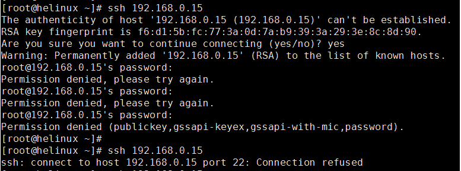

# fail2ban 配置服务器ssh防暴力破解

fail2ban可以监视你的系统日志，然后匹配日志的错误信息（正则式匹配）执行相应的屏蔽动作（一般情况下是调用防火墙屏蔽），如:当有人在试探你的SSH、SMTP、FTP密码，只要达到你预设的次数，fail2ban就会调用防火墙屏蔽这个IP，而且可以发送e-mail通知系统管理员，是一款很实用、很强大的软件！

## 功能和特性：

其实fail2ban就是用来监控，具体是调用iptables来实现动作！

### 1、支持大量服务。

如sshd,apache,qmail,proftpd,sasl等等

### 2、支持多种动作。

如iptables,tcp-wrapper,shorewall(iptables第三方工具),mail notifications(邮件通知)等等。

### 3、在logpath选项中支持通配符

### 4、需要Gamin支持

(注：Gamin是用于监视文件和目录是否更改的服务工具)

### 5、需要安装python

iptables,tcp-wrapper,shorewall,Gamin。如果想要发邮件，那必需安装postfix或sendmail

### 6、配置yum源

首先配置yum源，这里采用的是yum直接装（也可源码安装）
```
 vim /etc/yum.repos.d/CentOS-Base.repo
 ```

在最后新增：
```
[atrpms] 
name=Red Hat Enterprise Linux $releasever - $basearch - ATrpms 
baseurl=http://dl.atrpms.net/el$releasever-$basearch/atrpms/stable 
gpgkey=http://ATrpms.net/RPM-GPG-KEY.atrpms 
gpgcheck=1 
enabled=1 
```

### 7、配置完成后防火墙无效

修改`/etc/fail2ban/action.d/iptables.conf`
```
actionban = iptables -I INPUT -p all -s -j DROP
actionunban = iptables -D INPUT -p all -s -j DROP
```

## 二、安装后配置

```
cp /etc/fail2ban/jail.conf  /etc/fail2ban/jail.local     --复制jail.conf文件 导出为jail.local 并配置
```

### 此时可以使用两种方法配置fail2ban

两种方法的区别:
firewalld是跟iptables.service一个层面上的东西。iptables跟firewall的关系是firewall会使用到iptables命令。
>iptables只是Linux防火墙的管理工具而已，位于/sbin/iptables。真正实现防火墙功能的是 netfilter，它是Linux内核中实现包过滤的内部结构。

## PLAN 1 使用默认firewall(防火墙)

>在配置文件更改
```
vim /etc/fail2ban/jial.local

#找到 banaction 将 “banaction = iptables-multiport”改成 “banaction = firewallcmd-new”

```
>更改SSHd中的配置文件 写入一下文件

```
[sshd]
enabled = true
port = ssh
logpath = /var/log/secure    
maxretry = 3        //最大尝试次数
bantime = 600      //## 非法 IP 被屏蔽时间（秒），-1 代表永远封锁

findtime = 600     //设置多长时间（秒）内超过 maxretry 限制次数即被封锁
```

>启动 fail2ban
```
systemctl start fail2ban
```



第四次连接时直接被拒绝了

>到fail2ban服务器上查看状态


## PLAN 2 使用iptables

```

[ssh-iptables]

enabled = true #启用配置

filter = sshd #规律规则名，对应filter.d目录下的sshd.conf

action = iptables[name=SSH, port=ssh, protocol=tcp]

logpath = /var/log/secure #检测的系统的登陆日志文件。这里要写sshd服务日志文件

bantime = 3600 #禁止用户IP访问主机1小时

findtime = 300 #在5分钟内内出现规定次数就开始工作

maxretry = 3 #3次密码验证失败

```
然后重启并认证

# 防火墙加入相关规则并重启

```
[root@localhost fail2ban-0.8.14]#iptables -A INPUT -p tcp --dport 22 -m state --state NEW -m recent --name ROUTER-SSH  --update --seconds 1800 --hitcount 5 -j DROP
```
```
[root@localhost fail2ban-0.8.14]#iptables -A INPUT -p tcp --dport 22 -m state --state NEW -m recent --name ROUTER-SSH --set -j ACCEPT
```
```
[root@localhost fail2ban-0.8.14]#service iptables restart
```

## 启动fail2ban服务

先创建日志文件
```
[root@localhost fail2ban-0.8.14]#touch /var/log/sshd.log
```
```
[root@localhost fail2ban-0.8.14]#service fail2ban restart
```


