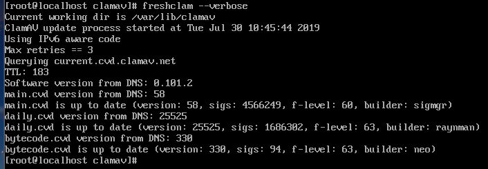

# Clamav安装于使用

https://www.cnblogs.com/fatt/p/6306612.html
https://www.cnblogs.com/duoyi/articles/clamav.html
https://www.cnblogs.com/omgasw/p/10340535.html
https://www.cnblogs.com/gaoyuechen/p/9019098.html

介绍 基本用于于邮件服务器杀毒软件 常规操作系统还是建议卡巴斯基。

## 1.安装依赖环境

```
yum install -y zlib openssl-devel
yum groupinstall -y "Development Tools"
yum install gcc openssl openssl-devel -y
```

>用epel源进行安装，但是需要连网才行（不过能中毒的也一般都是有外网的）
安装后会自动生成服务文件，启动服务后，可使用clamdsacn命令，扫描速度快。
启动服务后，会实时监控扫描连接，虽然`安全性高了，不过可能会对服务器性能有影响。`

### 1.下载安装epel.repo文件


### 2.更新病毒库

执行更新命令，下载病毒库
```
#wget http://database.clamav.net/main.cvd
#wget http://database.clamav.net/daily.cvd
#wget http://database.clamav.net/bytecode.cvd
 
```
或者
```
freshclam --verbose
```


### 3.开始扫描

clamav 有两个命令：`clamdscan`、`clamscan`

clamdscan 命令一般用 `yum 安装才能使用`，需要启动`clamd服务`，执行速度快
建议使用

clamscan `命令通用`，`不依赖服务`，命令参数较多，执行速度稍慢

### clamdscan：

```
用clamdscan扫描，`需要开始服务才能使用`。速度快，不用带 -r ，默认会递归扫描子目录
```
```
service clamd start  //启动杀毒软件

clamdscan /usr       //使用全局扫描
```

>这个命令不仅会显示找到的病毒，正常的扫描文件也会显示出来。

### 只显示找到的病毒信息

```
clamscan --no-summary -ri /tmp
//
-r 递归扫描子目录
-i 只显示发现的病毒文件
--no-summary 不显示统计信息
```

报错 要求更新（实际是我忽然断网了）
https://www.linuxidc.com/Linux/2015-05/117932.htm

## 返回值

```
>返回值
>0 : 无病毒
>1 : 发现病毒
>40: 已经通过的未知选项
>50: 数据库初始化错误
>52: 不支持的文件格式
>53: 无法打开目录
>54: 不能打开文件(ofm)
>55: 读文件错误(ofm)
>56: Can't stat input file / directory.
>57: Can't get absolute path name of current working directory.
>58: I/O 错误, 请检查文件系统
>59: 无法在/etc/passwd获得当前用户的信息
>60: 无法在/etc/passwd获得'clamav'（默认名）用户的信息
>61: Can't fork.
>63: 不能创建临时文件/目录(检查权限).
>64: 无法对临时目录进行写操作 (请指定另一个目录).
>70: 无法分配或释放内存 (calloc).
>71: 无法分配内存 (malloc).
```


